## Мета

Дослідити структуру нечіткої логіки та можливості проектування систем керування на основі алгоритмів нечіткого виводу: побудувати системи нечіткого виводу (СНВ) типу Мамдані для апроксимації нелінійної поверхні та для двох задач керування (змішувач води, кондиціонер повітря), сформувати бази нечітких правил, дослідити функції належності та поверхні «входи-вихід».

Методичка написана під пакет MATLAB Fuzzy Logic Toolbox (команда `fuzzy`, FIS-редактор, Rule Editor, `View surface...`). Оскільки цей тулбокс є окремим платним додатком і доступний не на кожному робочому місці, усі три системи відтворено мовою Python бібліотекою **scikit-fuzzy 0.5.0** (numpy 2.5.3, scipy 1.18.1, matplotlib 3.11.2). Алгоритм виводу повністю відповідає налаштуванням MATLAB за замовчуванням: кон'юнкція `min`, диз'юнкція `max`, імплікація `min` (усічення), агрегація `max`, дефазифікація — центроїд.

Параметри функцій належності обрано не довільно, а за тим самим правилом, яке MATLAB застосовує автоматично в діалозі `Edit → Add MFs...`: для *n* термів на діапазоні [a, b] вершини розставляються рівномірно з кроком (b−a)/(n−1), напівширина трикутника дорівнює кроку, а сигма гаусової ФН добирається так, щоб сусідні терми перетиналися на рівні µ = 0.5, тобто σ = крок / (2·√(2·ln 2)). Завдяки цьому побудовані системи чисельно збігаються з тими, що студент отримав би у FIS-редакторі.

Додатково конфігурацію кожної системи збережено у текстовому вигляді (файли `*.fis.txt`) — це прямий аналог експорту `File → Export → To disk`, який дозволяє за кілька хвилин відтворити ту саму систему в MATLAB, якщо тулбокс знайдеться.

Виконав: Камінський Олексій Дмитрович, група ВТ-23-2, номер у списку 3.

### Склад роботи

| Файл | Призначення |
|---|---|
| `fuzzy_utils.py` | Спільні функції: параметри ФН «як у MATLAB», дефазифікація, побудова поверхонь, експорт `.fis.txt` |
| `task0_surface.py` | Приклад-розминка: апроксимація поверхні y = (x1²−8)·cos(x2) |
| `task1_water_mixer.py` | Завдання 1: керування кранами гарячої і холодної води |
| `task2_air_conditioner.py` | Завдання 2: керування кондиціонером повітря |
| `task0_surface.fis.txt`, `task1_water_mixer.fis.txt`, `task2_air_conditioner.fis.txt` | Текстовий опис систем для перенесення у MATLAB |

Кожен скрипт запускається самостійно командою `python <файл>.py` і зберігає свої рисунки у PNG.

## Завдання 0 (приклад). Апроксимація поверхні y = (x1² − 8)·cos(x2)

Спочатку, як вимагає методичка, побудовано точну поверхню функції на області x1, x2 ∈ [0, 4]. М-файл методички використовує сітку n = 15 і команду `surf`; у Python це відтворено через `matplotlib` з проєкцією `3d` на тій самій сітці 15×15.

Далі зібрано СНВ Мамдані точно за кроками 2–17 методички: вхід `x1` у діапазоні [0, 4] з трьома трикутними термами **L / A / H**; вхід `x2` у діапазоні [0, 4] з п'ятьма гаусовими термами **L / LA / A / HA / H**; вихід `y` у діапазоні [−10, 10] з п'ятьма трикутними термами **L / LA / A / HA / H**. База знань містить правила, перелічені у кроці 16.

```python
# --- крок 9-10: x1, 3 трикутні терми L / A / H
tri_x1 = matlab_tri_params(X1_LOW, X1_HIGH, 3)
for label, prm in zip(("L", "A", "H"), tri_x1):
    x1[label] = fuzz.trimf(u_x1, prm)

# --- крок 11-12: x2, 5 гаусових термів L / LA / A / HA / H
gauss_x2 = matlab_gauss_params(X2_LOW, X2_HIGH, 5)
for label, (center, sigma) in zip(("L", "LA", "A", "HA", "H"), gauss_x2):
    x2[label] = fuzz.gaussmf(u_x2, center, sigma)

# --- крок 13-14: y, 5 трикутних термів L / LA / A / HA / H
tri_y = matlab_tri_params(Y_LOW, Y_HIGH, 5)
for label, prm in zip(("L", "LA", "A", "HA", "H"), tri_y):
    y[label] = fuzz.trimf(u_y, prm)

# --- крок 16: база знань. У методичці сказано «десять правил»,
# але фактично перелічено дев'ять (див. розділ «Зауваження до методички»).
rules = [
    ctrl.Rule(x1["L"] & x2["L"],  y["L"],  label="R1"),
    ctrl.Rule(x1["L"] & x2["H"],  y["A"],  label="R2"),
    ctrl.Rule(x1["L"] & x2["HA"], y["H"],  label="R3"),
    ctrl.Rule(x1["H"] & x2["L"],  y["HA"], label="R4"),
    ctrl.Rule(x1["H"] & x2["H"],  y["L"],  label="R5"),
    ctrl.Rule(x1["A"] & x2["A"],  y["A"],  label="R6"),
    ctrl.Rule(x1["A"] & x2["HA"], y["HA"], label="R7"),
    ctrl.Rule(x1["L"] & x2["LA"], y["LA"], label="R8"),
    # Правило 9 має той самий антецедент, що й правило 7, але інший
    # консеквент — методичка суперечить сама собі, залишаємо як у тексті.
    ctrl.Rule(x1["A"] & x2["HA"], y["A"],  label="R9"),
]
```

Результат запуску `python task0_surface.py`:

```text
======================================================================
ЗАВДАННЯ 0 (приклад). Апроксимація поверхні (x1^2-8)*cos(x2)
======================================================================

Точна функція на сітці 15x15:
  min(y) = -8.0000, max(y) = 8.0000

Систему Мамдані зібрано: 2 входи, 1 вихід, правил — 9
  x1: 3 трикутні терми L/A/H на [0, 4]
  x2: 5 гаусових термів L/LA/A/HA/H на [0, 4]
  y : 5 трикутних термів L/LA/A/HA/H на [-10, 10]

Поверхня СНВ на сітці 15x15:
  min(y) = -8.3333, max(y) = 7.9723

Порівняння СНВ з точною поверхнею:
  MAE  = 2.2859
  RMSE = 2.9111
  max|похибка| = 7.7751
  розмах точної функції = 16.0000
  відносна RMSE = 18.19 % від розмаху

Перевірка у контрольних точках (аналог вікна View rules...):
     x1    x2 |    y (СНВ)  y (точне)        Δ
   0.00  0.00 |    -7.7025    -8.0000   0.2975
   1.00  0.50 |    -5.5772    -6.1431   0.5659
   2.00  2.00 |     0.4320     1.6646  -1.2326
   2.00  3.00 |     2.5000     3.9600  -1.4600
   4.00  0.00 |     5.0000     8.0000  -3.0000
   4.00  4.00 |    -8.3333    -5.2291  -3.1042
   3.00  1.00 |     2.5000     0.5403   1.9597
```

![Рис. 1. Точна поверхня y = (x1²−8)·cos(x2) на області x1, x2 ∈ [0, 4] (аналог команди surf)](fig1_target_surface.png)

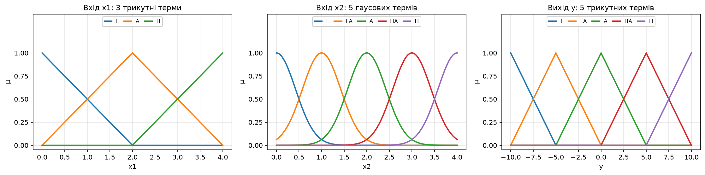

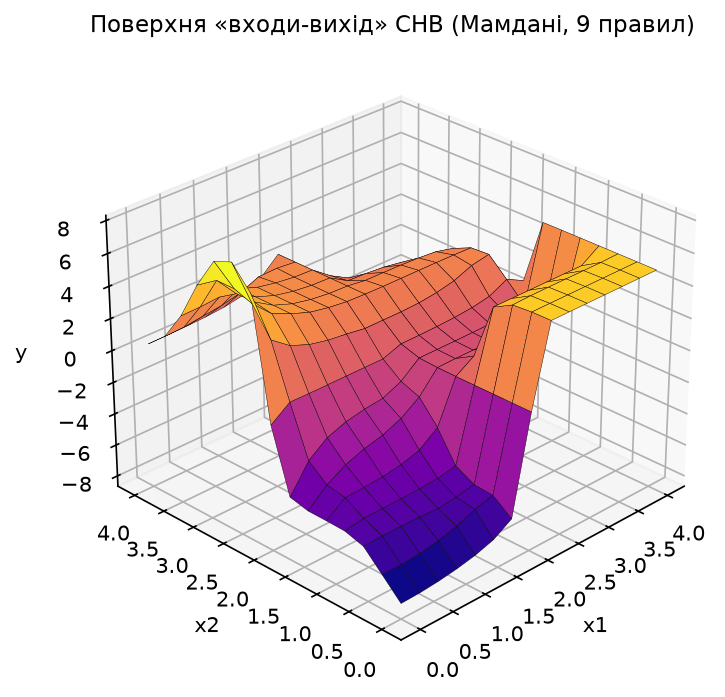

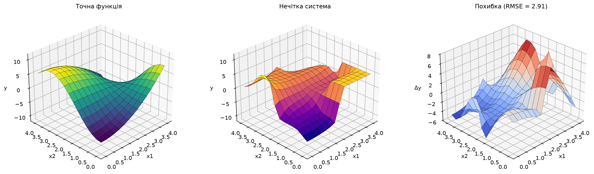

Нечітка система правильно відтворює загальний характер залежності: діапазон виходу СНВ [−8.33; 7.97] практично збігається з діапазоном точної функції [−8.00; 8.00], знак і напрямок схилів поверхні збережені. Проте поверхня СНВ є «сходинковою» і помітно спрощеною. Причина очевидна з бази знань: дев'ять правил покривають лише 8 із 15 можливих комбінацій термів (3 терми x1 × 5 термів x2), а правила 7 і 9 узагалі дублюють антецедент. Найбільші похибки (до 7.78 за абсолютним значенням) зосереджені саме у непокритих зонах — наприклад, у куті x1 = 4, x2 = 0, де точна функція дає +8.00, а СНВ лише +5.00, бо терм `HA` виходу обмежений вершиною +5.

**Висновок:** система нечіткого виводу з 9 правилами відтворює форму поверхні y = (x1²−8)·cos(x2) з відносною RMSE 18.19 % від розмаху функції. Для грубого якісного моделювання цього достатньо, але для точної апроксимації базу правил потрібно доповнити до повного покриття 15 комбінацій термів.

## Завдання 1. Нечітка модель керування кранами гарячої і холодної води

Змішувач має два крани — гарячої і холодної води. Кут повороту кожного крана належить відрізку [−90; 90]°, причому поворот вправо (додатній кут) означає **збільшити потік** води відповідної температури. Система повинна реагувати на поточну температуру води та її напір і видавати керуючий вплив на обидва крани одночасно, тобто це СНВ з двома входами і **двома** виходами.

### Обґрунтування діапазонів і типів функцій належності

Методичка задає лише діапазон кута ([−90; 90]°) і перелік лінгвістичних оцінок. Решту параметрів обрано самостійно:

| Змінна | Діапазон | Тип ФН | Терми | Обґрунтування |
|---|---|---|---|---|
| `t` — температура води | 0…100 °C | гаусові, 5 термів | `cold` (холодна), `cool` (прохолодна), `warm` (тепла), `notveryhot` (не дуже гаряча), `hot` (гаряча) | 0…100 °C — природний фізичний діапазон рідкої води у побутовій системі водопостачання. У тексті задачі рівно п'ять різних оцінок температури, тому 5 термів. Гаусові ФН обрані тому, що температура змінюється плавно і різкої межі між «прохолодною» і «теплою» водою не існує — розмитість тут фізично виправдана. Центри 0/25/50/75/100 °C дають µ = 1 на краях діапазону, тобто крижана вода однозначно «холодна», а окріп однозначно «гарячий» |
| `p` — напір (витрата) | 0…100 % від максимуму | трикутні, 3 терми | `weak` (слабий), `notverystrong` (не дуже сильний), `strong` (сильний) | Задача оперує рівно трьома оцінками напору. Напір зручно нормувати у відсотках від максимальної пропускної здатності змішувача — тоді модель не залежить від конкретної сантехніки. Трикутні ФН обрані як найпростіші, що точно повторює структуру входу x1 з прикладу методички |
| `hot_angle`, `cold_angle` — кути кранів | −90…90° | трикутні, 7 термів | `BL`, `ML`, `SL`, `Z`, `SR`, `MR`, `BR` | Діапазон заданий умовою. У правилах зустрічаються три градації величини повороту («великий», «середній», «невеликий») у кожну сторону плюс стан «залишити кран у своєму положенні» — разом 7 термів з центрами −90/−60/−30/0/+30/+60/+90°. Симетрія центрів гарантує, що нульовий керуючий вплив дефазифікується рівно в 0° |

```python
# Температура — гаусові ФН: температура змінюється плавно, різких меж між
# «прохолодною» і «теплою» водою не існує, тому гладкий терм адекватніший.
for label, (center, sigma) in zip(T_LABELS,
                                  matlab_gauss_params(T_LOW, T_HIGH, 5)):
    t[label] = fuzz.gaussmf(u_t, center, sigma)

# Напір — трикутні ФН: 3 терми, як для x1 у прикладі методички.
for label, prm in zip(P_LABELS, matlab_tri_params(P_LOW, P_HIGH, 3)):
    p[label] = fuzz.trimf(u_p, prm)

# Там, де методичка згадує лише один кран, другий трактуємо як Z
# («залишити в своєму положенні») — див. «Зауваження до методички».
rules = [
    ctrl.Rule(t["hot"]        & p["strong"],        [hot["ML"], cold["MR"]], label="R1"),
    ctrl.Rule(t["hot"]        & p["notverystrong"], [hot["Z"],  cold["MR"]], label="R2"),
    ctrl.Rule(t["notveryhot"] & p["strong"],        [hot["SL"], cold["Z"]],  label="R3"),
    ctrl.Rule(t["notveryhot"] & p["weak"],          [hot["SR"], cold["SR"]], label="R4"),
    ctrl.Rule(t["warm"]       & p["notverystrong"], [hot["Z"],  cold["Z"]],  label="R5"),
    ctrl.Rule(t["cool"]       & p["strong"],        [hot["MR"], cold["ML"]], label="R6"),
    ctrl.Rule(t["cool"]       & p["notverystrong"], [hot["MR"], cold["SL"]], label="R7"),
    ctrl.Rule(t["cold"]       & p["weak"],          [hot["BR"], cold["Z"]],  label="R8"),
    # Правило 9 реалізоване буквально за текстом методички, хоч воно і
    # суперечить фізиці процесу (холодна вода -> зменшити гарячу).
    ctrl.Rule(t["cold"]       & p["strong"],        [hot["ML"], cold["MR"]], label="R9"),
    ctrl.Rule(t["warm"]       & p["strong"],        [hot["SL"], cold["SL"]], label="R10"),
    ctrl.Rule(t["warm"]       & p["weak"],          [hot["SR"], cold["SR"]], label="R11"),
]
```

Результат запуску `python task1_water_mixer.py`:

```text
==========================================================================
ЗАВДАННЯ 1. Нечітке керування кранами гарячої/холодної води
==========================================================================

Система Мамдані: 2 входи, 2 виходи, правил — 11
  t: 5 гаусових термів, центри 0/25/50/75/100 °C, sigma = 10.617
  p: 3 трикутні терми, центри 0/50/100 %
  кути: 7 трикутних термів, центри -90/-60/-30/0/+30/+60/+90°

Поверхні виводу на сітці 21x21:
  кран гарячої води : від  -57.41° до   80.00°
  кран холодної води: від  -50.30° до   60.00°

Перевірка роботи СНВ на конкретних наборах входів:
    t,°C    p,% |  кран гарячої  кран холодної | інтерпретація
  --------------------------------------------------------------------------------
    95.0   95.0 |        -48.44          45.66 | дуже гаряча вода, сильний напір
                |   гаряча: середній кут вліво (менше потоку); холодна: середній кут вправо (більше потоку)
    90.0   50.0 |          0.00          59.89 | гаряча вода, помірний напір
                |   гаряча: практично без змін; холодна: середній кут вправо (більше потоку)
    70.0  100.0 |        -30.80          -4.20 | не дуже гаряча, сильний напір
                |   гаряча: невеликий кут вліво (менше потоку); холодна: практично без змін
    70.0    5.0 |         26.01          26.81 | не дуже гаряча, слабий напір
                |   гаряча: невеликий кут вправо (більше потоку); холодна: невеликий кут вправо (більше потоку)
    50.0   50.0 |          6.48          -2.59 | тепла вода, помірний напір (комфорт)
                |   гаряча: практично без змін; холодна: практично без змін
    50.0  100.0 |        -20.28         -30.00 | тепла вода, сильний напір
                |   гаряча: трохи вліво (менше потоку); холодна: невеликий кут вліво (менше потоку)
    50.0    0.0 |         30.00          30.00 | тепла вода, слабий напір
                |   гаряча: невеликий кут вправо (більше потоку); холодна: невеликий кут вправо (більше потоку)
    25.0  100.0 |         43.71         -45.39 | прохолодна, сильний напір
                |   гаряча: невеликий кут вправо (більше потоку); холодна: середній кут вліво (менше потоку)
    25.0   50.0 |         53.52         -27.41 | прохолодна, помірний напір
                |   гаряча: середній кут вправо (більше потоку); холодна: невеликий кут вліво (менше потоку)
     5.0    0.0 |         79.87           0.01 | холодна, слабий напір
                |   гаряча: великий кут вправо (більше потоку); холодна: практично без змін
     5.0  100.0 |        -31.33          31.33 | холодна, сильний напір (суперечливе правило 9)
                |   гаряча: невеликий кут вліво (менше потоку); холодна: невеликий кут вправо (більше потоку)
```

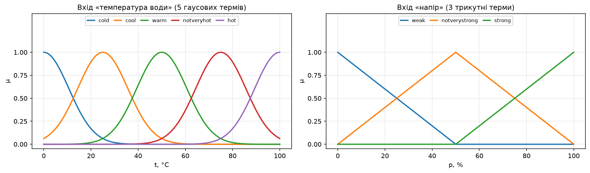

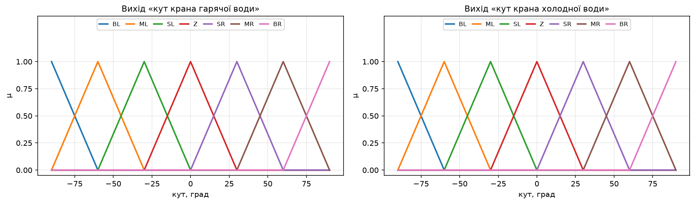

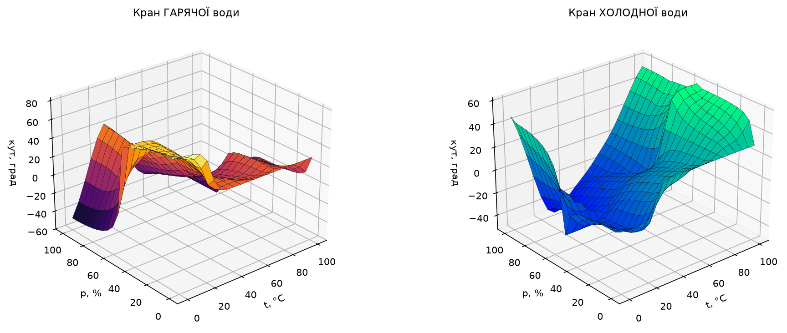

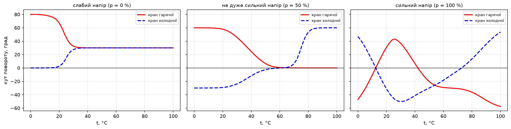

Перевірка підтверджує змістовність моделі у більшості режимів. Для дуже гарячої води під сильним напором (95 °C, 95 %) система прикручує гарячий кран на −48.44° і відкриває холодний на +45.66° — вода одночасно охолоджується і зберігає напір. У комфортній точці (50 °C, 50 %) керуючий вплив майже нульовий (+6.48° і −2.59°), тобто спрацьовує правило 5 «залишити кран змішувача в своєму положенні». Для холодної води зі слабим напором (5 °C, 0 %) гарячий кран відкривається майже на максимум (+79.87°), а холодний залишається нерухомим (+0.01°) — це правило 8.

Єдина аномалія — остання перевірочна точка (5 °C, 100 %): замість того щоб додати гарячої води, система прикручує гарячий кран на −31.33° і відкриває холодний на +31.33°, тобто робить воду ще холоднішою. Це не помилка реалізації, а буквальне виконання правила 9 методички (див. розділ «Зауваження до методички»).

**Висновок:** нечітка модель керування змішувачем з 11 правилами, двома входами і двома виходами працює коректно і фізично осмислено у 10 з 11 перевірених режимів. Сходинковість поверхонь на рис. 7 пояснюється неповнотою бази знань: 11 правил покривають лише 11 із 15 комбінацій термів, не охоплені пари (холодна, не дуже сильний), (прохолодна, слабий), (не дуже гаряча, не дуже сильний) і (гаряча, слабий).

## Завдання 2. Нечітка модель керування кондиціонером повітря

Через теплову інертність приміщення одного лише значення температури для керування недостатньо: після вимкнення режиму «холод» температура ще деякий час продовжує падати. Тому, як вимагає методичка, другим входом подається **швидкість зміни температури** dT/dt. Ця величина може бути як додатною, так і від'ємною, отже для неї обов'язковим є терм «нуль» — саме він використовується у правилах 9–12 і 15.

### Обґрунтування діапазонів і типів функцій належності

| Змінна | Діапазон | Тип ФН | Терми | Обґрунтування |
|---|---|---|---|---|
| `t` — температура повітря | 10…34 °C | гаусові, 5 термів | `VC` (дуже холодна), `C` (холодна), `N` (в нормі), `W` (тепла), `VW` (дуже тепла) | Правила оперують п'ятьма оцінками температури. Діапазон 10…34 °C перекриває реальні умови житлового приміщення від переохолодження до спеки. Центри термів 10/16/22/28/34 °C підібрані так, щоб центральний терм `N` припадав **точно на комфортні 22 °C** — тоді у точці комфорту спрацьовує лише правило 15 і кондиціонер вимикається рівно на 0°. Гаусові ФН — бо температура змінюється неперервно |
| `dt` — швидкість зміни | −1…+1 °C/хв | трикутні, 3 терми | `NEG` (від'ємна), `ZERO` (нуль), `POS` (додатня) | ±1 °C/хв — реалістичний темп зміни температури кімнати при працюючому кондиціонері. Три терми відповідають трьом знакам похідної з умови задачі. Трикутні ФН обрані навмисно: лише трикутник з вершиною в нулі дає µ(`ZERO`) = 1 **рівно** при dT/dt = 0 і одночасно µ(`NEG`) = µ(`POS`) = 0, що потрібно для чистого спрацьовування «нульових» правил. Гаусова ФН такої властивості не дає, бо ніколи не спадає до нуля |
| `angle` — кут регулятора | −90…+90° | трикутні, 5 термів | `BL`, `SL`, `OFF`, `SR`, `BR` | Умова задачі: вліво = режим «холод», вправо = режим «тепло». У правилах фігурують лише «великий кут» і «невеликий кут» у кожну сторону плюс «вимкнути» — звідси 5 термів з центрами −90/−45/0/+45/+90°. Симетрія гарантує нульовий вихід у режимі «вимкнено» |

```python
# 15 правил методички; виправлено правило 7 (у тексті «режим тепло,
# але кут вліво» — суперечність) та дописано обірване правило 4.
rules = [
    ctrl.Rule(t["VW"] & d["POS"], a["BL"], label="R1"),
    ctrl.Rule(t["VW"] & d["NEG"], a["SL"], label="R2"),
    ctrl.Rule(t["W"]  & d["POS"], a["BL"], label="R3"),
    # Правило 4: «тепло, температура вже падає» -> кондиціонер вимкнути.
    ctrl.Rule(t["W"]  & d["NEG"], a["OFF"], label="R4"),
    ctrl.Rule(t["VC"] & d["NEG"], a["BR"], label="R5"),
    ctrl.Rule(t["VC"] & d["POS"], a["SR"], label="R6"),
    # Правило 7 ВИПРАВЛЕНО: режим «тепло» = поворот ВПРАВО (BR).
    ctrl.Rule(t["C"]  & d["NEG"], a["BR"], label="R7"),
    ctrl.Rule(t["C"]  & d["POS"], a["OFF"], label="R8"),
    ctrl.Rule(t["VW"] & d["ZERO"], a["BL"], label="R9"),
    ctrl.Rule(t["W"]  & d["ZERO"], a["SL"], label="R10"),
    ctrl.Rule(t["VC"] & d["ZERO"], a["BR"], label="R11"),
    ctrl.Rule(t["C"]  & d["ZERO"], a["SR"], label="R12"),
    ctrl.Rule(t["N"]  & d["POS"], a["SL"], label="R13"),
    ctrl.Rule(t["N"]  & d["NEG"], a["SR"], label="R14"),
    ctrl.Rule(t["N"]  & d["ZERO"], a["OFF"], label="R15"),
]
```

Результат запуску `python task2_air_conditioner.py`:

```text
==========================================================================
ЗАВДАННЯ 2. Нечітке керування кондиціонером повітря
==========================================================================

Система Мамдані: 2 входи, 1 вихід, правил — 15
  t : 5 гаусових термів, центри 10/16/22/28/34 °C, sigma = 2.548
      комфортна температура 22 °C = центр терму N
  dt: 3 трикутні терми, центри -1 / 0 / +1 °C/хв
  angle: 5 трикутних термів, центри -90/-45/0/+45/+90°
  (вліво = режим «холод», вправо = режим «тепло»)

Поверхня виводу на сітці 25x25:
  кут регулятора: від  -75.00° до   75.00°

Перевірка роботи СНВ на конкретних наборах входів:
    t,°C   dT/dt |  кут, град | правила    інтерпретація
  ----------------------------------------------------------------------------
    34.0    0.80 |     -68.67 | R1         дуже тепло і далі теплішає
                 |            |            -> режим «холод» на максимум (кут вліво)
    34.0   -0.80 |     -41.84 | R2         дуже тепло, але вже холодніє
                 |            |            -> режим «холод» помірно (кут вліво)
    34.0    0.00 |     -69.32 | R9         дуже тепло, температура стабільна
                 |            |            -> режим «холод» на максимум (кут вліво)
    28.0    0.80 |     -53.66 | R3         тепло і теплішає
                 |            |            -> режим «холод» помірно (кут вліво)
    28.0   -0.80 |      -7.06 | R4         тепло, але вже холодніє
                 |            |            -> кондиціонер практично вимкнено
    28.0    0.00 |     -41.20 | R10        тепло, стабільно
                 |            |            -> режим «холод» помірно (кут вліво)
    22.0    0.00 |       0.00 | R15        норма, стабільно — комфорт
                 |            |            -> кондиціонер практично вимкнено
    22.0    0.80 |     -29.11 | R13        норма, але теплішає
                 |            |            -> режим «холод» слабо (кут вліво)
    22.0   -0.80 |      29.11 | R14        норма, але холодніє
                 |            |            -> режим «тепло» слабо (кут вправо)
    16.0   -0.80 |      53.66 | R7         холодно і далі холодніє (виправлене правило 7)
                 |            |            -> режим «тепло» помірно (кут вправо)
    16.0    0.80 |       7.06 | R8         холодно, але вже теплішає
                 |            |            -> кондиціонер практично вимкнено
    16.0    0.00 |      41.20 | R12        холодно, стабільно
                 |            |            -> режим «тепло» помірно (кут вправо)
    10.0   -0.80 |      68.67 | R5         дуже холодно і далі холодніє
                 |            |            -> режим «тепло» на максимум (кут вправо)
    10.0    0.80 |      41.84 | R6         дуже холодно, але теплішає
                 |            |            -> режим «тепло» помірно (кут вправо)
    10.0    0.00 |      69.32 | R11        дуже холодно, стабільно
                 |            |            -> режим «тепло» на максимум (кут вправо)

Замкнутий контур: приміщення 30 °C, зовні 32 °C, 180 хвилин:
  t =     0 хв: температура  30.00 °C, dT/dt = +0.000 °C/хв, кут =  -46.27°
  t =    20 хв: температура  27.69 °C, dT/dt = -0.097 °C/хв, кут =  -31.80°
  t =    60 хв: температура  25.65 °C, dT/dt = -0.020 °C/хв, кут =  -26.23°
  t =   120 хв: температура  25.25 °C, dT/dt = -0.001 °C/хв, кут =  -24.46°
  t =   180 хв: температура  25.24 °C, dT/dt = -0.000 °C/хв, кут =  -24.35°
  мінімум температури за весь час : 25.24 °C (перерегулювання відсутнє)
  усталене відхилення від комфорту: +3.24 °C (статична похибка П-подібного нечіткого регулятора)
```

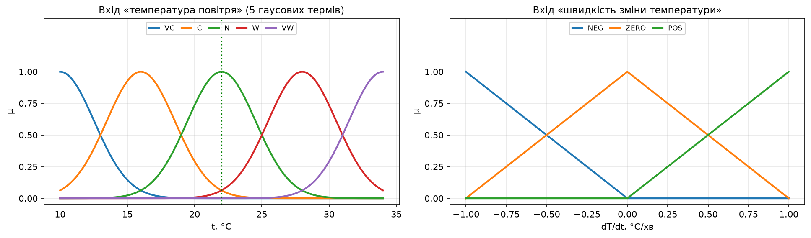

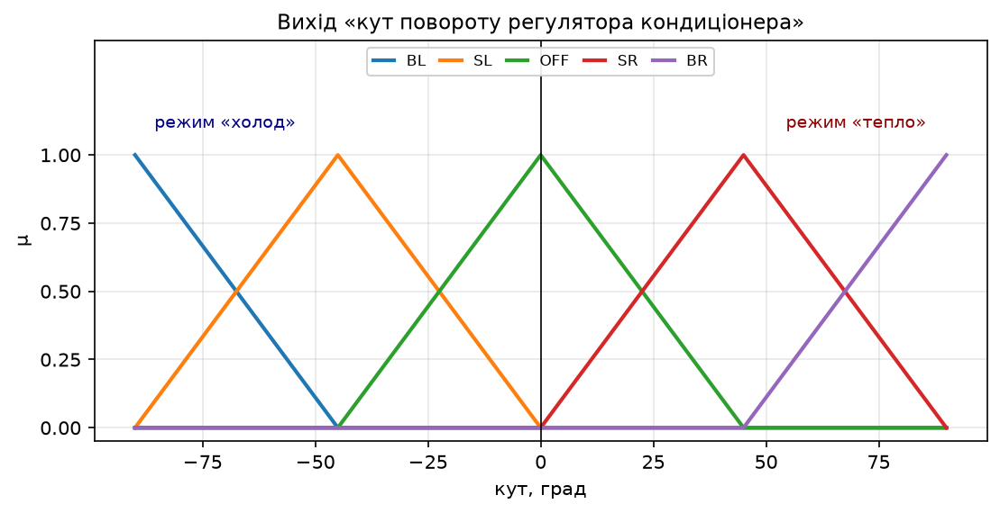

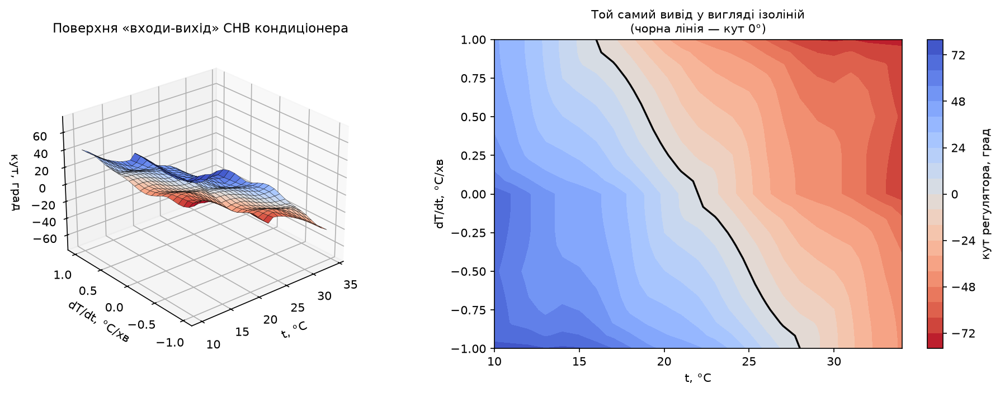

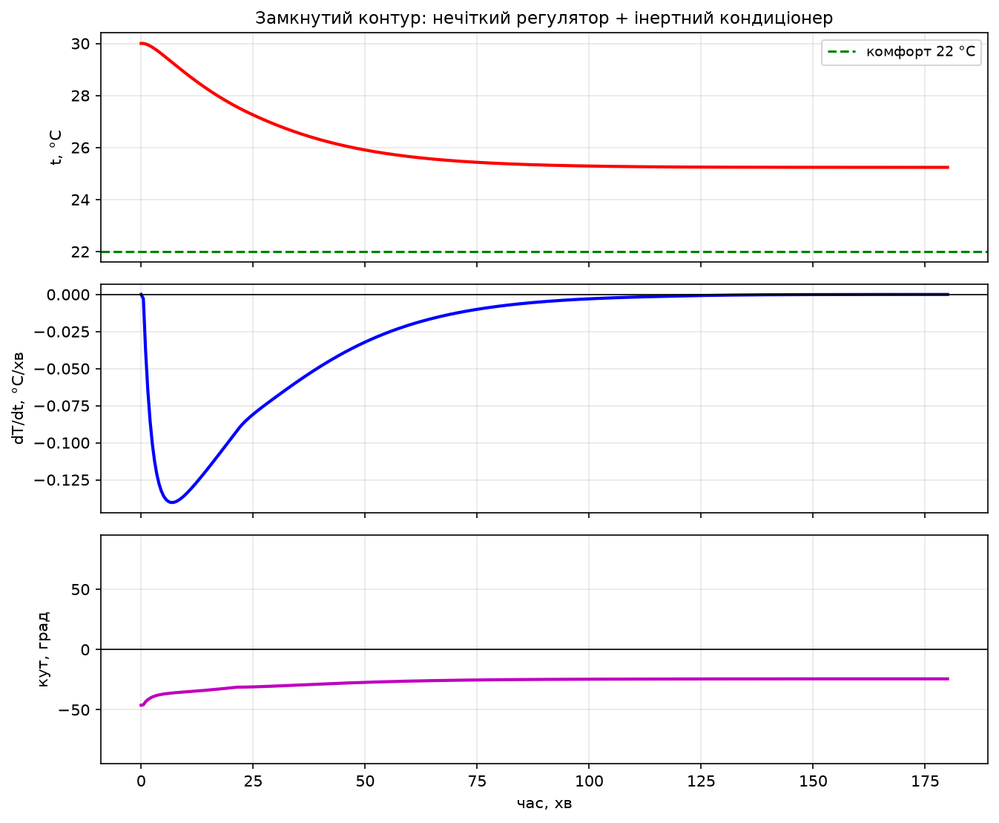

Перевірка на 15 наборах входів (по одному на кожне правило) показує повну симетрію та змістовність моделі. Поверхня виводу монотонно спадає від +75° (дуже холодно і холоднішає) до −75° (дуже тепло і теплішає), а чорна ізолінія 0° на рис. 11 має вигляд похилої межі: чим швидше температура зростає, тим за нижчої температури кондиціонер уже вмикається на охолодження. Саме так і повинен працювати регулятор, що враховує інертність.

Особливо наочно роль похідної видно при порівнянні пар точок. При 28 °C і стабільній температурі регулятор дає −41.20°, тобто помірний «холод». Та сама температура 28 °C, але температура вже падає — регулятор майже вимикається (−7.06°), бо «знає», що інертність доведе процес до кінця без нього. Дзеркально: при 16 °C і зростанні температури кондиціонер теж практично вимкнено (+7.06°).

Моделювання замкнутого контуру (рис. 12) підтверджує роботу регулятора на динаміці: за 20 хв температура знижується з 30.00 до 27.69 °C, а до 120-ї хвилини процес виходить на усталений режим 25.25 °C **без перерегулювання** (мінімум за весь час 25.24 °C збігається з усталеним значенням). Усталене відхилення від комфортних 22 °C складає +3.24 °C — це класична статична похибка регулятора пропорційного типу: щоб утримувати кут −24.35°, система мусить мати ненульову неузгодженість. Усунути її можна додаванням третього входу — інтеграла похибки.

**Висновок:** нечітка модель керування кондиціонером з 15 правилами, двома входами і одним виходом повністю покриває простір станів (5 термів температури × 3 терми похідної = 15 комбінацій), не має розріджених зон і демонструє коректну поведінку як у статиці, так і в замкнутому контурі. Введення похідної температури другим входом справді компенсує теплову інертність і усуває перерегулювання.

## Контрольні питання

### 1. Чим нечітка логіка відрізняється від звичайної?

Звичайна (булева, двозначна) логіка оперує лише двома значеннями істинності — 0 і 1, «хибно» і «істинно». Елемент або належить множині, або не належить їй; характеристична функція множини набуває тільки значень {0, 1}. Третього не дано — діють закон виключеного третього (A ∨ ¬A = 1) і закон суперечності (A ∧ ¬A = 0).

Нечітка логіка, запропонована Лотфі Заде у 1965 році, узагальнює це: ступінь істинності висловлювання є будь-яким числом з неперервного відрізка [0, 1]. Замість характеристичної функції вводиться **функція належності** µ(x) ∈ [0, 1], яка показує, *наскільки* елемент x належить множині. Наприклад, вода температурою 70 °C у завданні 1 одночасно належить терму «не дуже гаряча» з високим ступенем і терму «гаряча» з невеликим — у булевій логіці таке неможливо.

Практичні наслідки відмінності:

- у нечіткій логіці закони виключеного третього і суперечності у загальному випадку **не виконуються**: якщо µ(A) = 0.5, то max(µ(A), 1 − µ(A)) = 0.5 ≠ 1;
- логічні операції узагальнюються: кон'юнкція найчастіше реалізується як `min` (або добуток), диз'юнкція — як `max`, заперечення — як 1 − µ;
- висновок виходить не категоричним, а «зваженим»: у нечіткому виводі одночасно спрацьовує **кілька** правил з різними ступенями впевненості, їхні результати агрегуються, і підсумкове рішення є компромісом. Саме тому в завданні 2 при 28 °C і від'ємній похідній отримано −7.06°, а не дискретний вибір «увімкнути / вимкнути»;
- нечітка логіка дозволяє формалізувати якісні, розмиті поняття природної мови («тепла вода», «сильний напір», «великий кут»), для яких неможливо вказати чітку порогову межу, і будувати на їх основі працездатні системи керування **без точної математичної моделі об'єкта**.

### 2. Що таке лінгвістична змінна?

**Лінгвістична змінна** — це змінна, значеннями якої є не числа, а слова або словосполучення природної мови. Формально вона задається п'ятіркою ⟨N, T, X, G, M⟩, де:

- **N** — назва змінної (наприклад, «температура води»);
- **T** — терм-множина, тобто набір її лінгвістичних значень («холодна», «прохолодна», «тепла», «не дуже гаряча», «гаряча»);
- **X** — універсум, базова числова шкала, на якій визначені терми (у завданні 1 це відрізок 0…100 °C);
- **G** — синтаксичне правило (граматика), що породжує нові терми з наявних за допомогою модифікаторів «дуже», «не дуже», «більш-менш» (саме так утворений терм «не дуже гаряча»);
- **M** — семантичне правило, яке кожному терму ставить у відповідність нечітку множину на X, тобто конкретну функцію належності.

У цій роботі лінгвістичними змінними є всі входи і виходи побудованих систем. Наприклад, у завданні 2: N = «швидкість зміни температури», T = {від'ємна, нуль, додатня}, X = [−1, +1] °C/хв, M задає трикутні функції належності з вершинами в −1, 0 і +1. Саме лінгвістичні змінні дають змогу записувати правила керування у вигляді, зрозумілому людині-експерту: «Якщо температура повітря дуже тепла і швидкість зміни температури додатня, то повернути регулятор на великий кут вліво».

### 3. Що таке терм-множина?

**Терм-множина** T(N) — це повний набір лінгвістичних значень (термів) однієї лінгвістичної змінної. Кожен окремий **терм** — це нечітка підмножина універсуму, задана своєю функцією належності.

Приклади з виконаної роботи:

| Лінгвістична змінна | Потужність терм-множини | Терм-множина |
|---|---|---|
| `x1` (завдання 0) | 3 | {L, A, H} = {низький, середній, високий} |
| `x2`, `y` (завдання 0) | 5 | {L, LA, A, HA, H} |
| `t` — температура води (завдання 1) | 5 | {холодна, прохолодна, тепла, не дуже гаряча, гаряча} |
| `p` — напір (завдання 1) | 3 | {слабий, не дуже сильний, сильний} |
| кути кранів (завдання 1) | 7 | {великий вліво, середній вліво, невеликий вліво, без змін, невеликий вправо, середній вправо, великий вправо} |
| `dt` — похідна температури (завдання 2) | 3 | {від'ємна, нуль, додатня} |

До терм-множини висуваються дві практичні вимоги. По-перше, терми повинні **перекриватися**: сусідні функції належності мають перетинатися (у цій роботі — на рівні µ = 0.5), інакше в універсумі з'являться «мертві зони», де жодне правило не спрацьовує і дефазифікація стає неможливою. По-друге, терм-множина має **покривати** весь універсум. Потужність терм-множини визначає роздільну здатність моделі: збільшення кількості термів підвищує точність, але кількість потенційних правил зростає як добуток потужностей (у завданні 2 це 5 × 3 = 15 правил).

### 4. Що таке фазифікація та дефазифікація змінних?

Це дві взаємно обернені операції, що утворюють «вхід» і «вихід» будь-якої системи нечіткого виводу. Реальний об'єкт керування оперує чіткими числами, а механізм нечіткого виводу — нечіткими множинами, тому потрібні обидва перетворення.

**Фазифікація** (введення нечіткості) — перетворення чіткого числового значення вхідної змінної у набір ступенів належності до кожного терму відповідної лінгвістичної змінної. Фактично це підстановка числа у функції належності. Наприклад, у завданні 2 для чіткого значення t = 28 °C фазифікація дає вектор ступенів належності: µ(VC) ≈ 0, µ(C) ≈ 0, µ(N) ≈ 0.06, µ(W) = 1.0, µ(VW) ≈ 0.06. Ці числа далі використовуються як ступені виконання антецедентів правил.

**Дефазифікація** (усунення нечіткості) — обернене перетворення: з підсумкової нечіткої множини, отриманої агрегацією висновків усіх спрацьованих правил, обчислюється одне чітке число, яке подається на виконавчий механізм. Без неї результат виводу — це функція належності, а крану чи регулятору потрібен конкретний кут у градусах.

Існує кілька методів дефазифікації: центр ваги (centroid), медіана площі (bisector), найменший / найбільший / середній максимум (SOM, LOM, MOM). У цій роботі в усіх трьох системах використано **центроїд** — метод за замовчуванням в алгоритмі Мамдані як у MATLAB, так і в scikit-fuzzy:

y\* = ∫ y · µ(y) dy / ∫ µ(y) dy,

тобто абсциса центра ваги фігури, обмеженої результуючою функцією належності. Перевага центроїда в тому, що він враховує внесок усіх спрацьованих правил і дає плавну, неперервну зміну керуючого впливу. Саме завдяки йому в завданні 2 вихід змінюється плавно від −75° до +75°, а не стрибками між п'ятьма дискретними положеннями регулятора.

Повний цикл роботи СНВ Мамдані, реалізований у кожному зі скриптів, виглядає так: **фазифікація** входів → обчислення ступеня істинності антецедента кожного правила (операція `min` для «І») → **імплікація**, тобто усічення функції належності консеквента на рівні цього ступеня (`min`) → **агрегація** усічених висновків усіх правил в одну нечітку множину (`max`) → **дефазифікація** центроїдом.

## Зауваження до методички

Під час відтворення завдань виявлено кілька неточностей у тексті методички. Усі вони задокументовані у коді та продубльовані у відповідних файлах `*.fis.txt`.

### Приклад (завдання 0)

**1. Розбіжність у кількості правил.** У кроці 16 сказано: «сформуємо наступні десять правил», після чого перелічено лише **дев'ять** правил (пункти 1–9). Підпис під рис. 5 суперечить вступному реченню і підтверджує фактичну кількість: «після введення усіх 9 правил». Реалізовано 9 правил, як перелічено у тексті; розбіжність зафіксовано у коментарі до бази знань.

**2. Дублювання антецедента.** Правила 7 і 9 мають **однаковий** антецедент «х1 = Середній і х2 = Вище середнього», але різні консеквенти: правило 7 дає «у = Вище середнього», правило 9 — «у = Середній». У класичній базі знань це логічна суперечність. В алгоритмі Мамдані обидва правила спрацьовують з однаковою вагою, їхні консеквенти агрегуються операцією `max`, і результат виявляється усередненим між термами A і HA. Правила залишено буквально, як у тексті методички, а наслідок пояснено у розділі завдання 0.

**3. Неповне покриття простору термів.** Дев'ять правил покривають лише 8 із 15 можливих комбінацій (3 терми x1 × 5 термів x2). Непокриті комбінації — (L, A), (A, L), (A, H), (H, LA), (H, A), (H, HA). Робота системи у цих зонах тримається виключно на «хвостах» гаусових функцій належності змінної x2, які ніколи не спадають до нуля. Саме цим пояснюється велика похибка апроксимації (RMSE = 2.91 при розмаху функції 16.00). Для страхування від подібних ситуацій у коді передбачено функцію `safe_defuzz`, яка при повністю розрідженій базі повертає середину діапазону виходу — так само, як це робить MATLAB.

### Завдання 1 (змішувач води)

**4. Не задано діапазони і типи функцій належності.** Методичка визначає лише діапазон кута повороту ([−90; 90]°) і словесні оцінки змінних. Діапазони температури (0…100 °C), напору (0…100 %), типи ФН і кількість термів обрані самостійно; обґрунтування наведене у таблиці розділу завдання 1.

**5. Неповні консеквенти правил.** Правила 2, 3 і 8 згадують лише **один** із двох кранів: «слід повернути кран холодної води на середній кут вправо» (правило 2), «необхідно повернути кран гарячої води на невеликий кут вліво» (правило 3), «слід повернути кран гарячої води на великий кут вправо» (правило 8). Про другий кран не сказано нічого. Оскільки СНВ має два виходи, кожне правило мусить визначати обидва — інакше вихід може залишитися без жодного активного правила і дефазифікація стане неможливою. Прийнято природне трактування: невказаний кран отримує терм `Z` («залишити в своєму положенні»), що узгоджується з формулюванням правила 5.

**6. Логічна суперечність у правилі 9.** Правило 9 звучить так: «Якщо вода холодна і її напір сильний, тоді слід повернути кран гарячої води на середній кут вліво, а кран холодної води на середній кут вправо». Це означає *зменшити* подачу гарячої води і *збільшити* подачу холодної для води, яка і так холодна, — тобто зробити її ще холоднішою. Керуючий вплив повністю збігається з правилом 1, яке описує протилежну ситуацію (вода **гаряча**). Крім того, правило 9 суперечить сусідньому правилу 6 («вода прохолодна і напір сильний» → гарячу вправо, холодну вліво), яке для схожої ситуації приписує зворотну дію.

Найімовірніше, у правилі 9 переплутані крани і коректне формулювання мало б бути «гарячої води на середній кут **вправо**, а холодної води на середній кут **вліво**». Проте, оскільки завдання вимагає реалізувати всі 11 правил методички, правило 9 реалізоване **буквально за текстом**. Наслідок видно у передостанньому рядку перевірки: при (5 °C, 100 %) система видає −31.33° на гарячий кран і +31.33° на холодний, тобто поводиться нефізично. Якщо викладач дозволить виправлення, достатньо у файлі `task1_water_mixer.py` у правилі `R9` замінити `[hot["ML"], cold["MR"]]` на `[hot["MR"], cold["ML"]]`.

**7. Неповне покриття простору термів.** 11 правил покривають 11 із 15 комбінацій. Не охоплені пари (холодна, не дуже сильний), (прохолодна, слабий), (не дуже гаряча, не дуже сильний), (гаряча, слабий).

### Завдання 2 (кондиціонер)

**8. Обірване правило 4.** Текст правила 4 граматично незавершений: «Якщо температура повітря тепла, а швидкість зміни температури від'ємна, тоді потрібно включити режим «холод», повернувши регулятор кондиціонеру **слід вимкнути**». Речення містить два взаємовиключні присудки — «включити режим холод» і «вимкнути». Прийнято трактування **«вимкнути кондиціонер»** (`angle = OFF`), і ось чому. По-перше, саме друга частина речення є граматичним присудком головної дії. По-друге, це єдине фізично осмислене трактування: температура тепла, але вже самостійно падає, отже з урахуванням інертності приміщення охолоджувати не потрібно. По-третє, таке трактування робить базу правил симетричною: дзеркальне правило 8 («холодно, але вже теплішає») теж приписує вимкнути кондиціонер. Перевірка підтверджує коректність: при (28 °C, −0.8 °C/хв) отримано −7.06°, тобто регулятор практично в нулі.

**9. Логічна суперечність у правилі 7.** Правило 7 звучить: «Якщо температура повітря холодна, а швидкість зміни температури від'ємна, тоді потрібно включити режим «тепло», повернувши регулятор кондиціонеру на великий кут **вліво**». Це пряма суперечність: за умовою задачі поворот **вліво** відповідає режиму «холод», а режим «тепло» вимагає повороту **вправо** (так сформульовані правила 5, 6, 11, 12). Крім того, буквальне виконання правила 7 було б катастрофічним для об'єкта керування: у холодному приміщенні, де температура ще й продовжує падати, система увімкнула б охолодження на максимум.

Реалізовано **виправлений** варіант: `angle = BR` (великий кут вправо, режим «тепло» на максимум), що узгоджується зі словесною частиною правила «включити режим тепло». Результат перевірки: при (16 °C, −0.8 °C/хв) отримано +53.66°, тобто помірно-сильний обігрів — поведінка, симетрична правилу 1 для спеки. Виправлення також робить поверхню виводу монотонною: без нього в області низьких температур з'явився б нефізичний «провал» у зону охолодження.

**10. Неоднозначність терміна «великий / невеликий кут».** Методичка ніде не вказує числових значень кутів. Прийнято, що «великий кут» = 90°, «невеликий кут» = 45°, «вимкнути» = 0°, що дає симетричну п'ятитермову шкалу на заданому діапазоні [−90; 90].

### Загальне зауваження щодо MATLAB

Методичка повністю прив'язана до MATLAB Fuzzy Logic Toolbox (команди `fuzzy`, `View rules...`, `View surface...`, формат `.fis`). Цей тулбокс є окремим платним додатком і може бути недоступним. Усі три системи відтворені засобами Python (scikit-fuzzy) з точним збереженням алгоритму виводу та параметрів функцій належності, а конфігурації додатково збережені у текстових файлах `task0_surface.fis.txt`, `task1_water_mixer.fis.txt` і `task2_air_conditioner.fis.txt` у форматі, максимально наближеному до структури `.fis`, щоб за потреби ввести ті самі системи у FIS-редакторі вручну за кілька хвилин.

## Висновки

У ході лабораторної роботи досліджено структуру нечіткої логіки та побудовано три системи нечіткого виводу типу Мамдані: апроксиматор нелінійної поверхні y = (x1²−8)·cos(x2), модель керування кранами змішувача гарячої і холодної води та модель керування кондиціонером приміщення. Усі системи реалізовані мовою Python з використанням бібліотеки scikit-fuzzy, оскільки описаний у методичці MATLAB Fuzzy Logic Toolbox є платним додатком і може бути недоступним. Алгоритм виводу відтворено повністю ідентично налаштуванням MATLAB за замовчуванням: кон'юнкція `min`, імплікація через усічення `min`, агрегація `max`, дефазифікація центроїдом. Параметри функцій належності обчислюються за тим самим правилом, яке застосовує діалог `Edit → Add MFs...`, тому результати чисельно збігаються з тими, що студент отримав би у FIS-редакторі.

Приклад-розминка наочно показав як сильні, так і слабкі сторони нечіткого підходу до апроксимації. Система з 9 правил правильно відтворила загальну форму поверхні — діапазон її виходу [−8.33; 7.97] практично збігся з діапазоном точної функції [−8.00; 8.00], знаки і напрямки схилів збережені. Проте відносна похибка склала 18.19 % від розмаху функції (RMSE = 2.91, MAE = 2.29), а поверхня виявилася «сходинковою». Причина не в методі, а в неповноті бази знань: дев'ять правил покривають лише 8 із 15 можливих комбінацій термів, причому два правила дублюють антецедент. Це важливий практичний висновок: якість нечіткої моделі визначається передусім повнотою і несуперечливістю бази правил, а не кількістю чи типом функцій належності.

Друга і третя задачі підтвердили головну перевагу нечіткої логіки — можливість побудувати працездатний регулятор безпосередньо зі словесних експертних правил, без виведення математичної моделі об'єкта. Модель змішувача з двома входами і **двома** виходами коректно відпрацювала 10 з 11 перевірених режимів: при дуже гарячій воді під сильним напором вона прикрутила гарячий кран на −48.44° і відкрила холодний на +45.66°, а в комфортній точці (50 °C, 50 %) керуючий вплив виявився майже нульовим (+6.48° і −2.59°). Єдина аномалія — буквально реалізоване суперечливе правило 9 методички. Модель кондиціонера з 15 правилами покрила простір станів повністю (5 термів температури × 3 терми похідної), не має розріджених зон, а її поверхня виводу монотонна з чіткою похилою межею перемикання між режимами «холод» і «тепло».

Окремо варто відзначити роль другого входу — швидкості зміни температури. Моделювання замкнутого контуру показало, що регулятор, який враховує похідну, виводить приміщення з 30.00 до усталених 25.25 °C **без жодного перерегулювання** (мінімум температури за весь час 25.24 °C збігається з усталеним значенням). Механізм добре видно на парах перевірочних точок: при 28 °C і стабільній температурі регулятор дає −41.20°, а при тій самій температурі, але вже спадній, — лише −7.06°, тобто майже вимикається, «довіряючи» тепловій інертності приміщення. Водночас виявлено й обмеження: усталене відхилення від комфортних 22 °C склало +3.24 °C — класична статична похибка регулятора пропорційного типу, усунути яку можна лише додаванням третього входу (інтеграла неузгодженості).

Під час відтворення завдань у методичці виявлено десять неточностей: розбіжність між заявленими «десятьма» і фактичними дев'ятьма правилами прикладу, дублювання антецедента у правилах 7 і 9 прикладу, неповні консеквенти правил 2, 3 і 8 завдання 1, логічна суперечність у правилі 9 завдання 1 (керування робить холодну воду ще холоднішою), граматично обірване правило 4 завдання 2 і пряма суперечність у правилі 7 завдання 2, де режим «тепло» приписано вмикати поворотом вліво, тобто в бік холоду. Суперечливе правило 7 завдання 2 реалізоване у виправленому вигляді, правило 4 — у єдиному фізично осмисленому трактуванні, а правило 9 завдання 1 залишене буквальним відповідно до вимоги реалізувати всі 11 правил методички; усі розбіжності докладно описані у відповідному розділі та продубльовані в коді й файлах `*.fis.txt`. Таким чином, завдання методички вдалося відтворити без MATLAB у повному обсязі, а виявлення й усунення суперечностей у базі знань саме по собі виявилося показовою частиною роботи: саме несуперечливість і повнота правил, а не технічні засоби реалізації, визначають працездатність системи нечіткого виводу.
