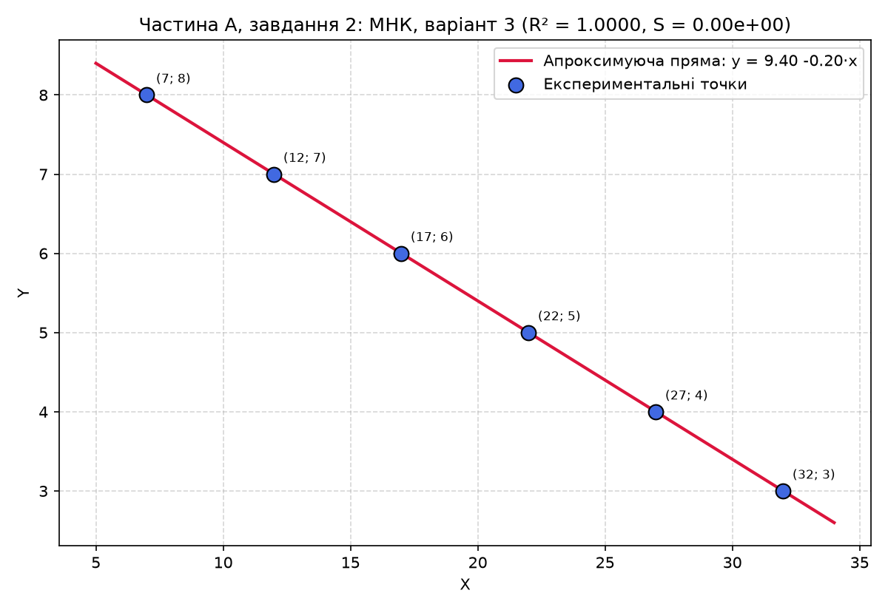
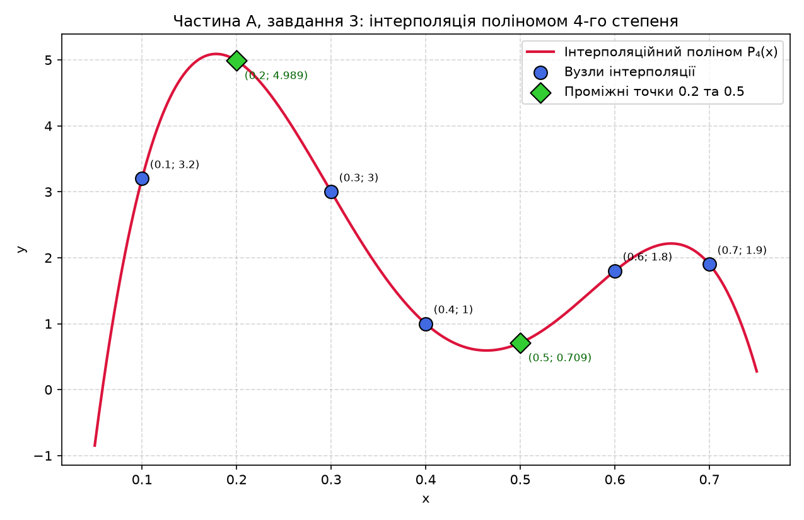
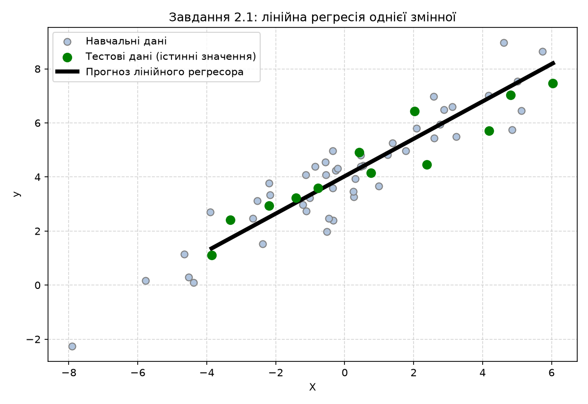
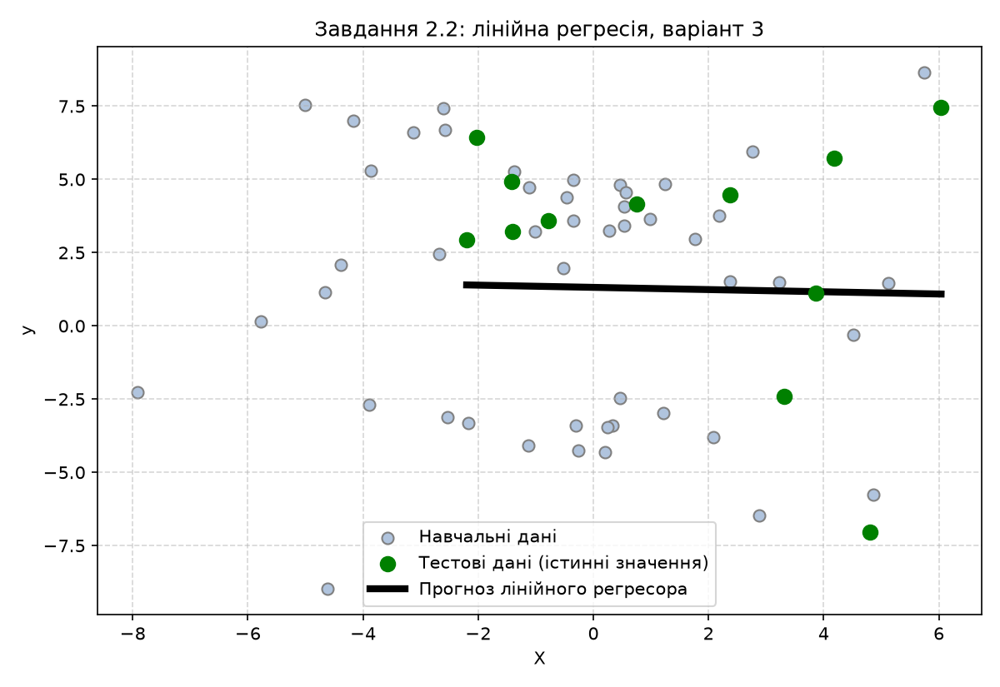
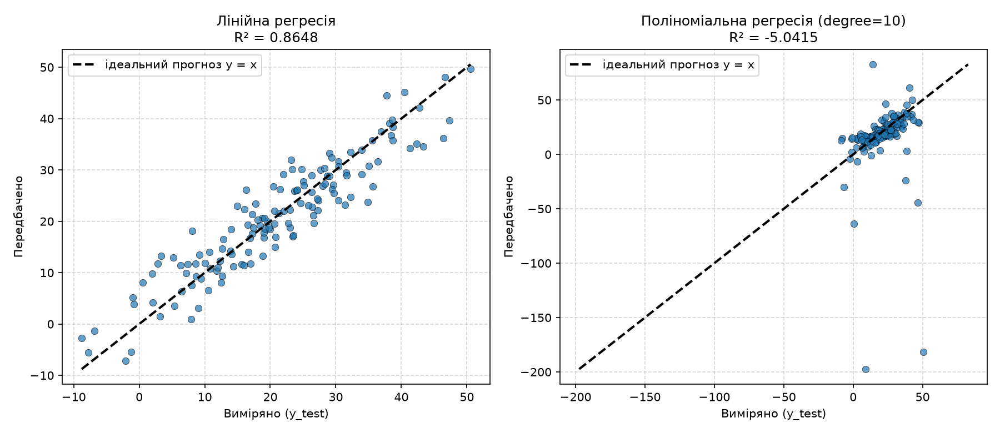
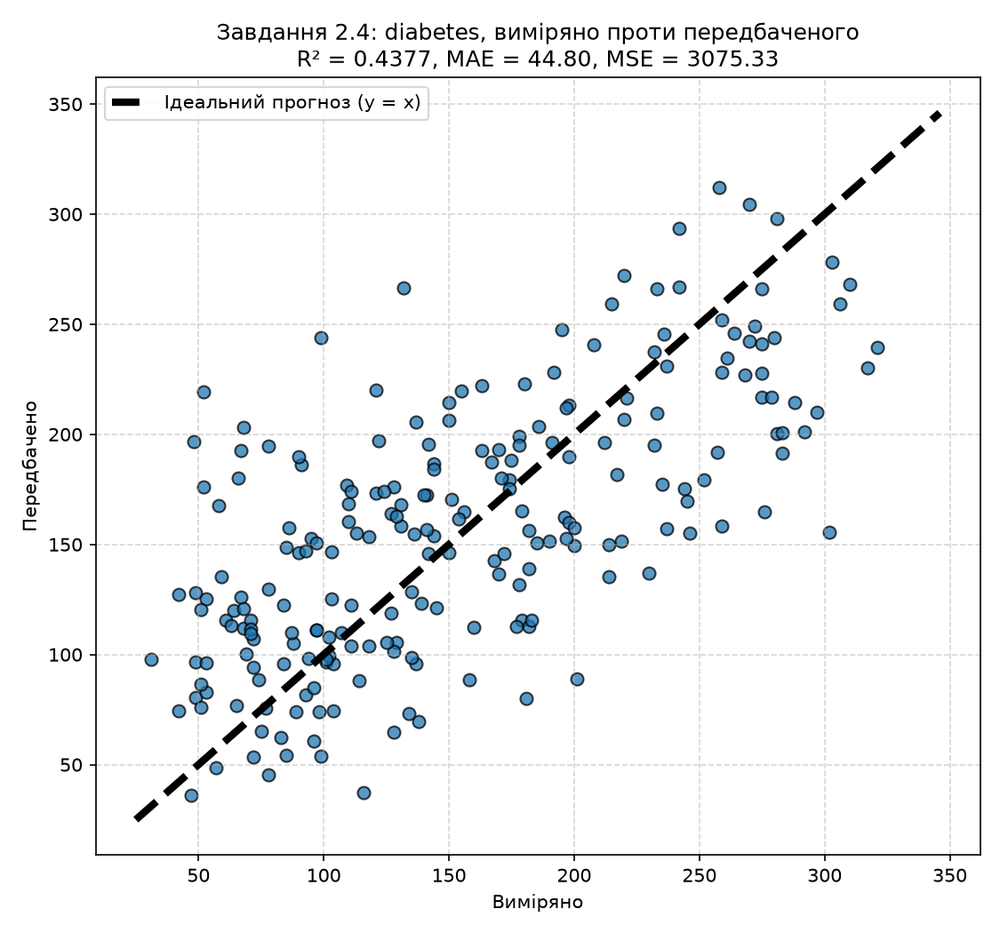
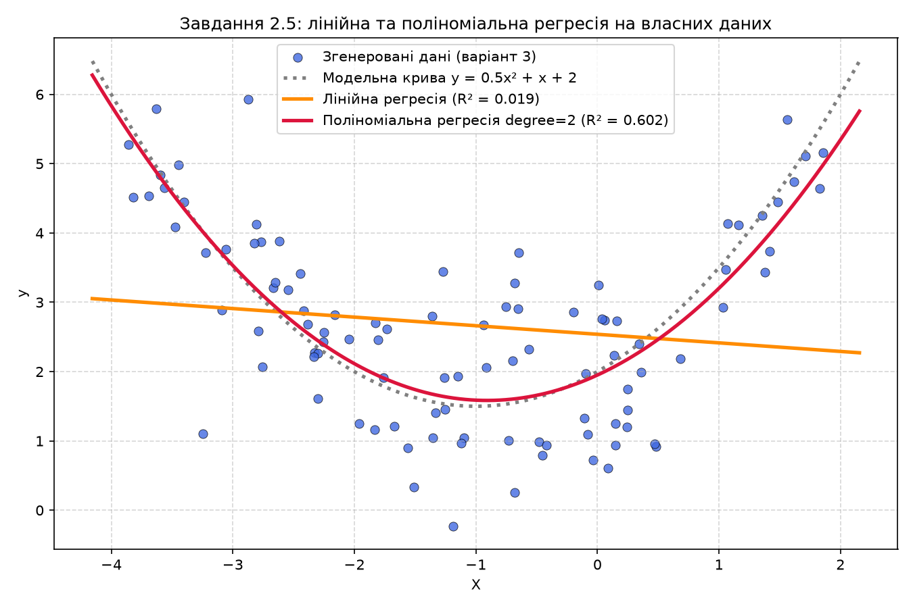
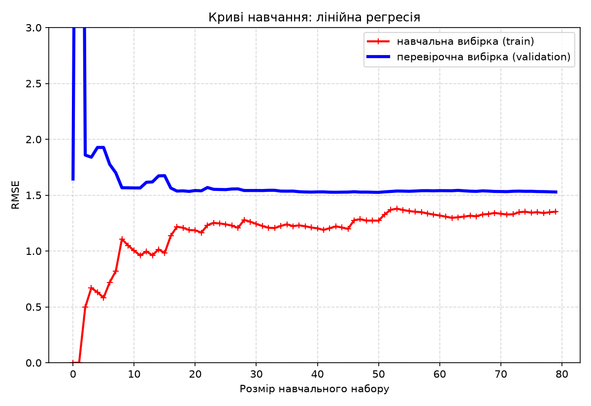
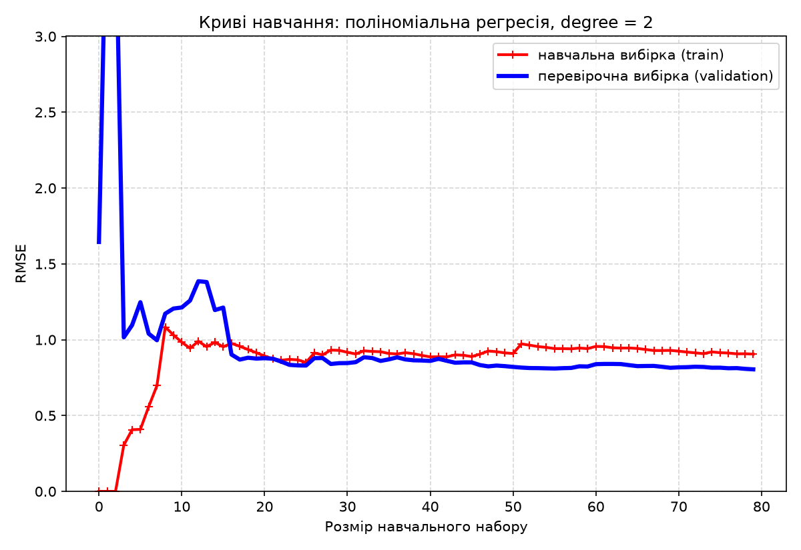
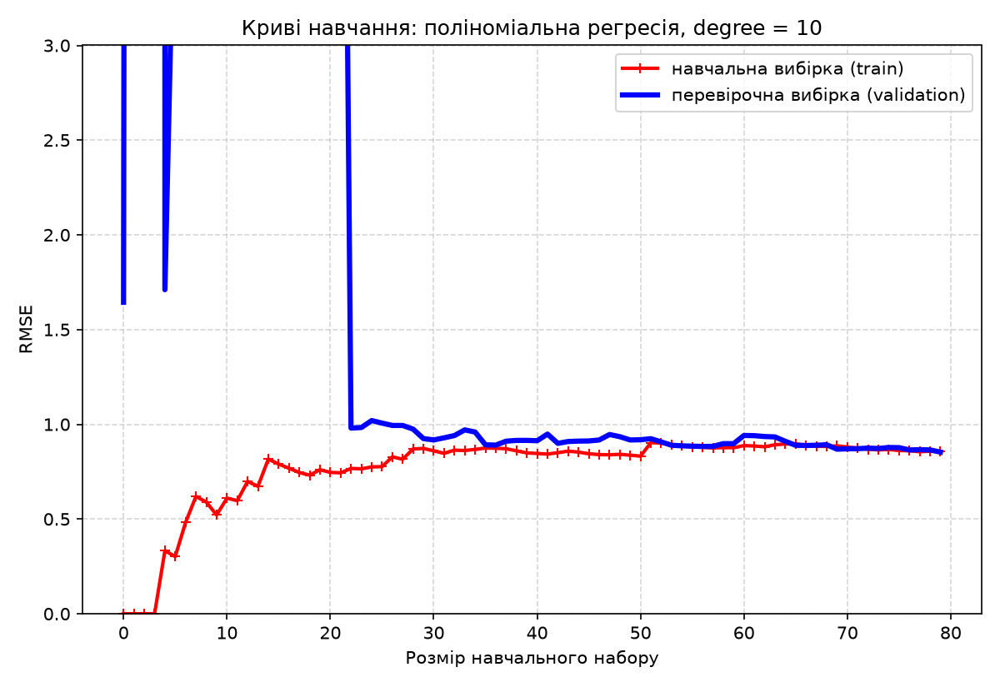

Виконав: Камінський Олексій Дмитрович, група ВТ-23-2, номер у списку 3.

## Мета

Опрацювати поняття «лінійна регресія», дослідити метод найменших квадратів (МНК) та задачу інтерполяції, а також засобами мови Python і бібліотеки scikit-learn дослідити методи регресії даних у машинному навчанні: регресію однієї змінної, багатовимірну та поліноміальну регресію, оцінювання якості моделей за метриками (MAE, MSE, Median AE, Explained variance, R²), збереження моделей та аналіз кривих навчання.

Роботу виконано за **варіантом 3**. Усі розрахунки виконано в середовищі Python 3 (numpy 2.5.3, scipy 1.18.1, scikit-learn 1.9.1, matplotlib); усі числа у звіті є реальним виводом наведених програм.


## Частина А. Метод найменших квадратів та інтерполяція

### Завдання 1 (частина А). Теоретичні відомості

Завдання 1 методички — опрацювати теоретичні відомості з лекційного курсу. Нижче наведено
стислий конспект того, на чому побудована вся частина А, і контрольний перерахунок
розібраного в методичці прикладу.

**Регресія** обчислює числову величину (на відміну від класифікації, яка обирає категорію).
Проста лінійна регресія описує залежність `y = β₀ + β₁·x + ε`, де `β₀` — зсув (значення `y`
при `x = 0`), `β₁` — нахил прямої, `ε` — випадкова помилка спостереження. Разом `β₀` і `β₁`
називають модельними коефіцієнтами.

**Метод найменших квадратів (МНК)** оцінює ці коефіцієнти з умови мінімуму суми квадратів
похибок `S(β₀, β₁) = Σᵢ(yᵢ − β₀ − β₁·xᵢ)²`. Мінімум знаходять, прирівнявши до нуля часткові
похідні `∂S/∂β₀` і `∂S/∂β₁`, що дає систему двох рівнянь із двома невідомими — **нормальні
рівняння**:

```
n·β₀    + (Σx)·β₁  = Σy
(Σx)·β₀ + (Σx²)·β₁ = Σxy
```

Її розв'язок: `β₁ = (n·Σxy − Σx·Σy) / (n·Σx² − (Σx)²)`, `β₀ = (Σy − β₁·Σx) / n`.

**Розібраний приклад методички.** Дано чотири точки: (1,6), (2,5), (3,7), (4,10). Потрібно
знайти пряму `y = β₀ + β₁·x`, що найкраще підходить цим точкам. Методичка наводить відповідь
`β₀ = 3.5`, `β₁ = 1.4`, тобто `y = 3.5 + 1.4x`, із мінімальною сумою квадратів похибок
`S(3.5, 1.4) = 1.1² + (−1.3)² + (−0.7)² + 0.9² = 4.2`. Цей приклад перераховано програмно
тими самими формулами, якими далі розв'язується варіант 3 — щоб переконатися, що реалізація
нормальних рівнянь правильна ще до застосування її до власних даних.

```python
Xe = np.array([1.0, 2.0, 3.0, 4.0])    # абсциси чотирьох точок прикладу
Ye = np.array([6.0, 5.0, 7.0, 10.0])   # ординати чотирьох точок прикладу
ne = len(Xe)                           # кількість точок у прикладі (N = 4)
# Ті самі нормальні рівняння: D = n*Σx² - (Σx)², b1 = (n*Σxy - Σx*Σy)/D, b0 = (Σy - b1*Σx)/n
De = ne * (Xe * Xe).sum() - Xe.sum() ** 2                               # визначник системи
b1e = (ne * (Xe * Ye).sum() - Xe.sum() * Ye.sum()) / De                 # нахил прямої β1
b0e = (Ye.sum() - b1e * Xe.sum()) / ne                                  # зсув прямої β0
Se = ((Ye - (b0e + b1e * Xe)) ** 2).sum()                               # мінімум S(β0, β1)
```

```text
ЧАСТИНА А. ЗАВДАННЯ 1. КОНТРОЛЬ ТЕОРЕТИЧНОГО ПРИКЛАДУ МЕТОДИЧКИ
Точки прикладу: (1,6), (2,5), (3,7), (4,10)
  Σx = 10.0, Σy = 28.0, Σx² = 30.0, Σxy = 77.0
  Нормальні рівняння дають: β0 = 3.5000, β1 = 1.4000  => y = 3.5 + 1.4·x
  Залишки e_i = [ 1.1 -1.3 -0.7  0.9]
  Мінімальна сума квадратів похибок S(β0, β1) = 4.2000
  Очікування методички: β0 = 3.5, β1 = 1.4, S = 4.2 -> збіг: так
```

**Інтерполяція**, яку розглядає завдання 3, ставить іншу задачу: знайти поліном
`Qₘ(x) = c₀ + c₁x + … + cₘxᵐ` можливо найнижчого степеня, який у заданих вузлах `xᵢ`
приймає **точно** ті самі значення, що й функція. Для `n + 1` вузла такий поліном має
степінь `n`, а його коефіцієнти знаходять із системи `X·A = Y`, де `X` — матриця Вандермонда.
Різниця принципова: МНК шукає компроміс і згладжує похибки вимірювань, інтерполяція вимагає
точного проходження через вузли й нічого не згладжує.

**Висновок:** Реалізація нормальних рівнянь МНК перевірена на розібраному в методичці
прикладі й відтворює його до останньої цифри (`β₀ = 3.5`, `β₁ = 1.4`, `S = 4.2`), тому
результати для варіанта 3 нижче отримані вже перевіреним кодом.

### Завдання 2 (частина А). Метод найменших квадратів, варіант 3

За варіантом 3 експериментально отримано шість пар значень:

| X | 7 | 12 | 17 | 22 | 27 | 32 |
|---|---|----|----|----|----|----|
| Y | 8 | 7  | 6  | 5  | 4  | 3  |

Шукаємо параметри лінійної функції `y = b₀ + b₁·x` за методом найменших квадратів. МНК мінімізує суму квадратів похибок `S(b₀,b₁) = Σ(yᵢ − b₀ − b₁·xᵢ)²`. Прирівнявши часткові похідні `∂S/∂b₀ = 0` і `∂S/∂b₁ = 0` до нуля, отримуємо систему нормальних рівнянь:

```
n·b₀    + (Σx)·b₁  = Σy
(Σx)·b₀ + (Σx²)·b₁ = Σxy
```

Розрахунок виконано **вручну** через проміжні суми, а результат незалежно перевірено трьома засобами numpy (`linalg.solve`, `linalg.lstsq`, `polyfit`) — усі дають однакові коефіцієнти.

```python
# Проміжні суми для нормальних рівнянь
sum_x = X.sum()                         # Σx
sum_y = Y.sum()                         # Σy
sum_xx = (X * X).sum()                  # Σx²
sum_xy = (X * Y).sum()                  # Σxy

# Визначник системи нормальних рівнянь: D = n*Σx² - (Σx)²
D = n * sum_xx - sum_x ** 2
# Коефіцієнт нахилу: b1 = (n*Σxy - Σx*Σy) / D
b1 = (n * sum_xy - sum_x * sum_y) / D
# Коефіцієнт зсуву: b0 = (Σy - b1*Σx) / n
b0 = (sum_y - b1 * sum_x) / n

# Оцінка якості апроксимації
Y_fit = b0 + b1 * X                     # значення апроксимуючої функції у вузлах
residuals = Y - Y_fit                   # залишки e_i = y_i - ŷ_i
S = (residuals ** 2).sum()              # мінімальна сума квадратів похибок
SS_tot = ((Y - Y.mean()) ** 2).sum()    # повна сума квадратів відхилень
R2 = 1.0 - S / SS_tot                   # коефіцієнт детермінації
```

```text
1) Проміжні суми для нормальних рівнянь:
   Σx   = 117.0000      Σy   = 33.0000
   Σx²  = 2719.0000     Σxy  = 556.0000

   Таблиця проміжних обчислень:
     i      x_i      y_i      x_i^2    x_i*y_i
     1     7.00     8.00      49.00      56.00
     2    12.00     7.00     144.00      84.00
     3    17.00     6.00     289.00     102.00
     4    22.00     5.00     484.00     110.00
     5    27.00     4.00     729.00     108.00
     6    32.00     3.00    1024.00      96.00

2) Розв'язок нормальних рівнянь (ручний розрахунок):
   D  = n*Σx² - (Σx)² = 6*2719.00 - 117.00² = 2625.0000
   b1 = (n*Σxy - Σx*Σy)/D = (6*556.00 - 117.00*33.00)/2625.00 = -0.200000
   b0 = (Σy - b1*Σx)/n = (33.00 - (-0.200000)*117.00)/6 = 9.400000

3) Перевірка іншими засобами:
   numpy.linalg.solve  -> b0 = 9.400000, b1 = -0.200000
   numpy.linalg.lstsq  -> b0 = 9.400000, b1 = -0.200000
   numpy.polyfit(1)    -> b0 = 9.400000, b1 = -0.200000

4) Якість апроксимації:
   Залишки e_i = [0. 0. 0. 0. 0. 0.]
   S(b0,b1) = Σe² = 0.000000000000
   R²       = 1.000000000000

   Контроль: квадратична МНК-апроксимація y = -1.019e-18x² + -0.200000x + 9.400000, S = 5.206e-29

ВІДПОВІДЬ: y = 9.4000 -0.2000·x
```



**Висновок:** Параметри апроксимуючої функції варіанта 3: `y = 9.4 − 0.2·x`. Сума квадратів похибок `S = 0`, коефіцієнт детермінації `R² = 1`, тобто всі шість експериментальних точок лежать точно на одній прямій. Контрольна квадратична апроксимація дає коефіцієнт при `x²` порядку 10⁻¹⁸ (машинний нуль), що підтверджує: ускладнювати модель немає сенсу, лінійна функція описує дані вичерпно.


### Завдання 3 (частина А). Інтерполяція поліномом 4-го степеня

Функцію задано таблично у п'яти точках: `x = [0.1, 0.3, 0.4, 0.6, 0.7]`, `y = [3.2, 3.0, 1.0, 1.8, 1.9]`. Оскільки вузлів `n = 5`, однозначно визначається інтерполяційний поліном степеня `m = n − 1 = 4`.

На відміну від завдання 2 (де крива лише наближає точки), тут поліном має проходити **точно через усі вузли**. Задача зводиться до розв'язання СЛАР `X·A = Y`, де `X` — матриця Вандермонда (рядок `i` має вигляд `[1, xᵢ, xᵢ², xᵢ³, xᵢ⁴]`). Визначник Вандермонда відмінний від нуля, тому розв'язок єдиний.

```python
# 1) Заповнення матриці X (Вандермонда)
Xmat = np.zeros((n, m + 1))                    # заготовка матриці 5x5
for i in range(n):                             # цикл по рядках (вузлах)
    for j in range(m + 1):                     # цикл по стовпцях (степенях)
        Xmat[i, j] = x[i] ** j                 # елемент X[i][j] = x_i^j

# 2) Отримання коефіцієнтів полінома — розв'язок СЛАР X·A = Y
A = np.linalg.solve(Xmat, y)

# 3) Визначення функції полінома степеня 4
def P(t):
    """P4(t) = a0 + a1*t + a2*t² + a3*t³ + a4*t⁴."""
    t = np.asarray(t, dtype=float)
    s = np.zeros_like(t)
    for j in range(m + 1):                     # додаємо доданок a_j * t^j
        s = s + A[j] * t ** j
    return s

# 5) Значення функції у проміжних точках
x_mid = np.array([0.2, 0.5])
y_mid = P(x_mid)
```

```text
1) Матриця X (Вандермонда), рядок = [1, x, x², x³, x⁴]:
   [  1.000000    0.100000    0.010000    0.001000    0.000100 ]
   [  1.000000    0.300000    0.090000    0.027000    0.008100 ]
   [  1.000000    0.400000    0.160000    0.064000    0.025600 ]
   [  1.000000    0.600000    0.360000    0.216000    0.129600 ]
   [  1.000000    0.700000    0.490000    0.343000    0.240100 ]
   Визначник Вандермонда Δ = 1.296000e-06  (Δ ≠ 0 => розв'язок єдиний)

2) Коефіцієнти інтерполяційного полінома:
   a0 =      -8.180000
   a1 =     186.250000
   a2 =    -864.027778
   a3 =    1480.555556
   a4 =    -852.777778

3) P4(x) = -8.180000 +186.250000·x^1 -864.027778·x^2 +1480.555556·x^3 -852.777778·x^4
   Перевірка умови інтерполяції P4(x_i) = y_i:
     P4(0.1) =  3.200000000   y_i = 3.2   різниця = 0.00e+00
     P4(0.3) =  3.000000000   y_i = 3.0   різниця = -1.78e-15
     P4(0.4) =  1.000000000   y_i = 1.0   різниця = -1.07e-14
     P4(0.6) =  1.800000000   y_i = 1.8   різниця = -1.71e-14
     P4(0.7) =  1.900000000   y_i = 1.9   різниця = -2.26e-14
   Максимальна нев'язка у вузлах: 2.265e-14

5) Значення функції у проміжних точках:
   P4(0.2) = 4.988889
   P4(0.5) = 0.708889
```



**Висновок:** Побудовано інтерполяційний поліном `P₄(x) = −8.18 + 186.25x − 864.028x² + 1480.556x³ − 852.778x⁴`, який проходить через усі вузли з точністю до похибки округлення (максимальна нев'язка 2.3·10⁻¹⁴). Значення у проміжних точках: `P₄(0.2) = 4.9889`, `P₄(0.5) = 0.7089`. Характерно, що обидва значення виходять **за межі діапазону** вузлових ординат [1.0; 3.2]: між вузлами поліном високого степеня дає сильні викиди. Це наочна ілюстрація того, що інтерполяція точно відтворює вузли, але не гарантує розумної поведінки між ними.


## Частина Б. Дослідження методів регресії (scikit-learn)

### Завдання 2.1. Створення регресора однієї змінної

Будуємо лінійну регресію на наборі `data_singlevar_regr.txt` (60 зразків, одна ознака). Дані розбиваються послідовно у співвідношенні 80/20, модель навчається на тренувальній частині, оцінюється на тестовій, після чого зберігається у файл через `pickle` і завантажується назад для перевірки.

```python
# Завантаження даних: у файлі роздільник — кома
data = np.loadtxt(input_file, delimiter=",")
X, y = data[:, :-1], data[:, -1]            # останній стовпець — цільова змінна

# Розбивка даних на навчальний та тестовий набори (80% / 20%)
num_training = int(0.8 * len(X))
X_train, y_train = X[:num_training], y[:num_training]
X_test, y_test = X[num_training:], y[num_training:]

# Створення та навчання лінійного регресора
regressor = linear_model.LinearRegression()
regressor.fit(X_train, y_train)
y_test_pred = regressor.predict(X_test)

# Збереження моделі
with open(output_model_file, "wb") as f:
    pickle.dump(regressor, f)

# Завантаження моделі з диска (у методичці цей крок пропущено!)
with open(output_model_file, "rb") as f:
    regressor_model = pickle.load(f)
y_test_pred_new = regressor_model.predict(X_test)
```

```text
Розмір набору: X (60, 1), y (60,)
Навчальна вибірка: 48 зразків, тестова: 12 зразків

Параметри навченої моделі:
  Рівняння: y = 0.6918·x +4.0272

Linear regressor performance:
Mean absolute error = 0.59
Mean squared error = 0.49
Median absolute error = 0.51
Explain variance score = 0.86
R2 score = 0.86

Модель збережено у файл: model_task1.pkl
New mean absolute error = 0.59
Максимальна різниця прогнозів до/після pickle: 0.00e+00
```



**Висновок:** Побудовано регресійну модель `y = 0.6918·x + 4.0272` з показником `R² = 0.86`, тобто модель пояснює 86 % дисперсії цільової змінної — для одновимірних зашумлених даних це хороший результат. Серіалізація через `pickle` відтворює модель точно: максимальна різниця прогнозів до і після збереження дорівнює нулю, а MAE залишається 0.59.


### Завдання 2.2. Передбачення за допомогою регресії однієї змінної (варіант 3)

За таблицею 2.1 методички номер у списку 3 відповідає **варіанту 3**, тобто файлу `data_regr_3.txt`. Код аналогічний завданню 2.1, але результат принципово інший, тому до програми додано блок діагностики.

```python
# ---- діагностика: чому R2 виявився близьким до нуля/від'ємним
r = np.corrcoef(X[:, 0], y)[0, 1]               # коефіцієнт кореляції Пірсона
print("  r² = %.4f -> лінійною моделлю можна пояснити лише %.1f%% дисперсії y"
      % (r ** 2, 100 * r ** 2))

# Модель, навчена на ВСЬОМУ наборі (найкраща можлива пряма для цих даних)
full = linear_model.LinearRegression().fit(X, y)

# Контроль: чи не є від'ємний R² артефактом послідовного розбиття 80/20?
Xtr2, Xte2, ytr2, yte2 = train_test_split(X, y, test_size=0.2, random_state=0)
rnd = linear_model.LinearRegression().fit(Xtr2, ytr2)
cv = cross_val_score(linear_model.LinearRegression(), X, y, cv=5, scoring="r2")
```

```text
Розмір набору: X (60, 1), y (60,)
Діапазон X: [-7.91; 6.04], діапазон y: [-8.97; 8.65]

Параметри навченої моделі:
  Рівняння: y = -0.0377·x +1.3146

Linear regressor performance:
Mean absolute error = 3.59
Mean squared error = 17.39
Median absolute error = 3.39
Explain variance score = 0.02
R2 score = -0.16

ДІАГНОСТИКА НАБОРУ ДАНИХ ВАРІАНТА 3:
  Коефіцієнт кореляції Пірсона r(X, y) = -0.0339
  r² = 0.0012  -> лінійною моделлю можна пояснити лише 0.1% дисперсії y
  Найкраща пряма по всьому набору: y = -0.0477·x +1.6378, R² = 0.0012
  Випадкове розбиття (random_state=0): R² на тесті = 0.0003
  5-блокова перехресна перевірка R²: [-0.091 -0.018 -2.182 -0.985 -0.159], середнє = -0.6870
```



**Висновок:** На даних варіанта 3 лінійна модель виявилася непрацездатною: `R² = −0.16`, тобто вона прогнозує гірше, ніж проста константа — середнє значення `y`. Діагностика показує, що це властивість самих даних, а не помилка коду: коефіцієнт кореляції `r = −0.034`, тобто лінійний зв'язок між X та y практично відсутній, а нульовий результат відтворюється і на випадковому розбитті, і при 5-блоковій перехресній перевірці. Висновок практичний: перед побудовою моделі потрібно перевіряти наявність залежності, бо МНК формально побудує пряму навіть для чистого шуму.


### Завдання 2.3. Створення багатовимірного регресора

Набір `data_multivar_regr.txt` містить 700 зразків із трьома ознаками та цільовою змінною. Будуємо лінійну регресію, потім поліноміальну степеня 10, і прогнозуємо значення для контрольної точки `[[7.75, 6.35, 5.56]]`, близької до рядка 11 файлу (`7.66, 6.29, 5.66 → 41.35`).

```python
# Лінійна багатовимірна модель
linear_regressor = linear_model.LinearRegression()
linear_regressor.fit(X_train, y_train)

# Поліноміальна регресія степеня 10
polynomial = PolynomialFeatures(degree=10)
X_train_transformed = polynomial.fit_transform(X_train)   # НАВЧАЄМО перетворювач на train
poly_linear_model = linear_model.LinearRegression()
poly_linear_model.fit(X_train_transformed, y_train)

datapoint = [[7.75, 6.35, 5.56]]        # 2D-масив: predict вимагає два виміри
# У методичці тут polynomial.fit_transform(datapoint) — це помилка:
# fit_transform переналаштовує перетворювач на одному зразку. Правильно — transform.
poly_datapoint = polynomial.transform(datapoint)

# Аналіз обумовленості: розв'язок НЕ ЄДИНИЙ, бо матриця ознак вироджена
rank = np.linalg.matrix_rank(X_train_transformed)
cond = np.linalg.cond(X_train_transformed)
for rc in [None, 1e-15, 1e-12, 1e-10, 1e-8, 1e-6, 1e-4]:
    coef, _, rk, _ = np.linalg.lstsq(X_train_transformed, y_train, rcond=rc)

# ТОЧНА ПРИЧИНА: LinearRegression.fit викликає scipy.linalg.lstsq(X, y, cond=self.tol),
# а self.tol за замовчуванням = 1e-6. Відтворюємо значення методички одним параметром:
for tol_value in [None, 1e-15]:
    md = (linear_model.LinearRegression() if tol_value is None
          else linear_model.LinearRegression(tol=tol_value))
    md.fit(X_train_transformed, y_train)
    pr = md.predict(poly_datapoint)[0]            # прогноз у контрольній точці
    r2v = md.score(X_test_transformed, y_test)    # R² на тестовій вибірці

# Поведінка sklearn < 1.9: той самий розв'язувач без параметра cond
coef_sp, _, rank_sp, _ = scipy.linalg.lstsq(X_train_transformed, y_train)
```

```text
Розмір набору: X (700, 3) (3 ознаки), y (700,)
Рівняння: y = 5.8981 +1.9522·x1 +3.9083·x2 -1.7612·x3

Linear Regressor performance:
Mean absolute error = 3.58          Mean squared error = 20.31
Median absolute error = 2.99        Explained variance score = 0.86
R2 score = 0.86

Поліноміальні ознаки degree=10: 3 -> 286 ознак

Polynomial Regressor performance (degree=10):
Mean absolute error = 11.19         Mean squared error = 907.66
Median absolute error = 5.09        Explained variance score = -4.9
R2 score = -5.04

Linear regression:
 [36.05286276]
Polynomial regression:
 [31.63944054]

АНАЛІЗ ОБУМОВЛЕНОСТІ ПОЛІНОМІАЛЬНОЇ ЗАДАЧІ:
  Матриця ознак: 560 зразків x 286 ознак
  Ранг матриці = 280 (менший за кількість ознак 286 => система вироджена)
  Число обумовленості cond = 1.020e+14

  Залежність прогнозу в точці [7.75, 6.35, 5.56] від порога rcond:
  rcond      ранг    прогноз      R² на тесті
  None       280     41.1061      -572.171
  1e-15      286     41.4713      -1031.913
  1e-12      271     41.0940      -5566.288
  1e-10      231     39.7830      -931.881
  1e-08      172     35.6396      -424.747
  1e-06      109     20.4072      -12.153
  0.0001     54      51.1404      -4.526
  Прогноз змінюється від ~20 до ~51 при незмінних даних і степені!

  ПРИЧИНА РОЗБІЖНОСТІ З МЕТОДИЧКОЮ (параметр LinearRegression.tol):
  LinearRegression.fit -> scipy.linalg.lstsq(X, y, cond=self.tol), tol за замовч. = 1e-06
    tol = 1e-06 (дефолт) rank_ = 109  прогноз = 31.6394    R² на тесті = -5.041
    tol = 1e-15          rank_ = 285  прогноз = 41.4595    R² на тесті = -1156.296
    scipy.linalg.lstsq(X, y) без cond (поведінка sklearn < 1.9):
      rank = 286, прогноз = 41.4713
    той самий розв'язувач з драйвером gelsy: rank = 286, прогноз = 41.4716

  Поліноми помірного степеня (адекватна альтернатива degree=10):
  степінь   ознак     прогноз      R² на тесті
  2         10        35.4718      0.8607
  3         20        35.3638      0.8625
  4         35        35.1138      0.8608
  5         56        36.1869      0.8439
```



**Пояснення різниці лінійного і поліноміального прогнозу.**

Методичка стверджує, що поліноміальний регресор має дати значення, ближче до 41.35, і тому «дає кращі результати». У нашому запуску вийшло навпаки: лінійна модель прогнозує 36.053, поліноміальна — 31.639. Причина цієї розбіжності встановлена точно, і значення методички відтворюється одним параметром публічного API.

**Механізм.** `LinearRegression.fit` для щільних даних не розв'язує нормальні рівняння самостійно, а викликає `scipy.linalg.lstsq(X, y, cond=self.tol)`. Параметр `cond` — це поріг, нижче якого сингулярні числа матриці ознак вважаються нульовими й відкидаються. У scikit-learn атрибут `tol` за замовчуванням дорівнює **1e-6**, причому передавати його як `cond` для щільних даних почали лише з версії 1.9 (`versionchanged:: 1.9` у документації класу). До версії 1.9 той самий виклик ішов без параметра `cond`, тобто з дефолтом LAPACK — порядку машинної точності. Саме ця зміна дефолта, а не властивість задачі, й дає різні відповіді:

| розв'язувач | поріг відсікання | ранг | прогноз у контрольній точці | R² на тесті |
|---|---|---|---|---|
| LinearRegression() — sklearn 1.9.1 | tol = 1e-6 | 109 | 31.6394 | −5.041 |
| LinearRegression(tol=1e-15) | tol = 1e-15 | 285 | 41.4595 | −1156.296 |
| scipy.linalg.lstsq(X, y) — поведінка sklearn < 1.9 | дефолт LAPACK | 286 | 41.4713 | — |
| той самий виклик із драйвером gelsy | дефолт LAPACK | 286 | 41.4716 | — |

Отже обіцяні методичкою 41.35 (у Colab — 41.45) — це результат **старого дефолта розв'язувача**, і він відтворюється в один рядок: `LinearRegression(tol=1e-15).fit(X_train_transformed, y_train)` дає 41.4595. Жодної «недосяжності» тут немає.

**Чому це не робить поліном кращим.** Чутливість відповіді до порога — наслідок того, що задача вироджена: поліноміальні ознаки степеня 10 для трьох вхідних змінних дають **286 ознак** на 560 навчальних зразках, ранг матриці ознак лише 280, число обумовленості 1.02·10¹⁴. Прогноз у контрольній точці «плаває» від 20.4 до 51.1 залежно лише від порога відсікання. Але вирішальним є не прогноз в одній точці, а якість узагальнення: `R²` на тестовій вибірці від'ємний для всіх варіантів, і чим ближче прогноз до 41.35, тим гірший `R²` — при дефолтному `tol = 1e-6` він дорівнює −5.04, а при `tol = 1e-15`, який і дає «правильні» 41.46, падає до **−1156.3**. Тобто влучання в орієнтир методички купується тридцятиразовим погіршенням узагальнення. Для порівняння, поліноми помірного степеня (2–5) дають стабільний прогноз близько 35 і `R² ≈ 0.86`, тобто поводяться так само, як лінійна модель.

**Висновок:** Лінійна багатовимірна модель `y = 5.898 + 1.952·x₁ + 3.908·x₂ − 1.761·x₃` дає `R² = 0.86` і адекватний прогноз 36.05 для контрольної точки. Розбіжність поліноміального прогнозу з методичкою пояснюється конкретно: `LinearRegression.tol = 1e-6` передається як `cond` у `scipy.linalg.lstsq`, тому в sklearn 1.9.1 виходить 31.64, а зі старим дефолтом (`tol=1e-15`) — 41.46. Проте поліном степеня 10 на цих даних перенавчений у будь-якому варіанті: `R² = −5.04` при дефолтному порозі й `R² = −1156.3` при порозі, що відтворює число методички. Правильний висновок протилежний до наведеного в методичці — підвищення степеня тут не покращує, а руйнує модель.


### Завдання 2.4. Регресія багатьох змінних (набір diabetes)

Використовуємо вбудований набір `sklearn.datasets.load_diabetes()`: 442 пацієнти, 10 ознак, цільова змінна — кількісний показник прогресування хвороби через рік. Розбиття виконано з параметрами методички: `test_size = 0.5`, `random_state = 0`.

Графік будується у координатах «виміряно — передбачено»: по осі абсцис відкладено істинні значення `y_test`, по осі ординат — передбачені. Це **не** залежність від однієї ознаки: пряма `y = x` показує ідеальний прогноз, а розкид точок навколо неї відображає залишкову суму квадратів, яку мінімізує регресія.

```python
diabetes = datasets.load_diabetes()
X = diabetes.data                               # матриця ознак 442x10
y = diabetes.target

Xtrain, Xtest, ytrain, ytest = train_test_split(X, y, test_size=0.5, random_state=0)
regr = linear_model.LinearRegression()
regr.fit(Xtrain, ytrain)
ypred = regr.predict(Xtest)

# Графік "Виміряно / Передбачено" з лінією ідеального прогнозу y = x
fig, ax = plt.subplots(figsize=(7.5, 7))
ax.scatter(ytest, ypred, edgecolors=(0, 0, 0), alpha=0.75, s=45)
ax.plot([y.min(), y.max()], [y.min(), y.max()], "k--", lw=4)
ax.set_xlabel("Виміряно")
ax.set_ylabel("Передбачено")
```

```text
Розмір набору: X (442, 10), y (442,)
Назви ознак: age, sex, bmi, bp, s1, s2, s3, s4, s5, s6
Навчальна вибірка: 221 зразків, тестова: 221 зразків

Коефіцієнти регресії (regr.coef_) по ознаках:
   age    :     -20.4048        s2     :     395.5572
   sex    :    -265.8852        s3     :      23.4966
   bmi    :     564.6509        s4     :     116.3640
   bp     :     325.5623        s5     :     843.9461
   s1     :    -692.1612        s6     :      12.7186
Вільний член (regr.intercept_) = 154.3589

Показники якості на тестовій вибірці:
   R2 score (коефіцієнт кореляції R²) = 0.4377
   Mean absolute error (MAE)          = 44.8006
   Mean squared error (MSE)           = 3075.3307
   RMSE = sqrt(MSE)                   = 55.4557
```



**Висновок:** Лінійна модель на наборі diabetes дає `R² = 0.4377`, тобто пояснює близько 44 % дисперсії прогресування хвороби; `MAE = 44.8` при середньому значенні цільової змінної 152.1. Найбільші за модулем коефіцієнти належать ознакам `s5` (843.9), `s1` (−692.2) та `bmi` (564.7) — саме вони найсильніше впливають на прогноз (ознаки попередньо відцентровані й масштабовані, тому коефіцієнти можна порівнювати між собою). Хмара точок на графіку витягнута вздовж прямої `y = x`, але розкид значний — медичні дані містять суттєву частку інформації, яку лінійна модель за десятьма ознаками охопити не може.


### Завдання 2.5. Самостійна побудова регресії (варіант 3)

За таблицею 2.2 номер у списку 3 відповідає варіанту 3:

```
m = 100
X = 6 * np.random.rand(m, 1) - 4
y = 0.5 * X ** 2 + X + 2 + np.random.randn(m, 1)
```

Отже, модельне (істинне) рівняння має вигляд **y = 0.5·x² + 1·x + 2 + N(0, 1)**: квадратична залежність плюс гаусів шум зі стандартним відхиленням 1. Зерно генератора зафіксовано (`np.random.seed(3)`) для відтворюваності результатів.

```python
np.random.seed(3)
m = 100
X = 6 * np.random.rand(m, 1) - 4                    # ознака X на [-4; 2]
y = 0.5 * X ** 2 + X + 2 + np.random.randn(m, 1)    # цільова змінна з шумом

# Лінійна регресія — пряма, підігнана до нелінійних даних
lin_reg_simple = LinearRegression().fit(X, y)

# Поліноміальна регресія: додаємо квадрат ознаки як нову ознаку
poly_features = PolynomialFeatures(degree=2, include_bias=False)
X_poly = poly_features.fit_transform(X)         # розширений набір ознак [x, x²]
lin_reg = LinearRegression().fit(X_poly, y)

# Порівняння модельних і знайдених коефіцієнтів
a_hat = lin_reg.coef_[0][1]                     # коефіцієнт при x²
b_hat = lin_reg.coef_[0][0]                     # коефіцієнт при x
c_hat = lin_reg.intercept_[0]                   # вільний член

# Контроль стійкості: повторюємо весь експеримент на 20 різних зернах генератора,
# щоб побачити, чи відхилення оцінок від модельних значень є вибірковою мінливістю
for seed in range(20):
    rng = np.random.RandomState(seed)                       # власний генератор
    Xs = 6 * rng.rand(m, 1) - 4                             # ті самі формули варіанта 3
    ys = 0.5 * Xs ** 2 + Xs + 2 + rng.randn(m, 1)
    pf_s = PolynomialFeatures(degree=2, include_bias=False)
    mdl = LinearRegression().fit(pf_s.fit_transform(Xs), ys)
    estimates.append([mdl.coef_[0][1], mdl.coef_[0][0], mdl.intercept_[0]])
means, stds = estimates.mean(axis=0), estimates.std(axis=0, ddof=1)
```

```text
Модельне рівняння: y = 0.5·x² + 1·x + 2 + N(0, 1)
Згенеровано m = 100 зразків, X ∈ [-3.856; 1.856]

1) Лінійна регресія (пряма y = b + k·x):
   Рівняння: y = -0.1238·x +2.5385
   R²   = 0.0188     MAE  = 1.1367     MSE  = 1.9289

2) Перетворення ознак класом PolynomialFeatures(degree=2):
   X[0]      = [-0.69521258]
   X_poly[0] = [-0.69521258  0.48332054]   (перша ознака x, друга — її квадрат x²)
   Форма X: (100, 1)  ->  форма X_poly: (100, 2)

3) Поліноміальна регресія (degree=2):
   intercept_ = 1.950190
   coef_      = [0.807217 0.444751]
   R²   = 0.6019     MAE  = 0.7044     MSE  = 0.7827

4) Порівняння модельних і знайдених коефіцієнтів:
   Модель варіанта 3:   y = 0.5000·x² + 1.0000·x + 2.0000
   Знайдена регресія:   y = 0.4448·x² + 0.8072·x + 1.9502
   коефіцієнт   модельний    знайдений    |різниця|
   при x²       0.5000       0.4448       0.0552
   при x        1.0000       0.8072       0.1928
   вільний      2.0000       1.9502       0.0498

5) Контроль стійкості оцінок (20 різних зерен генератора):
   коефіцієнт   модельний   середнє(20)   ст.відх.    наше зерно (seed=3)
   при x²       0.5000      0.4893        0.0289      0.4448 (z = -1.91)
   при x        1.0000      0.9731        0.1069      0.8072 (z = -1.80)
   вільний      2.0000      2.0228        0.1530      1.9502 (z = -0.33)
   Середні по 20 зернах збігаються з модельними (|різниця| <= 0.0269),
   а найбільше відхилення нашої оцінки становить 1.91 ст.відхилення (< 2σ).
```



Методичка вимагає, щоб знайдені коефіцієнти були близькими до модельних. Для `x²` і вільного члена відхилення малі (0.055 і 0.050), але коефіцієнт при `x` вийшов 0.8072 замість 1.0 — відхилення 19 %, і це найслабше місце результату. Щоб з'ясувати, чи це дефект моделі, весь експеримент повторено на 20 різних зернах генератора (п. 5 виводу). Середні по 20 прогонах — `0.4893`, `0.9731`, `2.0228` — збігаються з модельними `0.5`, `1.0`, `2.0` з точністю до 0.027, а вибіркове стандартне відхилення оцінки при `x` становить 0.1069. Наша оцінка 0.8072 відстоїть від модельної 1.0 на 1.80 стандартного відхилення, і це найбільше відхилення з трьох коефіцієнтів не перевищує 1.91 σ. Отже, 19 % — це нормальна вибіркова мінливість при `σ = 1` і `m = 100`, а не помилка побудови моделі; зерно `seed = 3` обране як номер варіанта і не підбиралося під результат.

**Висновок:** Модель варіанта записується рівнянням `y = 0.5x² + x + 2`, а знайдена регресія — `y = 0.4448x² + 0.8072x + 1.9502`. Відхилення оцінок (0.055, 0.193 і 0.050 при рівні шуму σ = 1) лежать у межах вибіркової мінливості: контроль на 20 зернах дає середні 0.4893, 0.9731 і 2.0228, тобто незміщені оцінки модельних коефіцієнтів. Проста пряма на цих даних безпорадна (`R² = 0.019`): через симетричність параболи лінійний тренд майже нульовий. Додавання лише однієї нової ознаки `x²` піднімає `R²` до 0.602 і зменшує MSE з 1.93 до 0.78 — це і є суть прийому поліноміальної регресії: лінійна за параметрами модель, навчена на розширеному наборі ознак, успішно описує нелінійні дані.


### Завдання 2.6. Побудова кривих навчання

Криві навчання — це графіки помилки моделі на навчальному та перевірочному наборах як функції від розміру навчальної вибірки. Модель навчається багаторазово на підмножинах зростаючого розміру. Використано ті самі дані варіанта 3, що й у завданні 2.5 (те саме зерно генератора). Побудовано криві для лінійної моделі, поліноміальної degree = 2 та, для повноти картини, degree = 10.

Методичка про поліном 10-го степеня зазначає: «Між кривими є проміжок. Це означає, що модель виконується значно краще на навчальних даних», і просить побачити в цьому ознаку перенавчання. Одного числа «плато» для цього недостатньо: на повному наборі даних проміжок уже закритий. Тому, окрім плато (середнє останніх 10 точок), обчислено **максимальний і середній розрив між кривими по всій кривій навчання**. Область малих `n` при цьому виключено: поки навчальних зразків не більше, ніж параметрів моделі, вона інтерполює їх точно (train RMSE = 0) і розрив тривіально нескінченний — це властивість підрахунку, а не моделі. Тому максимум шукаємо при `n ≥ 2·(кількість параметрів)`: для лінійної моделі це `n ≥ 4`, для degree = 2 — `n ≥ 6`, для degree = 10 (10 ознак + вільний член) — `n ≥ 22`.

```python
def plot_learning_curves(model, X, y, ax, title, max_rmse=3.0):
    """Будує криві навчання: RMSE на train і validation як функцію розміру train."""
    # Відокремлюємо перевірочну вибірку (20%), решта — пул для навчання
    X_train, X_val, y_train, y_val = train_test_split(X, y, test_size=0.2, random_state=10)
    train_errors, val_errors = [], []

    # Поступово збільшуємо розмір навчальної підмножини від 1 до len(X_train)
    for n in range(1, len(X_train) + 1):
        model.fit(X_train[:n], y_train[:n])             # навчаємо на перших n зразках
        y_train_predict = model.predict(X_train[:n])    # прогноз на цих самих зразках
        y_val_predict = model.predict(X_val)            # прогноз на перевірочній вибірці
        train_errors.append(mean_squared_error(y_train[:n], y_train_predict))
        val_errors.append(mean_squared_error(y_val, y_val_predict))

    # Переводимо MSE у RMSE — так криві мають розмірність самої величини y
    train_rmse, val_rmse = np.sqrt(train_errors), np.sqrt(val_errors)
    ax.plot(train_rmse, "r-+", linewidth=2, label="навчальна вибірка (train)")
    ax.plot(val_rmse, "b-", linewidth=3, label="перевірочна вибірка (validation)")
    return train_rmse, val_rmse

def report(name, train_rmse, val_rmse, n_params):
    """Числові характеристики кривих: плато, максимальний і середній розрив."""
    gap = val_rmse - train_rmse                 # розрив між кривими у кожній точці
    # Поки n <= n_params, модель інтерполює точки ТОЧНО (train RMSE = 0) і розрив
    # тривіально нескінченний, тому максимум шукаємо при n >= 2*n_params
    start = 2 * n_params - 1                    # індекс масиву для n = 2*n_params
    idx = start + int(np.argmax(gap[start:]))   # індекс максимального розриву
    print("   Розрив між кривими на плато = %.4f"
          % (val_rmse[-10:].mean() - train_rmse[-10:].mean()))
    print("   Максимальний розрив при n >= %d: %.4f при n = %d зразків"
          % (2 * n_params, gap[idx], idx + 1))
        print("   Середній розрив при n >= %d = %.4f" % (2 * n_params, gap[start:].mean()))
    half = start + (len(gap) - start) // 2      # середина змістовної області
    print("   Середній розрив: n = %d..%d -> %.4f;  n = %d..%d -> %.4f"
          % (2 * n_params, half, gap[start:half].mean(),
             half + 1, len(gap), gap[half:].mean()))
```

```text
Лінійна регресія (параметрів моделі: 2):
   RMSE train (плато, останні 10 точок) = 1.3417
   RMSE val   (плато, останні 10 точок) = 1.5325
   Розрив між кривими на плато = 0.1907
   Максимальний розрив при n >= 4: 1.3453 при n = 6 зразків
   (у цій точці train RMSE = 0.5818, val RMSE = 1.9271)
   Середній розрив при n >= 4 = 0.3541
   Середній розрив: n = 4..41 -> 0.4895;  n = 42..80 -> 0.2222

Поліноміальна регресія degree=2 (параметрів моделі: 3):
   RMSE train (плато) = 0.9129      RMSE val (плато) = 0.8146
   Розрив між кривими на плато = -0.0983
   Максимальний розрив при n >= 6: 0.8383 при n = 6 зразків
   Середній розрив при n >= 6 = -0.0170
   Середній розрив: n = 6..42 -> 0.0710;  n = 43..80 -> -0.1027

Поліноміальна регресія degree=10 (параметрів моделі: 11):
   RMSE train (плато) = 0.8648      RMSE val (плато) = 0.8692
   Розрив між кривими на плато = 0.0044
   Максимальний розрив при n >= 22: 6.3528 при n = 22 зразків
   (у цій точці train RMSE = 0.7439, val RMSE = 7.0967)
   Середній розрив при n >= 22 = 0.1618
   Середній розрив: n = 22..50 -> 0.3147;  n = 51..80 -> 0.0139

ПОРІВНЯННЯ МОДЕЛЕЙ ЗА КРИВИМИ НАВЧАННЯ:
модель                     RMSE train  RMSE val    розрив(плато) макс.розрив (при n)
лінійна                    1.3417      1.5325      0.1907        1.3453 (n = 6)
поліноміальна degree=2     0.9129      0.8146      -0.0983       0.8383 (n = 6)
поліноміальна degree=10    0.8648      0.8692      0.0044        6.3528 (n = 22)

ТРАКТУВАННЯ РІВНЯ ШУМУ:
  σ = 1.0 (за умовою варіанта) — це ОЧІКУВАНЕ значення RMSE ідеальної
  моделі, а НЕ недосяжна нижня межа. Перевірочна вибірка містить лише
  n_val = 20 точок, тому вибіркова оцінка RMSE має розкид
  sd ≈ σ/√(2*n_val) = 0.158, а інтервал σ ± 2*sd = [0.684; 1.316].
  Отримані val RMSE 0.8146 (degree=2) і 0.8692 (degree=10) лежать у цьому
  інтервалі, тобто УЗГОДЖУЮТЬСЯ з σ = 1.0, а не суперечать їй.
```







**Проміжок між кривими і чому він зникає на плато.** Для degree = 10 плато дає розрив лише +0.0044, і за цим числом перенавчання не видно. Але розрив справді існує — на середніх розмірах навчального набору: при `n = 22` він досягає **6.3528** (train RMSE 0.7439 проти val RMSE 7.0967), а в середньому по області `n ≥ 22` становить 0.1618. На рисунку 10 це видно як просвіт між червоною та синьою кривими на малих і середніх `n`, причому біля `n = 22` синя крива взагалі виходить за верхню межу осі (вісь обмежена RMSE = 3.0). Те, що розрив закривається з ростом `n`, видно з розбиття змістовної області навпіл: середній розрив при `n = 22…50` дорівнює **0.3147**, а при `n = 51…80` — лише **0.0139**, тобто падає більш ніж у 20 разів. Отже 80 навчальних зразків уже достатньо, щоб 11 параметрів моделі були визначені надійно, і зайві ступені свободи перестають шкодити. Саме тому проміжок потрібно шукати на середніх `n`, а не на плато — на повному наборі даних перенавчання degree = 10 на цих даних уже не проявляється.

**Чому розрив для degree = 2 вийшов від'ємним.** Значення −0.0983 (train 0.9129 проти val 0.8146) не означає, що модель працює на нових даних краще, ніж на навчальних. Перевірочна вибірка містить лише 20 точок, тому її оцінка RMSE має власний розкид: для нормального шуму `sd(RMSE) ≈ σ/√(2·n_val) = 1.0/√40 = 0.158`. Різниця 0.098 менша за цей розкид, тобто статистично незначуща — це вибіркова мінливість, а не властивість моделі.

**Про рівень шуму σ = 1.0.** `σ = 1.0` — це **очікуване** значення RMSE ідеальної моделі, а не недосяжна нижня межа. Інтервал `σ ± 2·sd = [0.684; 1.316]` накриває обидва отримані значення val RMSE (0.8146 і 0.8692), тому вони узгоджуються з `σ = 1.0`, а не суперечать їй. Твердження «RMSE ≈ 1.0 — найкраще досяжне значення» справедливе лише як твердження про математичне сподівання на нескінченній перевірочній вибірці.

**Висновок:** Криві лінійної моделі демонструють класичну картину **недонавчання**: обидві криві швидко виходять на високе плато (RMSE 1.34 і 1.53), додавання нових зразків тут не допоможе — потрібна складніша модель. Модель degree = 2 опускається до val RMSE 0.8146, що в межах вибіркового розкиду відповідає закладеному рівню шуму σ = 1.0: це ознака правильно підібраної складності. Модель degree = 10 виходить на те саме плато, але дорогою ціною — на середніх розмірах навчального набору її перевірочна помилка в рази перевищує навчальну (максимальний розрив 6.35 при n = 22), і лише близько 80 зразків «викуповують» її 11 параметрів. Саме це й ілюструє проміжок між кривими, про який говорить методичка.


## Зауваження до методички

1. **Пропущено крок завантаження моделі (п. 2.1).** У розділі про `pickle` наведено рядок `y_test_pred_new = regressor_model.predict(X_test)`, але сам об'єкт `regressor_model` ніде не створюється — блок `with open(output_model_file, 'rb') as f: regressor_model = pickle.load(f)` відсутній. Код у такому вигляді падає з `NameError`. Додано відсутнє завантаження моделі з диска.

2. **`fit_transform` замість `transform` для нової точки (п. 2.3).** Методичка пропонує `poly_datapoint = polynomial.fit_transform(datapoint)`. Це концептуально хибно: `fit_transform` переналаштовує перетворювач на одному-єдиному зразку замість того, щоб застосувати вже навчене на `X_train` перетворення. На цих конкретних даних помилка непомітна (набір поліноміальних ознак залежить лише від кількості ознак і степеня, тому результат збігається — перевірено, різниця 0.00e+00), але сам прийом неправильний і ламається, щойно перетворювач зберігає будь-який стан, залежний від даних. Використано `polynomial.transform(datapoint)`.

3. **Неправильний висновок про перевагу полінома степеня 10 (п. 2.3).** Методичка стверджує, що поліноміальний регресор дає результат, ближчий до 41.35, і тому «кращий». Розбіжність із цим числом має конкретну технічну причину, встановлену й перевірену: `LinearRegression.fit` для щільних даних викликає `scipy.linalg.lstsq(X, y, cond=self.tol)`, а `self.tol` за замовчуванням дорівнює `1e-6`; передавати `tol` як `cond` для щільних даних почали лише з scikit-learn 1.9 (`versionchanged:: 1.9`), до того виклик ішов із дефолтом LAPACK порядку машинної точності. Тому в нашій версії 1.9.1 виходить 31.6394 (ранг 109), а значення методички відтворюється одним параметром публічного API: `LinearRegression(tol=1e-15)` дає **41.4595** (ранг 285), а прямий виклик `scipy.linalg.lstsq(X, y)` — **41.4713** (ранг 286). Тобто 41.35/41.45 — це результат старого дефолта розв'язувача, а не властивість задачі. Але висновок методички все одно хибний: задача вироджена (286 ознак на 560 зразків, ранг 280, число обумовленості 1.02·10¹⁴), і влучання в орієнтир купується погіршенням узагальнення — `R²` на тесті падає з −5.04 (дефолтний `tol`) до −1156.3 (`tol=1e-15`). Поліноми степеня 2–5 дають стабільний прогноз ~35 і `R² ≈ 0.86`.

4. **Дані варіанта 3 у п. 2.2 не містять лінійної залежності.** У файлі `data_regr_3.txt` коефіцієнт кореляції між X та y дорівнює −0.034, тому будь-яка лінійна модель дає `R² ≈ 0` (на заданому розбитті 80/20 — навіть −0.16). Це перевірено трьома способами: послідовним розбиттям, випадковим розбиттям і 5-блоковою перехресною перевіркою. Результат залишено як є і пояснено в звіті, оскільки він є властивістю наданих даних, а не наслідком помилки реалізації.

5. **`plt.show()` у всіх прикладах.** Виклик блокує виконання скрипта і не працює в неінтерактивному середовищі. Замінено на `matplotlib.use("Agg")` з подальшим збереженням рисунків через `savefig(dpi=150)`.

6. **Нерегулярні значення в таблиці варіантів завдання 2 (частина А).** У таблиці 15 варіантів частина рядків виглядає суперечливо. У варіанті 6 значення X подано як «3,33 1 63 0,87 0,42 0,27»: ряд монотонно спадає, і лише третій елемент «63» випадає з нього на два порядки. У варіанті 7 ряд X «-12 29 0 4 6 8» теж немонотонний. Яким саме має бути правильне значення, з таблиці встановити неможливо (у варіанті 12 тієї ж таблиці «63,75» і «21» стоять як самостійні коректні значення), тому обмежуємося констатацією факту. Варіанта 3, за яким виконувалася робота, ці питання не торкаються: пари (7;8), (12;7), (17;6), (22;5), (27;4), (32;3) узгоджені й лягають точно на пряму.

7. **Різні нумерації робіт.** Методичка `СШІ_ЛР_4_ЗАДАЧА_РЕГРЕСІЇ.pdf` усередині має заголовок «Лабораторна робота №7», а друга методичка — «Лабораторна робота № 3». Обидві є частинами однієї лабораторної роботи №4; у звіті збережено наскрізну нумерацію завдань відповідно до джерел.

Окремо, не як зауваження до методички, а як загальна примітка про сумісність із сучасними версіями бібліотек: у NumPy 2.x конструкція `float(array)` для масиву з одним елементом викидає `TypeError: only 0-dimensional arrays can be converted to Python scalars`, тому в усіх скриптах значення з масивів беруться через індексування `[0]` або `.item()`. У текстах обох методичок такої конструкції немає — це запобіжник на випадок копіювання прикладів із підручника Джоши, на який посилається методичка.


## Висновки

У ході лабораторної роботи опрацьовано задачу регресії у двох взаємодоповнювальних формах: класичній обчислювальній (метод найменших квадратів та інтерполяція «вручну», через нормальні рівняння й матрицю Вандермонда) і прикладній машинно-навчальній (бібліотека scikit-learn). Ручний розрахунок МНК для варіанта 3 дав функцію `y = 9.4 − 0.2x` із нульовою сумою квадратів похибок та `R² = 1`; результат незалежно підтверджено трьома різними засобами numpy. Інтерполяційний поліном 4-го степеня, побудований розв'язанням системи `X·A = Y`, проходить через усі п'ять вузлів із точністю до машинної похибки (нев'язка 2.3·10⁻¹⁴) і дає у проміжних точках значення `P₄(0.2) = 4.9889` та `P₄(0.5) = 0.7089`.

Порівняння двох задач — апроксимації та інтерполяції — виявилося показовим. МНК шукає компроміс і згладжує похибки вимірювань, тоді як інтерполяція вимагає точного проходження через вузли, і за це доводиться платити: обидва обчислені проміжні значення вийшли за межі діапазону вузлових ординат. Поліном високого степеня точно відтворює задані точки, але між ними може поводитися непередбачувано — це практичний аргумент на користь моделей помірної складності.

Робота з реальними наборами даних показала, наскільки важливо оцінювати модель за метриками, а не за візуальним враженням чи влучанням в одне очікуване число. На наборі `data_singlevar_regr.txt` лінійна модель дала `R² = 0.86`, на наборі diabetes — `R² = 0.44` при десяти ознаках, що відображає об'єктивну складність медичних даних. Натомість на даних варіанта 3 (`data_regr_3.txt`) модель отримала від'ємний `R² = −0.16`, і діагностика довела, що причина — відсутність лінійного зв'язку в самих даних (`r = −0.034`), а не дефект реалізації. Метод найменших квадратів формально побудує пряму навіть для чистого шуму, тому перевірка наявності залежності має передувати побудові моделі.

Найбільш повчальним виявилося завдання 2.3. Поліноміальна регресія степеня 10 для трьох ознак породжує 286 ознак на 560 зразках; матриця виявилася виродженою (ранг 280, число обумовленості 1.02·10¹⁴), а отже задача має безліч розв'язків, і конкретна відповідь залежить від порога відсікання малих сингулярних чисел. Розбіжність із обіцяними методичкою 41.35 вдалося пояснити точно, а не списати на «версію бібліотеки»: `LinearRegression.fit` викликає `scipy.linalg.lstsq(X, y, cond=self.tol)`, де `tol` за замовчуванням дорівнює `1e-6`, і цей дефолт з'явився у scikit-learn 1.9 — раніше поріг був порядку машинної точності. Тому число методички відтворюється одним параметром: `LinearRegression(tol=1e-15)` дає 41.4595 замість 31.6394. Проте це влучання не робить модель кращою, а гіршою: `R²` на тестовій вибірці падає з −5.04 до −1156.3. Твердження методички про перевагу полінома степеня 10 не підтверджується — справжнім критерієм є якість узагальнення, а не близькість до одного очікуваного числа. Адекватні результати дають лінійна модель (`R² = 0.86`) та поліноми степеня 2–5.

Цей сюжет дав і методологічний урок, що виходить за межі регресії: коли відтворити опубліковане число не вдається, різницю слід довести до конкретного параметра, а не до загального посилання на «іншу версію». Тут таким параметром виявився `tol`, а перевіркою — однорядковий контрольний прогін, що відтворює історичну поведінку розв'язувача поруч із поточною.

Завдання 2.5 і 2.6 замкнули логіку роботи на понятті компромісу між зміщенням і дисперсією. На власних даних варіанта 3 поліноміальна регресія степеня 2 відновила закладені коефіцієнти (`0.4448x² + 0.8072x + 1.9502` проти модельних `0.5x² + x + 2`), піднявши `R²` з 0.019 до 0.602. Найбільше відхилення — коефіцієнт при `x`: 0.8072 замість 1.0, тобто 19 %. Контроль на 20 різних зернах генератора показав, що оцінки незміщені (середні 0.4893, 0.9731, 2.0228), а наше відхилення не перевищує 1.91 вибіркового стандартного відхилення, тобто є мінливістю вибірки при σ = 1 і m = 100, а не дефектом моделі. Криві навчання підтвердили картину числами: лінійна модель недонавчена — обидві криві сходяться до високого плато (RMSE 1.34 і 1.53); модель степеня 2 опускається до val RMSE 0.8146, що в межах вибіркового розкиду (`sd ≈ σ/√(2·n_val) = 0.158`) відповідає закладеному рівню шуму σ = 1.0. Окремо варто підкреслити, що σ = 1.0 — це очікуване значення RMSE, а не жорстка нижня межа: на перевірочній вибірці з 20 точок оцінка цілком законно опускається нижче, і з тієї ж причини розрив між кривими для degree = 2 вийшов від'ємним (−0.0983) без жодного протиріччя. Модель степеня 10 виходить на те саме плато, але її перенавчання видно не на плато, а на середніх розмірах навчального набору: максимальний розрив між кривими 6.35 при n = 22, середній розрив 0.3147 при n = 22…50 проти 0.0139 при n = 51…80. Саме збіг помилки з рівнем шуму при найменшій складності моделі, а не формальне зменшення помилки будь-якою ціною, є ознакою правильно підібраної моделі.
