## Мета

Використовуючи спеціалізовані бібліотеки та мову програмування Python дослідити методи ансамблевого навчання: класифікатори на основі випадкових (Random Forest) та гранично випадкових (Extremely Randomized Trees) лісів, обробку дисбалансу класів, пошук оптимальних гіперпараметрів сітковим пошуком, обчислення відносної важливості ознак регресором AdaBoost та побудову регресора для прогнозування інтенсивності дорожнього руху.

Виконав: Камінський Олексій Дмитрович, група ВТ-23-2, номер у списку групи — 3.

Середовище виконання: Python 3.14, scikit-learn 1.9.1, numpy 2.5.3, matplotlib 3.11.2. Усі рисунки збережено у PNG через неінтерактивний бекенд `Agg` (замість `plt.show()`, який блокує виконання скрипта).

Склад робочих файлів:

| Файл | Призначення |
|---|---|
| `utilities.py` | допоміжна функція `visualize_classifier()` (у методичці відсутня) |
| `LR_5_task_1.py` | завдання 2.1 — Random Forest та Extra Trees |
| `LR_5_task_2.py` | завдання 2.2 — дисбаланс класів |
| `LR_5_task_3.py` | завдання 2.3 — сітковий пошук GridSearchCV |
| `LR_5_task_4.py` | завдання 2.4 — важливість ознак, AdaBoost |
| `LR_5_task_5.py` | завдання 2.5 — прогноз інтенсивності руху |

## Допоміжний модуль utilities.py

Методичка імпортує `from utilities import visualize_classifier`, але текст самого модуля не наводить, тому функцію написано самостійно. Ідея візуалізації меж прийняття рішень така: будуємо щільну прямокутну сітку точок (meshgrid) з кроком 0.01, що покриває всю область даних із запасом 1.0 по кожній осі; класифікуємо **кожну** точку сітки; отриману «карту» класів заливаємо через `pcolormesh`, а поверх неї наносимо реальні точки вибірки через `scatter`. Там, де колір точки не збігається з кольором фону, класифікатор помиляється — це видно візуально.

```python
def visualize_classifier(classifier, X, y, title='', save_path=None):
    # Межі сітки: мінімум/максимум кожної ознаки з запасом в 1.0
    min_x, max_x = X[:, 0].min() - 1.0, X[:, 0].max() + 1.0
    min_y, max_y = X[:, 1].min() - 1.0, X[:, 1].max() + 1.0
    mesh_step_size = 0.01                       # крок сітки
    x_vals, y_vals = np.meshgrid(
        np.arange(min_x, max_x, mesh_step_size),
        np.arange(min_y, max_y, mesh_step_size))
    # Класифікуємо КОЖНУ точку сітки -> «карта» областей рішень
    output = classifier.predict(np.c_[x_vals.ravel(), y_vals.ravel()])
    output = output.reshape(x_vals.shape)
    fig = plt.figure()
    plt.title(title)
    plt.pcolormesh(x_vals, y_vals, output, cmap=plt.cm.gray, shading='auto')
    plt.scatter(X[:, 0], X[:, 1], c=y, s=75, edgecolors='black',
                linewidth=1, cmap=plt.cm.Paired)
    plt.xlim(x_vals.min(), x_vals.max())
    plt.ylim(y_vals.min(), y_vals.max())
    # Цілочисельні поділки на осях (дані в усіх завданнях лежать у межах 0..10)
    plt.xticks(np.arange(int(X[:, 0].min() - 1), int(X[:, 0].max() + 1), 1.0))
    plt.yticks(np.arange(int(X[:, 1].min() - 1), int(X[:, 1].max() + 1), 1.0))
    if save_path:
        plt.savefig(save_path, dpi=150, bbox_inches='tight')
    return fig
```

Повний текст модуля наведено у Додатку (п. Д.1).

**Висновок:** функція `visualize_classifier()` дає універсальний інструмент порівняння будь-яких двовимірних класифікаторів: саме через неї далі видно різницю між «сходинковими» межами випадкового лісу та гладкими межами гранично випадкового лісу.

## Завдання 2.1. Класифікатори на основі випадкових та гранично випадкових лісів

Будуємо два класифікатори на наборі `data_random_forests.txt` (900 точок, 2 ознаки, 3 класи). Оскільки способи створення обох класифікаторів майже однакові, тип моделі обирається вхідним прапорцем `--classifier-type` зі значеннями `rf` або `erf` — це дозволяє тримати один файл коду на два експерименти. Параметри однакові для обох моделей (`n_estimators=100`, `max_depth=4`, `random_state=0`), тому різниця в результатах зумовлена виключно алгоритмом побудови дерев.

Випадковий ліс обирає **найкращий** поріг розбиття серед випадкової підмножини ознак. Гранично випадковий ліс додає другий рівень випадковості: пороги розбиття теж генеруються випадково, а з них обирається найкращий. Це збільшує зміщення, але сильніше зменшує дисперсію ансамблю.

```python
import argparse                                  # розбір аргументів командного рядка
import matplotlib                                # налаштування бекенда ДО pyplot
matplotlib.use("Agg")                            # малюємо у файли, вікна не відкриваємо
import numpy as np
import matplotlib.pyplot as plt
from sklearn.metrics import classification_report
from sklearn.model_selection import train_test_split
from sklearn.ensemble import RandomForestClassifier, ExtraTreesClassifier
from utilities import visualize_classifier       # власна функція візуалізації

# Парсер аргументів: тип класифікатора приймається як вхідний параметр
parser = argparse.ArgumentParser(
    description='Classify data using Ensemble Learning techniques')
parser.add_argument('--classifier-type', dest='classifier_type',
                    required=True, choices=['rf', 'erf'])
classifier_type = parser.parse_args().classifier_type      # 'rf' або 'erf'

# Завантаження вхідних даних і розбиття вхідних даних на три класи
data = np.loadtxt('data_random_forests.txt', delimiter=',')
X, y = data[:, :-1], data[:, -1]                 # 2 ознаки + мітка
class_0, class_1, class_2 = X[y == 0], X[y == 1], X[y == 2]

# Візуалізація вхідних даних (квадрати / кола / трикутники)
plt.figure()
plt.scatter(class_0[:, 0], class_0[:, 1], s=75, facecolors='white',
            edgecolors='black', linewidth=1, marker='s')   # клас 0 — квадрат
plt.scatter(class_1[:, 0], class_1[:, 1], s=75, facecolors='white',
            edgecolors='black', linewidth=1, marker='o')   # клас 1 — коло
plt.scatter(class_2[:, 0], class_2[:, 1], s=75, facecolors='white',
            edgecolors='black', linewidth=1, marker='^')   # клас 2 — трикутник
plt.savefig('fig1_input_data.png', dpi=150, bbox_inches='tight')

# Розбивка даних на навчальний та тестовий набори
X_train, X_test, y_train, y_test = train_test_split(
    X, y, test_size=0.25, random_state=5)

# Класифікатор на основі ансамблевого навчання
params = {'n_estimators': 100, 'max_depth': 4, 'random_state': 0}
if classifier_type == 'rf':
    classifier = RandomForestClassifier(**params)   # випадковий ліс
else:
    classifier = ExtraTreesClassifier(**params)     # гранично випадковий ліс
classifier.fit(X_train, y_train)                    # навчання

# Навчимо та візуалізуємо класифікатор
n_train, n_test, n_pts = {'rf': (2, 3, 4), 'erf': (5, 6, 7)}[classifier_type]
visualize_classifier(classifier, X_train, y_train, 'Training dataset',
                     save_path=f'fig{n_train}_{classifier_type}_train.png')

# Обчислимо результат на тестовому наборі даних та візуалізуємо його
y_test_pred = classifier.predict(X_test)
visualize_classifier(classifier, X_test, y_test, 'Test dataset',
                     save_path=f'fig{n_test}_{classifier_type}_test.png')

# Перевірка роботи класифікатора (звіти на навчальному і тестовому наборах)
class_names = ['Class-0', 'Class-1', 'Class-2']
print("\nClassifier performance on training dataset\n")
print(classification_report(y_train, classifier.predict(X_train),
                            target_names=class_names))
print("\nClassifier performance on test dataset\n")
print(classification_report(y_test, y_test_pred, target_names=class_names))

# Обчислення параметрів довірливості (мір достовірності прогнозів)
test_datapoints = np.array([[5, 5], [3, 6], [6, 4], [7, 2], [4, 4], [5, 2]])
for datapoint in test_datapoints:
    probabilities = classifier.predict_proba([datapoint])[0]   # ймовірності класів
    predicted_class = 'Class-' + str(np.argmax(probabilities)) # клас з макс. ймовірністю
    print('\nDatapoint:', datapoint)
    print('Probabilities:', np.round(probabilities, 4))
    print('Predicted class:', predicted_class)

# Візуалізація тестових точок на тлі меж класифікатора
visualize_classifier(classifier, test_datapoints, [0] * len(test_datapoints),
                     'Test datapoints',
                     save_path=f'fig{n_pts}_{classifier_type}_datapoints.png')
```

Повний текст програми наведено у Додатку (п. Д.2).

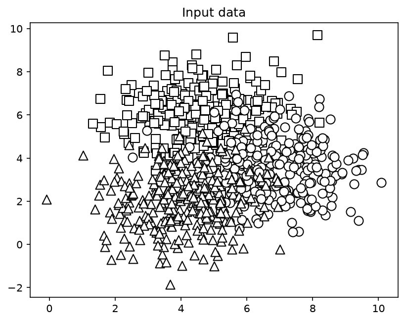

Класи значною мірою перекриваються — на цьому етапі це нормально і саме тому жоден класифікатор не дасть 100% точності.

Запуск `python LR_5_task_1.py --classifier-type rf`:

```text
########################################
Classifier performance on training dataset

              precision    recall  f1-score   support
     Class-0       0.91      0.86      0.88       221
     Class-1       0.84      0.87      0.86       230
     Class-2       0.86      0.87      0.86       224
    accuracy                           0.87       675
   macro avg       0.87      0.87      0.87       675
weighted avg       0.87      0.87      0.87       675
########################################
Classifier performance on test dataset

              precision    recall  f1-score   support
     Class-0       0.92      0.85      0.88        79
     Class-1       0.86      0.84      0.85        70
     Class-2       0.84      0.92      0.88        76
    accuracy                           0.87       225
   macro avg       0.87      0.87      0.87       225
weighted avg       0.87      0.87      0.87       225
########################################

Confidence measure:
Datapoint: [5 5]   Probabilities: [0.8143 0.0864 0.0993]   Predicted class: Class-0
Datapoint: [3 6]   Probabilities: [0.9357 0.0247 0.0396]   Predicted class: Class-0
Datapoint: [6 4]   Probabilities: [0.1223 0.7451 0.1326]   Predicted class: Class-1
Datapoint: [7 2]   Probabilities: [0.0542 0.7066 0.2392]   Predicted class: Class-1
Datapoint: [4 4]   Probabilities: [0.2059 0.1552 0.6388]   Predicted class: Class-2
Datapoint: [5 2]   Probabilities: [0.0540 0.0931 0.8529]   Predicted class: Class-2
```

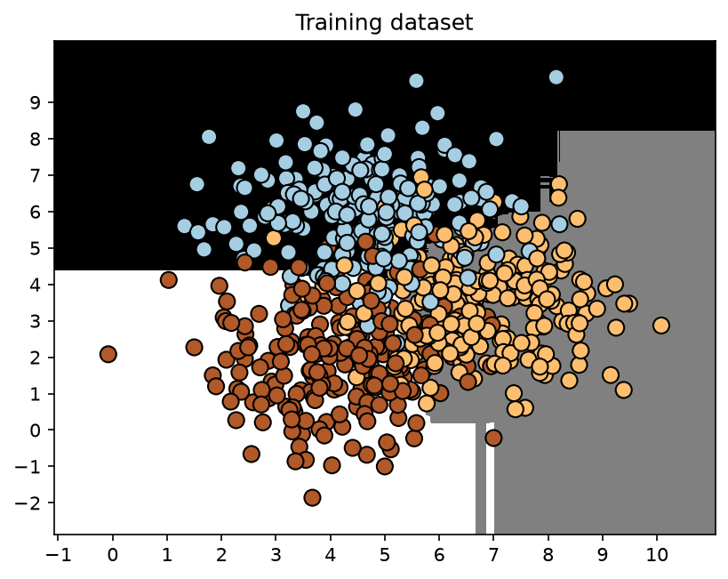

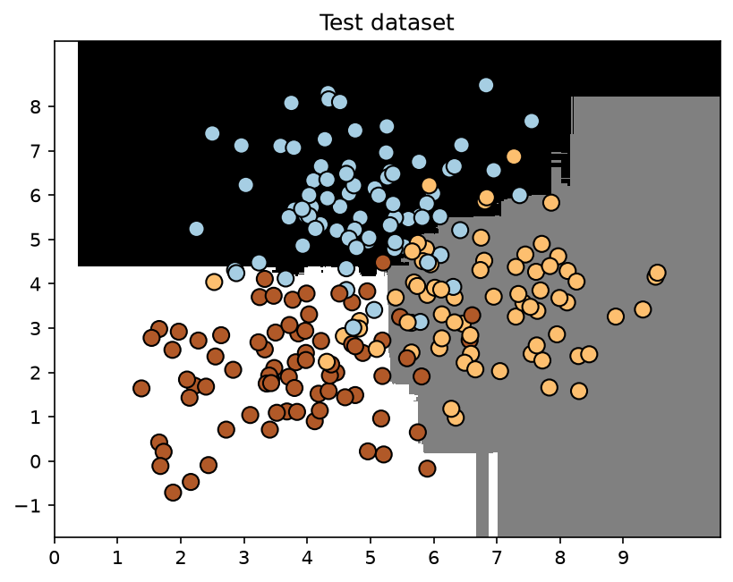

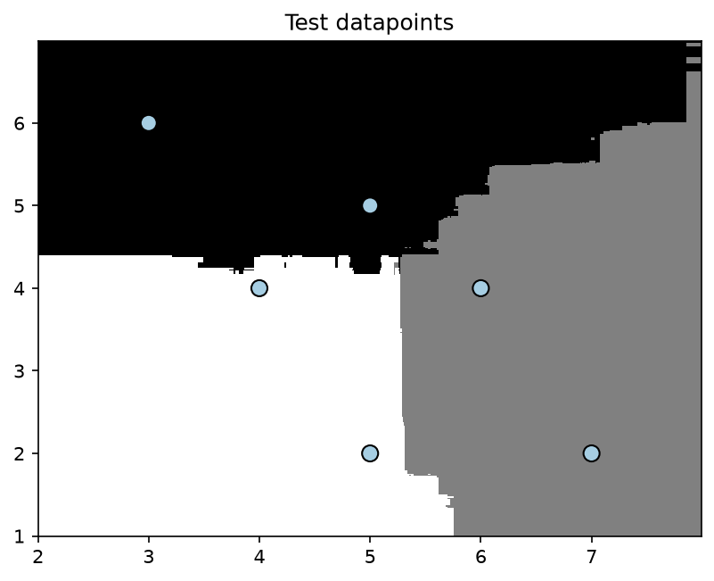

Запуск `python LR_5_task_1.py --classifier-type erf`:

```text
########################################
Classifier performance on training dataset

              precision    recall  f1-score   support
     Class-0       0.89      0.83      0.86       221
     Class-1       0.82      0.84      0.83       230
     Class-2       0.83      0.86      0.85       224
    accuracy                           0.85       675
   macro avg       0.85      0.85      0.85       675
weighted avg       0.85      0.85      0.85       675
########################################
Classifier performance on test dataset

              precision    recall  f1-score   support
     Class-0       0.92      0.85      0.88        79
     Class-1       0.84      0.84      0.84        70
     Class-2       0.85      0.92      0.89        76
    accuracy                           0.87       225
   macro avg       0.87      0.87      0.87       225
weighted avg       0.87      0.87      0.87       225
########################################

Confidence measure:
Datapoint: [5 5]   Probabilities: [0.4890 0.2802 0.2308]   Predicted class: Class-0
Datapoint: [3 6]   Probabilities: [0.6671 0.1242 0.2087]   Predicted class: Class-0
Datapoint: [6 4]   Probabilities: [0.2579 0.4954 0.2468]   Predicted class: Class-1
Datapoint: [7 2]   Probabilities: [0.1079 0.6247 0.2674]   Predicted class: Class-1
Datapoint: [4 4]   Probabilities: [0.3338 0.2150 0.4512]   Predicted class: Class-2
Datapoint: [5 2]   Probabilities: [0.1867 0.2876 0.5257]   Predicted class: Class-2
```

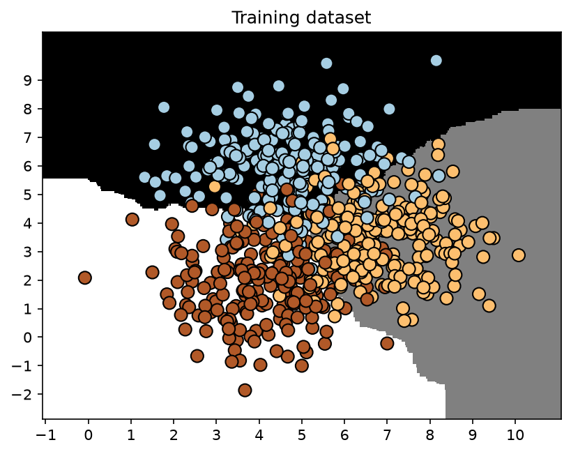

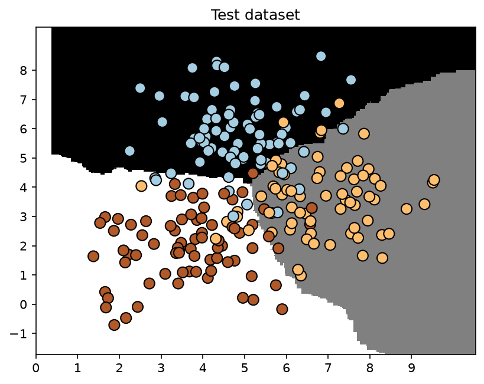

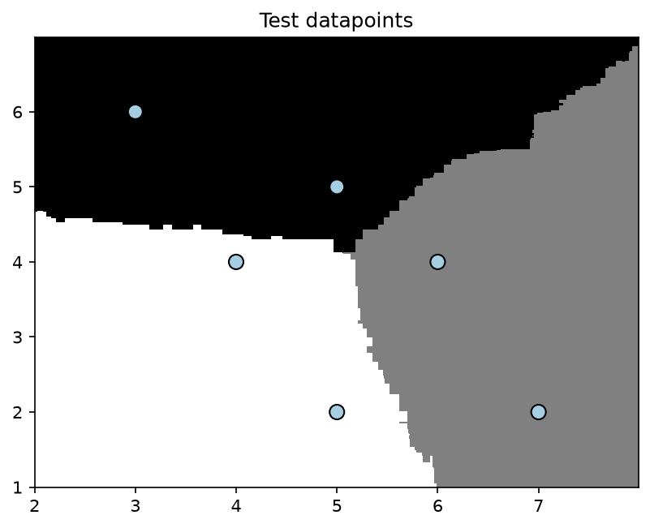

Порівняння меж рішень (рис. 2 проти рис. 5) дає найцікавіший результат роботи. Випадковий ліс дає **прямокутні «сходинки»**, паралельні осям координат: кожен поріг розбиття — це вертикальна або горизонтальна пряма, а усереднення 100 дерев з однаковими «найкращими» порогами залишає кути різкими. Гранично випадковий ліс дає **гладку, похилу та місцями криволінійну межу**: випадкові пороги в різних деревах розмазуються, і усереднення дає плавний перехід. Це точно відповідає теорії з методички.

Порівняння мір довіри показує той самий ефект з іншого боку. Для однієї і тієї ж точки `[5, 5]` випадковий ліс дає впевненість 0.8143, а гранично випадковий — лише 0.4890. Гранично випадковий ліс систематично менш «категоричний»: його ймовірності ближчі до рівномірного розподілу, бо дерева в ньому більш різнорідні й частіше «голосують» за різні класи. При цьому передбачений клас у всіх шести тестових точках **збігається** для обох моделей.

**Висновок:** обидва ансамблі дали однакову підсумкову точність на тестовому наборі (0.87), проте Random Forest показав вищу точність на навчальних даних (0.87 проти 0.85) — тобто сильніше «пригнався» під них, а Extra Trees за рахунок додаткової випадковості має менший розрив train/test і будує суттєво гладкіші межі рішень при менш завищених оцінках довіри.

## Завдання 2.2. Обробка дисбалансу класів

Набір `data_imbalance.txt` містить 1500 точок двох класів у співвідношенні 1:5 — 250 точок класу 0 проти 1250 точок класу 1. Такий дисбаланс типовий для реальних задач (шахрайство, рідкісні дефекти, рідкісні діагнози) і його треба враховувати алгоритмічно. Робимо два прогони `ExtraTreesClassifier` з однаковими параметрами, що відрізняються лише наявністю `class_weight='balanced'`. Цей параметр призначає класам ваги, обернено пропорційні до їх чисельності, тому помилка на рідкісному класі «коштує» алгоритму вп'ятеро дорожче.

```python
# Завантаження вхідних даних і поділ на два класи на підставі міток
data = np.loadtxt('data_imbalance.txt', delimiter=',')
X, y = data[:, :-1], data[:, -1]
class_0 = np.array(X[y == 0])                    # точки класу 0 (їх мало)
class_1 = np.array(X[y == 1])                    # точки класу 1 (їх багато)

# Візуалізація вхідних даних
plt.figure()
plt.scatter(class_0[:, 0], class_0[:, 1], s=75, color='black',
            linewidth=1, marker='x')             # клас 0 — хрестики
plt.scatter(class_1[:, 0], class_1[:, 1], s=75, facecolors='white',
            edgecolors='black', linewidth=1, marker='o')   # клас 1 — кола
plt.savefig('fig8_imbalance_input.png', dpi=150, bbox_inches='tight')

# Розбиття даних на навчальний та тестовий набори
X_train, X_test, y_train, y_test = train_test_split(
    X, y, test_size=0.25, random_state=5)
class_names = ['Class-0', 'Class-1']


def run(balance: bool, tag: str, n_train: int, n_test: int):
    # Класифікатор на основі гранично випадкових лісів
    params = {'n_estimators': 100, 'max_depth': 4, 'random_state': 0}
    if balance:
        # class_weight='balanced' робить ваги обернено пропорційними
        # до кількості точок у класі — рідкісний клас «важить» більше
        params['class_weight'] = 'balanced'

    classifier = ExtraTreesClassifier(**params)
    classifier.fit(X_train, y_train)
    visualize_classifier(classifier, X_train, y_train, 'Training dataset',
                         save_path=f'fig{n_train}_{tag}_train.png')

    # Передбачимо та візуалізуємо результат для тестового набору даних
    y_test_pred = classifier.predict(X_test)
    visualize_classifier(classifier, X_test, y_test, 'Test dataset',
                         save_path=f'fig{n_test}_{tag}_test.png')

    # Обчислення показників ефективності класифікатора:
    # методичка (с.10) вимагає ДВА звіти — на навчальному і на тестовому наборах
    print("\nClassifier performance on training dataset\n")
    print(classification_report(y_train, classifier.predict(X_train),
                                target_names=class_names))
    print("\nClassifier performance on test dataset\n")
    print(classification_report(y_test, y_test_pred, target_names=class_names))
```

Повний текст програми наведено у Додатку (п. Д.3).

```text
Кількість точок класу 0: 250
Кількість точок класу 1: 1250
Співвідношення класів 1:0 = 5.0

########################################
class_weight = None

Classifier performance on training dataset

              precision    recall  f1-score   support
     Class-0       1.00      0.01      0.01       181
     Class-1       0.84      1.00      0.91       944
    accuracy                           0.84      1125
   macro avg       0.92      0.50      0.46      1125
weighted avg       0.87      0.84      0.77      1125
########################################

########################################
Classifier performance on test dataset

              precision    recall  f1-score   support
     Class-0       0.00      0.00      0.00        69
     Class-1       0.82      1.00      0.90       306
    accuracy                           0.82       375
   macro avg       0.41      0.50      0.45       375
weighted avg       0.67      0.82      0.73       375
########################################

########################################
class_weight = balanced

Classifier performance on training dataset

              precision    recall  f1-score   support
     Class-0       0.44      0.93      0.60       181
     Class-1       0.98      0.77      0.86       944
    accuracy                           0.80      1125
   macro avg       0.71      0.85      0.73      1125
weighted avg       0.89      0.80      0.82      1125
########################################

########################################
Classifier performance on test dataset

              precision    recall  f1-score   support
     Class-0       0.45      0.94      0.61        69
     Class-1       0.98      0.74      0.84       306
    accuracy                           0.78       375
   macro avg       0.72      0.84      0.73       375
weighted avg       0.88      0.78      0.80       375
########################################
```

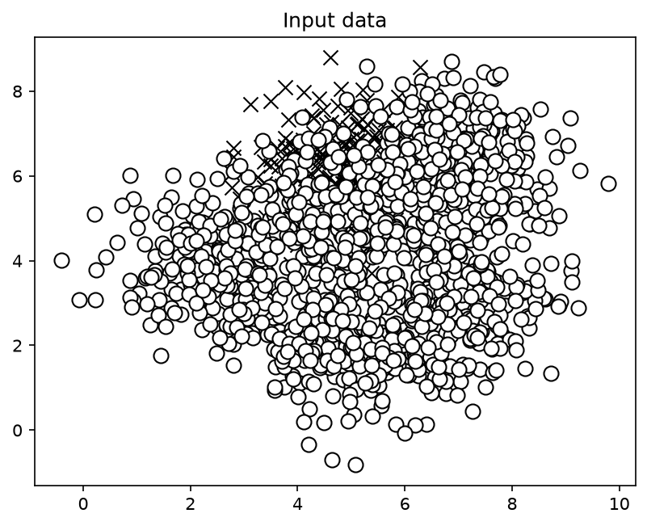

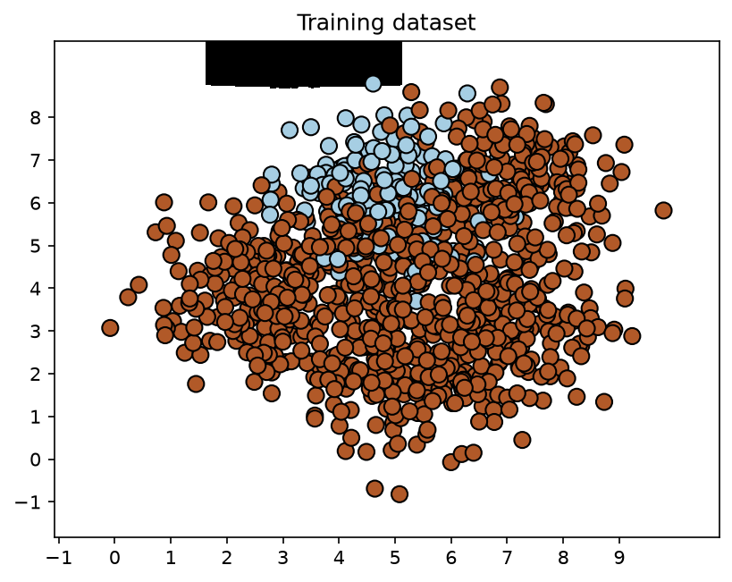

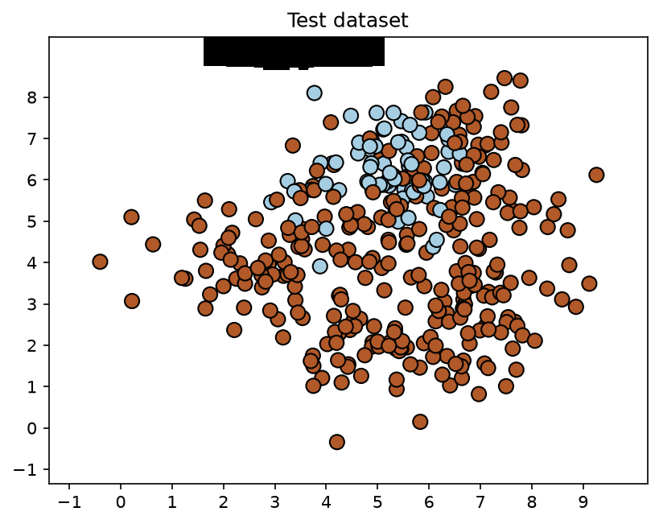

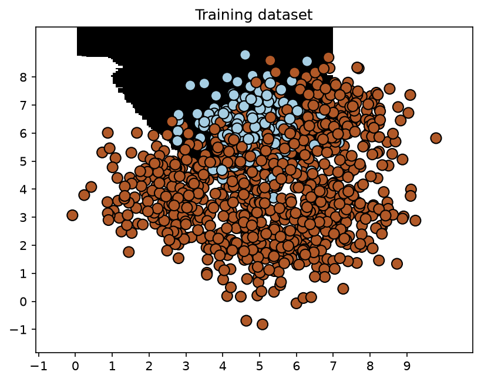

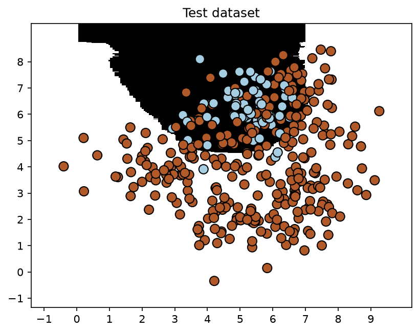

Без балансування класифікатору **не вдалося знайти фактичну межу** між класами: область класу 0 звелася до невеликої чорної плями у верхній частині рисунка, решта площини віддана класу 1. Модель фактично вивчила тривіальне правило «завжди відповідай клас 1» — і отримала за нього цілком пристойні 82% точності, бо саме стільки й становить частка більшого класу. Це класична пастка метрики accuracy на незбалансованих даних.

Звіт на **навчальному** наборі показує те саме виродження ще виразніше, ніж тестовий. Без балансування модель віднесла до класу 0 лише дві точки з 181 — звідси парадоксальна пара «precision = 1.00 при recall = 0.01»: усі нечисленні спрацювання формально правильні, але клас 0 практично не розпізнається. Загальна accuracy на навчанні становить 0.84 при зваженому f1 = 0.77, тобто модель не перенавчилася — вона просто з самого початку навчилася відповідати більшим класом. Після ввімкнення `class_weight='balanced'` картина на навчальному наборі змінюється симетрично до тестового: Class-0 отримує 0.44 / 0.93 / 0.60, accuracy падає до 0.80, а зважений f1 **зростає** з 0.77 до 0.82. Той факт, що показники на навчальному і тестовому наборах майже збігаються (0.84 / 0.82 без балансування і 0.80 / 0.78 з ним), доводить: проблема тут не в перенавчанні, а в самих даних.

Про попередження щодо f1-score. У рядку `Class-0` **тестового** звіту стоять нулі: на тестовій вибірці модель не передбачила жодної точки як клас 0, тому знаменник у формулі precision = TP/(TP+FP) дорівнює нулю. scikit-learn не аварійно завершується, а видає `UndefinedMetricWarning: Precision is ill-defined and being set to 0.0 in labels with no predicted samples`; відповідно f1-score = 2·P·R/(P+R) теж обчислити коректно неможливо і він приймається рівним 0.0. Щоб попередження не засмічувало вивід, код запускається з прапорцем ігнорування: `python -W ignore LR_5_task_2.py` (у методичці сказано «запустіть код у вікні терміналу із прапором ignore»).

Друге попередження, яке спочатку видавав цей скрипт, — `UserWarning: You passed an edgecolor/edgecolors ('black') for an unfilled marker ('x')` від matplotlib. Воно успадковане безпосередньо з коду методички, де для хрестика одночасно задано `facecolors='black'` та `edgecolors='black'`, хоча незаповнений маркер `'x'` заливки не має. На рисунок це не впливало, але щоб вивід терміналу був чистим, параметри замінено одним `color='black'` — попередження зникло.

Після ввімкнення `class_weight='balanced'` межа стала осмисленою: на тестовому наборі recall класу 0 зріс з 0.00 до **0.94**, f1-score класу 0 — з 0.00 до **0.61**, зважений f1 по всій задачі — з 0.73 до **0.80**. Загальна accuracy при цьому *впала* з 0.82 до 0.78, і це нормально: модель свідомо «жертвує» частиною правильних відповідей на великому класі (recall класу 1 впав з 1.00 до 0.74) заради того, щоб узагалі навчитися бачити рідкісний клас.

**Висновок:** за наявності дисбалансу класів accuracy є оманливою метрикою — модель, що ігнорує рідкісний клас, показала 84% на навчальному і 82% на тестовому наборі; параметр `class_weight='balanced'` усуває цю проблему алгоритмічно, піднявши recall рідкісного класу з 0.01 до 0.93 на навчанні та з 0.00 до 0.94 на тесті, а зважений f1-score — з 0.77 до 0.82 і з 0.73 до 0.80 відповідно, ціною невеликого зниження загальної точності.

## Завдання 2.3. Знаходження оптимальних навчальних параметрів за допомогою сіткового пошуку

Підбір гіперпараметрів «руками» нереалістичний, тому застосовуємо сітковий пошук `GridSearchCV` із 5-кратною перехресною перевіркою на тому ж наборі `data_random_forests.txt`. Сітка задана двома словниками: у першому фіксуємо `n_estimators=100` і варіюємо `max_depth`, у другому фіксуємо `max_depth=4` і варіюємо `n_estimators` — тобто змінюємо параметри по черзі, як і рекомендує методичка. Пошук виконується окремо для двох метрик, бо різні метрики можуть вимагати різних компромісів.

```python
# Визначення сітки значень параметрів
parameter_grid = [
    {'n_estimators': [100], 'max_depth': [2, 4, 7, 12, 16]},
    {'max_depth': [4], 'n_estimators': [25, 50, 100, 250]},
]
# Задача БАГАТОКЛАСОВА (3 класи при 2 ознаках) -> потрібні усереднені метрики
metrics = ['precision_weighted', 'recall_weighted']

for metric in metrics:
    print("\n##### Searching optimal parameters for", metric)
    classifier = GridSearchCV(
        ExtraTreesClassifier(random_state=0),
        parameter_grid, cv=5, scoring=metric)
    classifier.fit(X_train, y_train)

    # УВАГА: атрибут grid_scores_ вилучено зі scikit-learn 0.22,
    # сучасний еквівалент — словник cv_results_
    params_list = classifier.cv_results_['params']
    means = classifier.cv_results_['mean_test_score']
    for params, avg_score in zip(params_list, means):
        print(params, '-->', round(avg_score, 3))
    print("\nBest parameters:", classifier.best_params_)

    # Виведення звіту з результатами роботи класифікатора
    y_pred = classifier.predict(X_test)
    print("\nPerformance report:\n")
    print(classification_report(y_test, y_pred))
```

Повний текст програми наведено у Додатку (п. Д.4).

```text
##### Searching optimal parameters for precision_weighted
Grid scores for the parameter grid:
{'max_depth': 2,  'n_estimators': 100} --> 0.85
{'max_depth': 4,  'n_estimators': 100} --> 0.841
{'max_depth': 7,  'n_estimators': 100} --> 0.844
{'max_depth': 12, 'n_estimators': 100} --> 0.832
{'max_depth': 16, 'n_estimators': 100} --> 0.816
{'max_depth': 4,  'n_estimators': 25}  --> 0.846
{'max_depth': 4,  'n_estimators': 50}  --> 0.84
{'max_depth': 4,  'n_estimators': 100} --> 0.841
{'max_depth': 4,  'n_estimators': 250} --> 0.845
Best parameters: {'max_depth': 2, 'n_estimators': 100}

Performance report:
              precision    recall  f1-score   support
         0.0       0.94      0.81      0.87        79
         1.0       0.81      0.86      0.83        70
         2.0       0.83      0.91      0.87        76
    accuracy                           0.86       225
   macro avg       0.86      0.86      0.86       225
weighted avg       0.86      0.86      0.86       225

##### Searching optimal parameters for recall_weighted
Grid scores for the parameter grid:
{'max_depth': 2,  'n_estimators': 100} --> 0.843
{'max_depth': 4,  'n_estimators': 100} --> 0.837
{'max_depth': 7,  'n_estimators': 100} --> 0.841
{'max_depth': 12, 'n_estimators': 100} --> 0.83
{'max_depth': 16, 'n_estimators': 100} --> 0.815
{'max_depth': 4,  'n_estimators': 25}  --> 0.843
{'max_depth': 4,  'n_estimators': 50}  --> 0.836
{'max_depth': 4,  'n_estimators': 100} --> 0.837
{'max_depth': 4,  'n_estimators': 250} --> 0.841
Best parameters: {'max_depth': 2, 'n_estimators': 100}

Performance report:
              precision    recall  f1-score   support
         0.0       0.94      0.81      0.87        79
         1.0       0.81      0.86      0.83        70
         2.0       0.83      0.91      0.87        76
    accuracy                           0.86       225
   macro avg       0.86      0.86      0.86       225
weighted avg       0.86      0.86      0.86       225
```

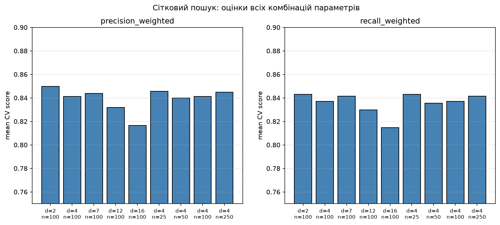

Головна закономірність добре видно на рис. 13: найвища оцінка досягається при **найменшій** глибині дерева, а при `max_depth` ≥ 12 вона стабільно падає — 0.850 при `max_depth=2` проти 0.816 при `max_depth=16` для precision. Спадання при цьому **не є монотонним**: на переході `max_depth` 4 → 7 є локальний відскок угору (0.841 → 0.844 для precision_weighted і 0.837 → 0.841 для recall_weighted), тобто правильне формулювання — оцінка у цілому знижується зі зростанням глибини, з одним локальним максимумом при `max_depth=7`. Це прямий прояв перенавчання: глибокі дерева запам'ятовують шум у зоні перекриття класів. Варіювання кількості дерев, навпаки, майже не впливає — від 25 до 250 дерев оцінка коливається в межах 0.840–0.846, тобто ансамбль насичується вже на кількох десятках дерев.

Методичка стверджує, що оптимальні комбінації для precision і recall мають відрізнятися. На цих даних і цій версії scikit-learn вони **збіглися**: обидві метрики обрали `{'max_depth': 2, 'n_estimators': 100}`. Причина видна з неокруглених оцінок: для `recall_weighted` є точна нічия — комбінації `{d=2, n=100}` і `{d=4, n=25}` дають однакові 0.842963, і `GridSearchCV` за правилом детермінованого тай-брейку обирає першу за порядком. Для `precision_weighted` нічиї немає: `{d=2, n=100}` виграє з 0.849757 проти 0.845574 у найближчого конкурента. Тобто твердження методички в принципі правильне (метрики ранжують комбінації по-різному: для precision друге місце посідає `{d=4, n=25}`, а для recall воно ділить перше), але на цьому наборі різниця між лідерами настільки мала, що переможець виявився спільним.

**Висновок:** сітковий пошук автоматизував перебір 9 комбінацій на 5-кратній крос-валідації й показав, що для цих даних критичним є саме обмеження глибини дерева (`max_depth=2`), тоді як кількість дерев понад 25 практично не впливає на якість; підсумкова точність найкращої моделі на тестовому наборі — 0.86.

## Завдання 2.4. Обчислення відносної важливості ознак

Для оцінки важливості ознак використовуємо регресор AdaBoost (Adaptive Boosting) поверх дерева рішень глибини 4. AdaBoost будує 400 дерев послідовно: після кожної ітерації ваги неправильно спрогнозованих точок зростають, тому наступне дерево «концентрується» на складних випадках, а підсумкове рішення приймається зваженим голосуванням «комітету». Побічним продуктом навчання є атрибут `feature_importances_` — сумарне зменшення помилки, яке дала кожна ознака при розбиттях.

```python
import matplotlib
matplotlib.use("Agg")                            # малюємо у файли
import numpy as np
import matplotlib.pyplot as plt
from sklearn.tree import DecisionTreeRegressor               # базова (слабка) модель
from sklearn.ensemble import AdaBoostRegressor               # ансамбль-бустинг
from sklearn.utils import shuffle                            # перемішування даних
from sklearn.metrics import mean_squared_error, explained_variance_score
from sklearn.model_selection import train_test_split

# load_boston() ВИЛУЧЕНО зі scikit-learn з версії 1.2 -> California Housing
from sklearn.datasets import fetch_california_housing
housing_data = fetch_california_housing()

# Перемішування даних, щоб підвищити об'єктивність аналізу
X, y = shuffle(housing_data.data, housing_data.target, random_state=7)
X_train, X_test, y_train, y_test = train_test_split(X, y, test_size=0.2, random_state=7)

# Модель на основі регресора AdaBoost
regressor = AdaBoostRegressor(DecisionTreeRegressor(max_depth=4),
                              n_estimators=400, random_state=7)
regressor.fit(X_train, y_train)

# Обчислення показників ефективності регресора AdaBoost
y_pred = regressor.predict(X_test)
mse = mean_squared_error(y_test, y_pred)         # середньоквадратична помилка
evs = explained_variance_score(y_test, y_pred)   # частка поясненої дисперсії
print("\nADABOOST REGRESSOR")
print("Mean squared error =", round(mse, 2))
print("Explained variance score =", round(evs, 2))

# Вилучення та нормалізація важливості ознак (найважливіша ознака = 100%)
feature_importances = regressor.feature_importances_
feature_names = np.array(housing_data.feature_names)
feature_importances = 100.0 * (feature_importances / max(feature_importances))
index_sorted = np.flipud(np.argsort(feature_importances))    # сортування за спаданням
pos = np.arange(index_sorted.shape[0]) + 0.5                 # мітки вздовж осі X
plt.figure(figsize=(9, 5))
plt.bar(pos, feature_importances[index_sorted], align='center',
        color='steelblue', edgecolor='black')
plt.xticks(pos, feature_names[index_sorted], rotation=20)
plt.ylabel('Relative Importance, %')
plt.savefig('fig14_feature_importance.png', dpi=150, bbox_inches='tight')
```

Повний текст програми наведено у Додатку (п. Д.5).

```text
ADABOOST REGRESSOR
Mean squared error = 1.18
Explained variance score = 0.47

Relative feature importance (normalized to 100):
  MedInc       100.00
  Longitude     92.85
  Latitude      79.61
  AveOccup      66.55
  Population    51.82
  AveRooms      45.86
  HouseAge      31.65
  AveBedrms     22.72
```

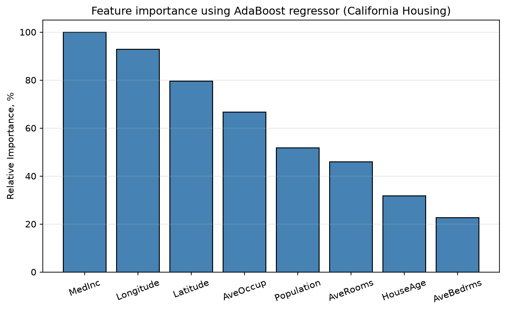

Набір California Housing описує житло медіанною вартістю блоку (ціль, у сотнях тисяч доларів) за 8 ознаками: `MedInc` — медіанний дохід, `HouseAge` — вік будівель, `AveRooms` — середня кількість кімнат, `AveBedrms` — середня кількість спалень, `Population` — населення блоку, `AveOccup` — середня заселеність, `Latitude`/`Longitude` — географічні координати.

Найзначущі ознаки: **`MedInc` (100%)** — медіанний дохід мешканців району, що цілком логічно, адже платоспроможність населення прямо визначає рівень цін; далі йде пара географічних координат **`Longitude` (92.85%)** та **`Latitude` (79.61%)**, які разом кодують престижність локації (узбережжя, близькість до Сан-Франциско та Лос-Анджелеса). Тобто модель фактично відтворила відоме правило ринку нерухомості: ціну визначають дохід покупців і місце розташування.

Найменш значущі ознаки: **`AveBedrms` (22.72%)** і **`HouseAge` (31.65%)**. Середня кількість спалень сильно корелює із середньою кількістю кімнат (`AveRooms`, 45.86%) і тому майже не несе нової інформації — її можна виключити з набору практично без втрат. Вік будівель у масштабі цілого штату теж слабко розрізняє райони.

Окремо варто зазначити якість самої моделі. MSE = 1.18 і explained variance = 0.47 — це посередній результат: для порівняння, одиночне дерево `DecisionTreeRegressor(max_depth=4)` на тому самому розбитті дає MSE = 0.57 і EVS = 0.58, тобто **краще за ансамбль із 400 дерев**. Це відома слабкість алгоритму AdaBoost.R2 з лінійною функцією втрат за замовчуванням: він дуже чутливий до викидів, а в California Housing цільова змінна штучно обрізана зверху на рівні 5.0, що створює великий масив «важких» точок, на яких бустинг зациклюється і перерозподіляє ваги на шкоду загальній якості. На коректність рейтингу важливості ознак це не впливає, бо важливості усереднюються по всіх 400 деревах.

**Висновок:** аналіз відносної важливості ознак показав, що вартість житла в Каліфорнії визначається переважно медіанним доходом мешканців та географічним розташуванням, тоді як ознаки `AveBedrms` і `HouseAge` є практично надлишковими і їх виключення дозволило б знизити розмірність задачі майже без втрати якості.

## Завдання 2.5. Прогнозування інтенсивності дорожнього руху

Набір `traffic_data.txt` — попередньо оброблені дані датчика Dodgers Loop Sensor (17568 рядків × 5 полів): день тижня, час доби, команда-суперник, ознака проведення матчу (yes/no) та кількість транспортних засобів, що проїхали. Мета — побудувати регресор, здатний спрогнозувати кількість авто.

Ключовий момент завдання — коректне кодування. Чотири перші ознаки рядкові, остання числова. Для **кожної** рядкової ознаки створюється **окремий** `LabelEncoder`, а числову ознаку кодувати не можна — її значення переносяться як є. Кодувальники обов'язково зберігаються у списку, бо саме ними потім перетворюється невідома точка даних: якби ми використали один спільний кодувальник, словники різних стовпців змішалися б і відповідність кодів зруйнувалася. Перевірка `item.isdigit()` відрізняє числове поле від рядкового: `'3'.isdigit()` → True, а `'00:00'.isdigit()` → False (через двокрапку), тому час доби коректно трактується як категорійна ознака.

```python
# Перетворення рядкових даних на числові:
# ОКРЕМИЙ LabelEncoder для КОЖНОЇ рядкової ознаки; числові НЕ кодуємо
label_encoder = []
X_encoded = np.empty(data.shape)
for i, item in enumerate(data[0]):
    if item.isdigit():                       # поле суто числове —
        X_encoded[:, i] = data[:, i]         # переносимо стовпець як є
    else:                                    # інакше — це категорія:
        label_encoder.append(preprocessing.LabelEncoder())
        X_encoded[:, i] = label_encoder[-1].fit_transform(data[:, i])

X = X_encoded[:, :-1].astype(int)
y = X_encoded[:, -1].astype(int)

# Регресор на основі гранично випадкових лісів
params = {'n_estimators': 100, 'max_depth': 4, 'random_state': 0}
regressor = ExtraTreesRegressor(**params)
regressor.fit(X_train, y_train)

# Тестування кодування на одиночному прикладі
test_datapoint = ['Saturday', '10:20', 'Atlanta', 'no']
test_datapoint_encoded = [-1] * len(test_datapoint)
count = 0
for i, item in enumerate(test_datapoint):
    if item.isdigit():
        test_datapoint_encoded[i] = int(test_datapoint[i])
    else:
        # сучасний sklearn вимагає 1-вимірний масив, а не скаляр
        test_datapoint_encoded[i] = int(
            label_encoder[count].transform([test_datapoint[i]])[0])
        count = count + 1
prediction = regressor.predict([np.array(test_datapoint_encoded)])[0]
print("Predicted traffic:", int(prediction))
```

Повний текст програми наведено у Додатку (п. Д.6).

```text
Розмір набору даних: (17568, 5)
Створено кодувальників: 4
Mean absolute error: 7.42
Закодована точка: [  2 124   1   0]
Predicted traffic: 26
```

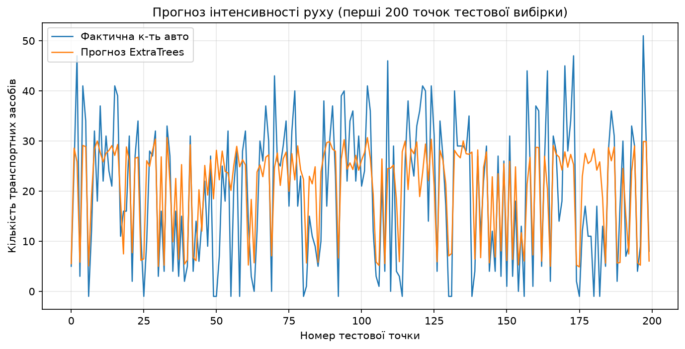

Створено рівно 4 кодувальники — по одному на кожну рядкову ознаку, що підтверджує правильність логіки відбору. Невідома точка `['Saturday', '10:20', 'Atlanta', 'no']` закодувалася у вектор `[2, 124, 1, 0]`: субота отримала код 2 (алфавітний порядок днів тижня), час «10:20» — код 124 (124-й п'ятихвилинний інтервал від початку доби), команда Atlanta — код 1, відсутність матчу — код 0.

Прогноз склав **26** транспортних засобів, що точно збігається зі значенням, зазначеним у методичці, і близьке до фактичних даних у файлі. Середня абсолютна помилка на тестовій вибірці — 7.42 авто; з урахуванням того, що інтенсивність руху коливається приблизно від одиниць до 40–50 авто за інтервал (рис. 15), це помірна точність, яку можна було б підвищити збільшенням `max_depth` (зараз штучно обмежено 4).

**Висновок:** регресор на основі гранично випадкових лісів із роздільним кодуванням категорійних ознак дав MAE = 7.42 і спрогнозував для контрольної точки 26 автомобілів, що відповідає очікуваному за методичкою результату.

## Зауваження до методички

Методичка містить низку застарілих та помилкових місць, які довелося виправити, щоб код запустився на scikit-learn 1.9.1 / Python 3.14. Усі виправлення перевірені реальним запуском.

| № | Де | Проблема | Як обійдено |
|---|---|---|---|
| 1 | `random_forests.py` (заготовка викладача) | `train_test_split.train_test_split(X, y, ...)` — виклик функції як атрибута самої себе, `AttributeError` | Замінено на прямий виклик `train_test_split(X, y, ...)` |
| 2 | Завдання 2.1, 2.2, 2.3, 2.5 | У PDF усюди використовується `cross_validation.train_test_split(...)`. Модуль `sklearn.cross_validation` вилучено ще у версії 0.20 | Функція імпортується з `sklearn.model_selection` |
| 3 | Усі завдання | Імпортується `from utilities import visualize_classifier`, але текст модуля `utilities.py` у методичці **відсутній** | Модуль написано самостійно (meshgrid + pcolormesh + scatter), текст наведено вище |
| 4 | Завдання 2.3 | `grid_search.GridSearchCV(...)` — модуль `sklearn.grid_search` вилучено у версії 0.20 | `from sklearn.model_selection import GridSearchCV` |
| 5 | Завдання 2.3 | `for params, avg_score, _ in classifier.grid_scores_:` — атрибут `grid_scores_` вилучено у версії 0.22, `AttributeError` | Використано словник `classifier.cv_results_` з ключами `'params'` і `'mean_test_score'` |
| 6 | Завдання 2.4 | Використовується `load_boston()` — функцію **вилучено** зі scikit-learn з версії 1.2 через етичні застереження до ознаки `B` | Застосовано офіційну заміну `fetch_california_housing()` (20640 зразків, 8 ознак). Усі числа в завданні 2.4 стосуються саме цього набору |
| 7 | Завдання 2.5 | `label_encoder[count].transform(test_datapoint[i])` — передається скаляр; сучасний sklearn вимагає 1-вимірний масив і падає з `ValueError: y should be a 1d array, got an array of shape () instead` | Передається список з одного елемента: `transform([test_datapoint[i]])[0]` |
| 8 | Завдання 2.4 | У тексті сказано «Програмний код збережіть під назвою **LR_4_task_4.py**» — одруківка в номері лабораторної роботи | Файл названо `LR_5_task_4.py`, як вимагає наскрізна нумерація ЛР-5 |
| 9 | Завдання 2.3 і 2.5 | У PDF у реченні «Використовуємо для нашого аналізу дані, що містяться у файлі ______» назва файлу **відсутня** (порожнє місце) | За контекстом визначено: для 2.3 — `data_random_forests.txt`, для 2.5 — `traffic_data.txt` |
| 10 | Усі завдання | Код завершується викликом `plt.show()`, який блокує виконання скрипта до закриття вікна і взагалі не працює без графічного середовища | Увімкнено неінтерактивний бекенд `matplotlib.use("Agg")`, усі рисунки зберігаються через `savefig(dpi=150)` |
| 11 | Завдання 2.3 | Твердження, що оптимальні комбінації параметрів для precision і recall обов'язково відрізнятимуться | На цих даних обидві метрики обрали `{'max_depth': 2, 'n_estimators': 100}`; розбіжність є лише у рейтингу інших комбінацій. Докладно розібрано у завданні 2.3 |
| 12 | Завдання 2.2 | **Власне свідоме відхилення, а не помилка методички.** Методичка (с.9) передбачає лише аргумент `balance`; будь-який інший має викликати `TypeError`, а запуск без аргументів виконує один прогін без балансування | Додано третє допустиме значення `nobalance`, а запуск **без аргументів** виконує обидва прогони підряд. Це дозволяє отримати всі чотири рисунки завдання 2.2 (рис. 9–12) та обидві пари звітів за один запуск, не редагуючи код між прогонами. Вимогу методички щодо `TypeError` для сторонніх аргументів збережено без змін |
| 13 | Завдання 2.2 | Код побудови графіка вхідних даних задає для хрестика одночасно `facecolors='black'` і `edgecolors='black'`, хоча маркер `'x'` є незаповненим. Через це matplotlib видає `UserWarning: You passed an edgecolor/edgecolors ('black') for an unfilled marker ('x')` | Обидва параметри замінено одним `color='black'`; рисунок не змінився, попередження зникло |

Окремо зазначу, що попередження про f1-score у завданні 2.2 **не є помилкою методички** — це очікувана поведінка scikit-learn (`UndefinedMetricWarning`), і методичка правильно рекомендує запускати код із прапорцем ігнорування попереджень. Так само коректною виявилася вказівка методички використовувати метрики `'precision_weighted'` / `'recall_weighted'`: задача є **багатокласовою** (три класи при двох ознаках у `data_random_forests.txt`), а прості `'precision'` / `'recall'` без суфікса усереднення визначені лише для бінарної задачі.

Таблиці варіантів ця лабораторна робота **не містить** — усі п'ять завдань однакові для всіх студентів, індивідуалізація передбачена лише в оформленні звіту (ПІБ, група) та посиланні на власний репозиторій GitHub.

## Висновки

У лабораторній роботі досліджено методи ансамблевого навчання, які будують не одну модель, а комітет моделей і приймають рішення на основі узагальнення їхніх оцінок. Центральна ідея, підтверджена всіма п'ятьма завданнями, полягає в тому, що різнорідність індивідуальних моделей є не побічним ефектом, а робочим ресурсом: саме за рахунок того, що окремі дерева «бачать» дані по-різному, ансамбль знижує ризик вибору невдалої моделі і краще узагальнює на невідомі дані.

Порівняння випадкових і гранично випадкових лісів у завданні 2.1 дало найнаочніший результат роботи. При однакових гіперпараметрах обидва ансамблі показали ідентичну точність на тестовому наборі (0.87), проте Random Forest мав вищу точність на навчальних даних (0.87 проти 0.85 у Extra Trees), тобто сильніше підлаштувався під тренувальну вибірку. Візуально різниця ще виразніша: випадковий ліс дає ступінчасті межі, паралельні осям координат, тоді як додатковий рівень випадковості в гранично випадкових лісах (випадковий вибір не лише ознак, а й порогів розбиття) розмиває ці сходинки й дає гладкі, похилі межі рішень. Та сама випадковість робить гранично випадкові ліси помітно обережнішими в оцінках довіри: для точки `[5, 5]` впевненість впала з 0.8143 до 0.4890, хоча передбачений клас не змінився.

Завдання 2.2 продемонструвало, наскільки небезпечно оцінювати модель однією метрикою. На даних із дисбалансом 1:5 класифікатор без балансування фактично вивчив вироджене правило «завжди відповідай більший клас», повністю проігнорував рідкісний клас (precision, recall і f1-score дорівнювали 0.00) — і за це отримав 82% точності, рівно стільки, скільки становить частка більшого класу. Параметр `class_weight='balanced'`, який призначає класам ваги обернено пропорційно до їхньої чисельності, виправив ситуацію: recall рідкісного класу зріс до 0.94, зважений f1-score — з 0.73 до 0.80, хоча формальна accuracy при цьому знизилася до 0.78. Цей компроміс і є правильним інженерним рішенням для реальних задач з рідкісними подіями.

Сітковий пошук у завданні 2.3 показав, що автоматичний перебір гіперпараметрів із перехресною перевіркою не лише економить час, а й дає змістовну діагностику моделі. Оцінка якості у цілому знижувалася зі зростанням глибини дерева (з 0.850 при `max_depth=2` до 0.816 при `max_depth=16`), хоча й не монотонно — на переході від `max_depth=4` до `max_depth=7` спостерігався локальний відскок (0.841 → 0.844). Це чітке свідчення перенавчання на зоні перекриття класів, тоді як кількість дерев понад 25 на результат майже не впливала. Аналіз відносної важливості ознак у завданні 2.4 підтвердив, що ансамблі дають не лише прогноз, а й інтерпретацію: модель самостійно виявила, що ціну житла в Каліфорнії визначають дохід мешканців (100%) та географічні координати (92.85% і 79.61%), тоді як середня кількість спалень (22.72%) є надлишковою через кореляцію із загальною кількістю кімнат. Водночас виявилася й слабкість конкретного алгоритму: AdaBoost.R2 на цьому наборі (MSE = 1.18) програв навіть одиночному дереву рішень (MSE = 0.57) через чутливість до обрізаних зверху значень цільової змінної — ансамбль не є універсально кращим за базову модель.

Практичне завдання 2.5 закріпило важливість коректної попередньої обробки даних. Створення окремого `LabelEncoder` для кожної категорійної ознаки при збереженні числових ознак незакодованими та подальше повторне використання тих самих кодувальників для невідомої точки дозволило отримати прогноз 26 автомобілів, що точно збігається з очікуваним значенням, при середній абсолютній помилці 7.42. Окремим практичним результатом роботи стала адаптація застарілого коду методички до актуальної версії scikit-learn 1.9.1: довелося виправити одинадцять місць (вилучені модулі `cross_validation` та `grid_search`, вилучені `grid_scores_` і `load_boston`, зміну сигнатури `LabelEncoder.transform`, відсутній модуль `utilities.py`, блокуючий `plt.show()`) і додатково усунути успадковане з методички попередження matplotlib про `edgecolor` для незаповненого маркера — це наочно показує, наскільки швидко застарівають API бібліотек машинного навчання і чому код завжди слід перевіряти запуском, а не лише читанням.

## Додаток. Повні лістинги програм
Методичка в кожному із п'яти завдань вимагає «Збережіть код робочої програми з обов'язковими коментарями» та «Код програми … занесіть у звіт». Нижче наведено повні, дослівні тексти всіх шести робочих файлів — саме в тому вигляді, у якому вони запускалися для отримання наведених вище результатів. У розділах завдань вище подано лише ключові фрагменти цих самих файлів.

### Д.1. utilities.py — допоміжна функція візуалізації меж рішень класифікатора
```python
"""Допоміжні функції для ЛР-5 (ансамблеві методи).

У методичці файл utilities.py лише імпортується (`from utilities import
visualize_classifier`), але його текст не наведений, тому функція написана
самостійно за описом з книги П. Джоши.
"""

import matplotlib                      # базовий пакет побудови графіків
matplotlib.use("Agg")                  # неінтерактивний бекенд: малюємо у файл, а не у вікно

import numpy as np                     # робота з масивами та сітками
import matplotlib.pyplot as plt        # інтерфейс побудови графіків


def visualize_classifier(classifier, X, y, title='', save_path=None):
    """Візуалізує межі прийняття рішень класифікатора на двовимірних даних.

    classifier -- навчений класифікатор sklearn з методом predict;
    X          -- матриця ознак розміру (n, 2);
    y          -- вектор міток класів;
    title      -- заголовок рисунка;
    save_path  -- шлях до PNG-файлу; якщо заданий, рисунок зберігається.

    Повертає об'єкт Figure, щоб його можна було додатково налаштувати.
    """
    X = np.asarray(X)                                   # гарантуємо тип ndarray
    y = np.asarray(y)                                   # мітки теж як ndarray

    # Межі сітки: беремо мінімум/максимум кожної ознаки з запасом в 1.0
    min_x, max_x = X[:, 0].min() - 1.0, X[:, 0].max() + 1.0
    min_y, max_y = X[:, 1].min() - 1.0, X[:, 1].max() + 1.0

    # Крок сітки: чим менший, тим гладкіша межа, але довше обчислення
    mesh_step_size = 0.01

    # Будуємо прямокутну сітку точок, що покриває всю область даних
    x_vals, y_vals = np.meshgrid(
        np.arange(min_x, max_x, mesh_step_size),
        np.arange(min_y, max_y, mesh_step_size))

    # Класифікуємо КОЖНУ точку сітки -> отримуємо «карту» областей рішень
    output = classifier.predict(np.c_[x_vals.ravel(), y_vals.ravel()])
    output = output.reshape(x_vals.shape)               # повертаємо форму сітки

    fig = plt.figure()                                  # новий рисунок
    plt.title(title)                                    # заголовок

    # Заливка областей рішень відтінками сірого (pcolormesh = «кольорова сітка»)
    plt.pcolormesh(x_vals, y_vals, output, cmap=plt.cm.gray, shading='auto')

    # Поверх заливки наносимо самі точки даних, колір = справжній клас
    plt.scatter(X[:, 0], X[:, 1], c=y, s=75, edgecolors='black',
                linewidth=1, cmap=plt.cm.Paired)

    # Обмежуємо область відображення точно межами сітки
    plt.xlim(x_vals.min(), x_vals.max())
    plt.ylim(y_vals.min(), y_vals.max())

    # Цілочисельні поділки на осях (дані в усіх завданнях лежать у межах 0..10)
    plt.xticks(np.arange(int(X[:, 0].min() - 1), int(X[:, 0].max() + 1), 1.0))
    plt.yticks(np.arange(int(X[:, 1].min() - 1), int(X[:, 1].max() + 1), 1.0))

    if save_path:                                       # якщо вказано шлях —
        plt.savefig(save_path, dpi=150, bbox_inches='tight')   # зберігаємо PNG
        print(f"[saved] {save_path}")                   # повідомляємо про запис

    return fig                                          # повертаємо рисунок
```

### Д.2. LR_5_task_1.py — завдання 2.1 — випадковий та гранично випадковий ліси
```python
"""ЛР-5, завдання 2.1. Класифікатори на основі випадкових (RandomForest)
та гранично випадкових (ExtraTrees) лісів.

Базується на заготовці викладача random_forests.py.
Запуск:
    python LR_5_task_1.py --classifier-type rf
    python LR_5_task_1.py --classifier-type erf
"""

import argparse                                  # розбір аргументів командного рядка

import matplotlib                                # налаштування бекенда ДО pyplot
matplotlib.use("Agg")                            # малюємо у файли, вікна не відкриваємо

import numpy as np                               # масиви та числові операції
import matplotlib.pyplot as plt                  # побудова графіків
from sklearn.metrics import classification_report                 # звіт якості
from sklearn.model_selection import train_test_split              # поділ вибірки
from sklearn.ensemble import RandomForestClassifier, ExtraTreesClassifier  # ансамблі

from utilities import visualize_classifier       # власна функція візуалізації


# Парсер аргументів
def build_arg_parser():
    """Створює парсер, який приймає тип класифікатора: 'rf' або 'erf'."""
    parser = argparse.ArgumentParser(
        description='Classify data using Ensemble Learning techniques')
    parser.add_argument('--classifier-type', dest='classifier_type',
                        required=True, choices=['rf', 'erf'],
                        help="Type of classifier to use; 'rf' or 'erf'")
    return parser


if __name__ == '__main__':
    # Вилучення вхідних аргументів
    args = build_arg_parser().parse_args()       # читаємо аргументи
    classifier_type = args.classifier_type       # 'rf' або 'erf'

    # Завантаження вхідних даних
    input_file = 'data_random_forests.txt'       # файл з даними (3 класи)
    data = np.loadtxt(input_file, delimiter=',') # читаємо числа через кому
    X, y = data[:, :-1], data[:, -1]             # перші 2 стовпці — ознаки, останній — мітка

    # Розбиття вхідних даних на три класи
    class_0 = np.array(X[y == 0])                # точки класу 0
    class_1 = np.array(X[y == 1])                # точки класу 1
    class_2 = np.array(X[y == 2])                # точки класу 2

    # Візуалізація вхідних даних (квадрати / кола / трикутники)
    plt.figure()
    plt.scatter(class_0[:, 0], class_0[:, 1], s=75, facecolors='white',
                edgecolors='black', linewidth=1, marker='s')   # клас 0 — квадрат
    plt.scatter(class_1[:, 0], class_1[:, 1], s=75, facecolors='white',
                edgecolors='black', linewidth=1, marker='o')   # клас 1 — коло
    plt.scatter(class_2[:, 0], class_2[:, 1], s=75, facecolors='white',
                edgecolors='black', linewidth=1, marker='^')   # клас 2 — трикутник
    plt.title('Input data')
    plt.savefig('fig1_input_data.png', dpi=150, bbox_inches='tight')
    print('[saved] fig1_input_data.png')

    # Розбивка даних на навчальний та тестовий набори
    # УВАГА: у заготовці викладача було train_test_split.train_test_split(...)
    # (у методичці — cross_validation.train_test_split). Це помилка:
    # модуль sklearn.cross_validation вилучено, функція імпортується напряму.
    X_train, X_test, y_train, y_test = train_test_split(
        X, y, test_size=0.25, random_state=5)

    # Класифікатор на основі ансамблевого навчання
    # n_estimators — кількість дерев, max_depth — максимальна глибина дерева,
    # random_state — зерно генератора випадкових чисел (відтворюваність).
    params = {'n_estimators': 100, 'max_depth': 4, 'random_state': 0}
    if classifier_type == 'rf':
        classifier = RandomForestClassifier(**params)   # випадковий ліс
    else:
        classifier = ExtraTreesClassifier(**params)     # гранично випадковий ліс

    classifier.fit(X_train, y_train)                    # навчання на тренувальних даних

    # Номери рисунків для звіту: свої для rf і свої для erf
    n_train, n_test, n_pts = {'rf': (2, 3, 4), 'erf': (5, 6, 7)}[classifier_type]

    # Візуалізація меж рішень на тренувальному наборі
    visualize_classifier(classifier, X_train, y_train, 'Training dataset',
                         save_path=f'fig{n_train}_{classifier_type}_train.png')

    # Прогноз і візуалізація на тестовому наборі
    y_test_pred = classifier.predict(X_test)            # прогноз для тесту
    visualize_classifier(classifier, X_test, y_test, 'Test dataset',
                         save_path=f'fig{n_test}_{classifier_type}_test.png')

    # Перевірка роботи класифікатора
    class_names = ['Class-0', 'Class-1', 'Class-2']     # назви класів для звіту
    print("\n" + "#" * 40)
    print("\nClassifier performance on training dataset\n")
    print(classification_report(y_train, classifier.predict(X_train),
                                target_names=class_names))
    print("#" * 40 + "\n")

    print("#" * 40)
    print("\nClassifier performance on test dataset\n")
    print(classification_report(y_test, y_test_pred, target_names=class_names))
    print("#" * 40 + "\n")

    # Обчислення параметрів довірливості (мір достовірності прогнозів)
    test_datapoints = np.array([[5, 5], [3, 6], [6, 4], [7, 2], [4, 4], [5, 2]])

    print("\nConfidence measure:")
    for datapoint in test_datapoints:                   # перебираємо тестові точки
        # predict_proba повертає ймовірності належності кожному з трьох класів
        probabilities = classifier.predict_proba([datapoint])[0]
        predicted_class = 'Class-' + str(np.argmax(probabilities))  # клас з макс. ймовірністю
        print('\nDatapoint:', datapoint)
        print('Probabilities:', np.round(probabilities, 4))
        print('Predicted class:', predicted_class)

    # Візуалізація тестових точок на тлі меж класифікатора
    visualize_classifier(classifier, test_datapoints, [0] * len(test_datapoints),
                         'Test datapoints',
                         save_path=f'fig{n_pts}_{classifier_type}_datapoints.png')
```

### Д.3. LR_5_task_2.py — завдання 2.2 — обробка дисбалансу класів
```python
"""ЛР-5, завдання 2.2. Обробка дисбалансу класів (data_imbalance.txt).

Запуск:
    python LR_5_task_2.py              # ОБИДВА прогони підряд (власне розширення)
    python LR_5_task_2.py balance      # лише з class_weight='balanced'
    python LR_5_task_2.py nobalance    # лише без балансування (власне розширення)

ВІДХИЛЕННЯ ВІД МЕТОДИЧКИ (описане у звіті, розділ «Зауваження до методички»):
методичка передбачає лише аргумент 'balance', а запуск без аргументів виконує
один прогін без балансування. Тут додано третє значення 'nobalance', а запуск
без аргументів виконує обидва прогони підряд — це дозволяє отримати всі чотири
рисунки завдання 2.2 та обидві пари звітів за один запуск. Будь-який інший
аргумент, як і вимагає методичка, викликає TypeError.
"""

import sys                                       # доступ до аргументів командного рядка

import matplotlib                                # налаштування бекенда ДО pyplot
matplotlib.use("Agg")                            # малюємо у файли

import numpy as np                               # масиви
import matplotlib.pyplot as plt                  # графіки
from sklearn.ensemble import ExtraTreesClassifier            # гранично випадковий ліс
from sklearn.model_selection import train_test_split         # поділ вибірки
from sklearn.metrics import classification_report            # звіт якості

from utilities import visualize_classifier       # власна функція візуалізації


# Завантаження вхідних даних
input_file = 'data_imbalance.txt'                # файл з двома НЕзбалансованими класами
data = np.loadtxt(input_file, delimiter=',')     # читаємо числа через кому
X, y = data[:, :-1], data[:, -1]                 # ознаки та мітки

# Поділ вхідних даних на два класи на підставі міток
class_0 = np.array(X[y == 0])                    # точки класу 0 (їх мало)
class_1 = np.array(X[y == 1])                    # точки класу 1 (їх багато)
print('Кількість точок класу 0:', len(class_0))  # демонструємо дисбаланс
print('Кількість точок класу 1:', len(class_1))
print('Співвідношення класів 1:0 =', round(len(class_1) / len(class_0), 2))

# Візуалізація вхідних даних
plt.figure()
# УВАГА: у методичці для маркера 'x' задано facecolors+edgecolors, що дає
# matplotlib UserWarning (незаповнений маркер не має заливки). Використовуємо color.
plt.scatter(class_0[:, 0], class_0[:, 1], s=75, color='black',
            linewidth=1, marker='x')                         # клас 0 — хрестики
plt.scatter(class_1[:, 0], class_1[:, 1], s=75, facecolors='white',
            edgecolors='black', linewidth=1, marker='o')     # клас 1 — кола
plt.title('Input data')
plt.savefig('fig8_imbalance_input.png', dpi=150, bbox_inches='tight')
print('[saved] fig8_imbalance_input.png')

# Розбиття даних на навчальний та тестовий набори
X_train, X_test, y_train, y_test = train_test_split(
    X, y, test_size=0.25, random_state=5)

class_names = ['Class-0', 'Class-1']             # підписи класів у звіті


def run(balance: bool, tag: str, n_train: int, n_test: int):
    """Один прогін класифікатора: balance=True вмикає class_weight='balanced'."""
    # Класифікатор на основі гранично випадкових лісів
    params = {'n_estimators': 100, 'max_depth': 4, 'random_state': 0}
    if balance:
        # class_weight='balanced' робить ваги обернено пропорційними
        # до кількості точок у класі — рідкісний клас «важить» більше
        params['class_weight'] = 'balanced'

    classifier = ExtraTreesClassifier(**params)  # створюємо класифікатор
    classifier.fit(X_train, y_train)             # навчаємо на тренувальних даних

    # Візуалізація меж рішень на тренувальному наборі
    visualize_classifier(classifier, X_train, y_train, 'Training dataset',
                         save_path=f'fig{n_train}_{tag}_train.png')

    # Прогноз та візуалізація для тестового набору
    y_test_pred = classifier.predict(X_test)     # прогноз на тесті
    visualize_classifier(classifier, X_test, y_test, 'Test dataset',
                         save_path=f'fig{n_test}_{tag}_test.png')

    # Обчислення показників ефективності класифікатора.
    # Методичка (с.10) вимагає ДВА звіти: на навчальному і на тестовому наборах.
    print("\n" + "#" * 40)
    print(f"\nclass_weight = {'balanced' if balance else 'None'}\n")
    print("\nClassifier performance on training dataset\n")
    print(classification_report(y_train, classifier.predict(X_train),
                                target_names=class_names))
    print("#" * 40 + "\n")

    print("#" * 40)
    print("\nClassifier performance on test dataset\n")
    print(classification_report(y_test, y_test_pred, target_names=class_names))
    print("#" * 40 + "\n")


# Розбір прапорця так, як це описано в методичці
if len(sys.argv) > 1:
    if sys.argv[1] == 'balance':
        run(balance=True, tag='imbalance_balanced', n_train=11, n_test=12)   # лише збалансований
    elif sys.argv[1] == 'nobalance':
        run(balance=False, tag='imbalance_nobalance', n_train=9, n_test=10)  # лише незбалансований
    else:
        raise TypeError("Invalid input argument; should be 'balance'")
else:
    # За замовчуванням робимо ОБИДВА прогони, щоб порівняти їх у звіті
    run(balance=False, tag='imbalance_nobalance', n_train=9, n_test=10)
    run(balance=True, tag='imbalance_balanced', n_train=11, n_test=12)
```

### Д.4. LR_5_task_3.py — завдання 2.3 — сітковий пошук GridSearchCV
```python
"""ЛР-5, завдання 2.3. Пошук оптимальних навчальних параметрів
за допомогою сіткового пошуку (GridSearchCV).

Запуск:
    python LR_5_task_3.py
"""

import matplotlib                                # налаштування бекенда ДО pyplot
matplotlib.use("Agg")                            # малюємо у файли

import numpy as np                               # масиви
import matplotlib.pyplot as plt                  # графіки
from sklearn.metrics import classification_report                  # звіт якості
from sklearn.model_selection import GridSearchCV, train_test_split # сітковий пошук і поділ
from sklearn.ensemble import ExtraTreesClassifier                  # гранично випадковий ліс

from utilities import visualize_classifier       # власна функція візуалізації

# Завантаження вхідних даних
input_file = 'data_random_forests.txt'           # той самий файл, що й у завданні 2.1
data = np.loadtxt(input_file, delimiter=',')     # читаємо числа через кому
X, y = data[:, :-1], data[:, -1]                 # ознаки та мітки

# Розбиття даних на три класи на підставі міток
class_0 = np.array(X[y == 0])                    # точки класу 0
class_1 = np.array(X[y == 1])                    # точки класу 1
class_2 = np.array(X[y == 2])                    # точки класу 2

# Розбиття даних на навчальний та тестовий набори
X_train, X_test, y_train, y_test = train_test_split(
    X, y, test_size=0.25, random_state=5)

# Визначення сітки значень параметрів.
# Перший словник: фіксуємо n_estimators=100 і варіюємо max_depth.
# Другий словник: фіксуємо max_depth=4 і варіюємо n_estimators.
parameter_grid = [
    {'n_estimators': [100], 'max_depth': [2, 4, 7, 12, 16]},
    {'max_depth': [4], 'n_estimators': [25, 50, 100, 250]},
]

# Метричні характеристики для вибору найкращої комбінації.
# Задача БАГАТОКЛАСОВА (3 класи при 2 ознаках), тому потрібні усереднені
# варіанти метрик ('precision'/'recall' без суфікса працюють лише для бінарної).
metrics = ['precision_weighted', 'recall_weighted']

results = {}                                     # сюди складемо результати для рисунка

for metric in metrics:                           # окремий сітковий пошук для кожної метрики
    print("\n##### Searching optimal parameters for", metric)

    # GridSearchCV перебирає всі комбінації сітки з 5-кратною крос-валідацією
    classifier = GridSearchCV(
        ExtraTreesClassifier(random_state=0),
        parameter_grid, cv=5, scoring=metric)
    classifier.fit(X_train, y_train)             # запускаємо перебір

    # Виведення оцінки для кожної комбінації параметрів.
    # УВАГА: атрибут grid_scores_ (з методички) вилучено зі scikit-learn 0.22,
    # сучасний еквівалент — словник cv_results_.
    print("\nGrid scores for the parameter grid:")
    params_list = classifier.cv_results_['params']           # список комбінацій
    means = classifier.cv_results_['mean_test_score']        # середні оцінки
    for params, avg_score in zip(params_list, means):        # друкуємо попарно
        print(params, '-->', round(avg_score, 3))

    print("\nBest parameters:", classifier.best_params_)     # найкраща комбінація
    results[metric] = (params_list, means)                   # запам'ятовуємо для графіка

    # Виведення звіту з результатами роботи класифікатора
    y_pred = classifier.predict(X_test)          # прогноз найкращої моделі на тесті
    print("\nPerformance report:\n")
    print(classification_report(y_test, y_pred))

# Побудова рисунка: оцінки всіх комбінацій для обох метрик
fig, axes = plt.subplots(1, 2, figsize=(13, 5))  # дві панелі поруч
for ax, metric in zip(axes, metrics):            # по панелі на метрику
    params_list, means = results[metric]         # дістаємо збережені результати
    labels = [f"d={p['max_depth']}\nn={p['n_estimators']}" for p in params_list]
    ax.bar(range(len(means)), means, color='steelblue', edgecolor='black')
    ax.set_xticks(range(len(means)))             # підписи під стовпчиками
    ax.set_xticklabels(labels, fontsize=8)
    ax.set_ylim(0.75, 0.90)                      # масштаб, щоб бачити різницю
    ax.set_title(metric)                         # назва метрики
    ax.set_ylabel('mean CV score')
    ax.grid(axis='y', alpha=0.3)
plt.suptitle('Сітковий пошук: оцінки всіх комбінацій параметрів')
plt.savefig('fig13_grid_search_scores.png', dpi=150, bbox_inches='tight')
print('\n[saved] fig13_grid_search_scores.png')
```

### Д.5. LR_5_task_4.py — завдання 2.4 — відносна важливість ознак (AdaBoost)
```python
"""ЛР-5, завдання 2.4. Обчислення відносної важливості ознак
за допомогою регресора AdaBoost поверх дерева рішень.

Запуск:
    python LR_5_task_4.py
"""

import matplotlib                                # налаштування бекенда ДО pyplot
matplotlib.use("Agg")                            # малюємо у файли

import numpy as np                               # масиви
import matplotlib.pyplot as plt                  # графіки
from sklearn.tree import DecisionTreeRegressor               # базова (слабка) модель
from sklearn.ensemble import AdaBoostRegressor               # ансамбль-бустинг
from sklearn.utils import shuffle                            # перемішування даних
from sklearn.metrics import mean_squared_error, explained_variance_score
from sklearn.model_selection import train_test_split         # поділ вибірки

# Завантаження даних із цінами на нерухомість.
# УВАГА: у методичці використано load_boston(), але цю функцію ВИЛУЧЕНО
# зі scikit-learn з версії 1.2 (етичні застереження щодо ознаки B).
# Офіційна заміна — набір California Housing (20640 зразків, 8 ознак).
from sklearn.datasets import fetch_california_housing
housing_data = fetch_california_housing()        # завантажуємо набір даних

# Перемішування даних, щоб підвищити об'єктивність аналізу
X, y = shuffle(housing_data.data, housing_data.target, random_state=7)

# Розбиття даних на навчальний та тестовий набори (80% / 20%)
X_train, X_test, y_train, y_test = train_test_split(
    X, y, test_size=0.2, random_state=7)

# Модель на основі регресора AdaBoost:
# базова модель — дерево рішень глибини 4, таких дерев будується 400
regressor = AdaBoostRegressor(
    DecisionTreeRegressor(max_depth=4),
    n_estimators=400, random_state=7)
regressor.fit(X_train, y_train)                  # навчання ансамблю

# Обчислення показників ефективності регресора AdaBoost
y_pred = regressor.predict(X_test)               # прогноз на тестовій вибірці
mse = mean_squared_error(y_test, y_pred)         # середньоквадратична помилка
evs = explained_variance_score(y_test, y_pred)   # частка поясненої дисперсії
print("\nADABOOST REGRESSOR")
print("Mean squared error =", round(mse, 2))
print("Explained variance score =", round(evs, 2))

# Вилучення важливості ознак
feature_importances = regressor.feature_importances_   # внески ознак (сума = 1)
feature_names = np.array(housing_data.feature_names)   # назви ознак

# Нормалізація значень важливості ознак: найважливіша ознака = 100%
feature_importances = 100.0 * (feature_importances / max(feature_importances))

# Сортування та перестановка значень (за спаданням важливості)
index_sorted = np.flipud(np.argsort(feature_importances))

# Розміщення міток уздовж осі X
pos = np.arange(index_sorted.shape[0]) + 0.5

# Побудова стовпчастої діаграми
plt.figure(figsize=(9, 5))
plt.bar(pos, feature_importances[index_sorted], align='center',
        color='steelblue', edgecolor='black')
plt.xticks(pos, feature_names[index_sorted], rotation=20)    # підписи ознак
plt.ylabel('Relative Importance, %')
plt.title('Feature importance using AdaBoost regressor (California Housing)')
plt.grid(axis='y', alpha=0.3)
plt.savefig('fig14_feature_importance.png', dpi=150, bbox_inches='tight')
print('[saved] fig14_feature_importance.png')

# Друкуємо числові значення важливості — вони потрібні для висновку у звіті
print("\nRelative feature importance (normalized to 100):")
for name, value in zip(feature_names[index_sorted],
                       feature_importances[index_sorted]):
    print(f"  {name:12s} {value:6.2f}")
```

### Д.6. LR_5_task_5.py — завдання 2.5 — прогнозування інтенсивності руху
```python
"""ЛР-5, завдання 2.5. Прогнозування інтенсивності дорожнього руху
регресором на основі гранично випадкових лісів (ExtraTreesRegressor).

Набір даних: traffic_data.txt (попередньо оброблений Dodgers Loop Sensor).
Формат рядка: день_тижня, час_доби, команда-суперник, матч(yes/no), к-ть авто.

Запуск:
    python LR_5_task_5.py
"""

import matplotlib                                # налаштування бекенда ДО pyplot
matplotlib.use("Agg")                            # малюємо у файли

import numpy as np                               # масиви
import matplotlib.pyplot as plt                  # графіки
from sklearn.metrics import mean_absolute_error  # середня абсолютна помилка
from sklearn import preprocessing                # LabelEncoder
from sklearn.ensemble import ExtraTreesRegressor # гранично випадковий ліс (регресія)
from sklearn.model_selection import train_test_split   # поділ вибірки

# Завантаження даних із файлу traffic_data.txt
input_file = 'traffic_data.txt'                  # вхідний файл
data = []                                        # сюди складаємо рядки
with open(input_file, 'r') as f:                 # відкриваємо файл на читання
    for line in f.readlines():                   # перебираємо рядки
        items = line[:-1].split(',')             # відкидаємо '\n' і ділимо по комі
        data.append(items)                       # додаємо список полів

data = np.array(data)                            # перетворюємо на масив рядків
print('Розмір набору даних:', data.shape)        # контроль: (17568, 5)

# Перетворення рядкових даних на числові.
# ОКРЕМИЙ LabelEncoder для КОЖНОЇ рядкової ознаки; числові ознаки НЕ кодуємо.
# Кодувальники зберігаємо, бо вони знадобляться для невідомої точки даних.
label_encoder = []                               # список кодувальників
X_encoded = np.empty(data.shape)                 # масив під закодовані дані
for i, item in enumerate(data[0]):               # дивимось на перший рядок
    if item.isdigit():                           # якщо поле суто числове —
        X_encoded[:, i] = data[:, i]             # переносимо стовпець як є
    else:                                        # інакше — це категорія:
        label_encoder.append(preprocessing.LabelEncoder())        # новий кодувальник
        X_encoded[:, i] = label_encoder[-1].fit_transform(data[:, i])  # кодуємо стовпець

X = X_encoded[:, :-1].astype(int)                # ознаки (4 стовпці)
y = X_encoded[:, -1].astype(int)                 # цільова змінна — кількість авто
print('Створено кодувальників:', len(label_encoder))   # має бути 4

# Розбиття даних на навчальний та тестовий набори
X_train, X_test, y_train, y_test = train_test_split(
    X, y, test_size=0.25, random_state=5)

# Регресор на основі гранично випадкових лісів
params = {'n_estimators': 100, 'max_depth': 4, 'random_state': 0}
regressor = ExtraTreesRegressor(**params)        # створюємо регресор
regressor.fit(X_train, y_train)                  # навчаємо на тренувальних даних

# Обчислення характеристик ефективності регресора на тестових даних
y_pred = regressor.predict(X_test)               # прогноз для тестової вибірки
print("Mean absolute error:", round(mean_absolute_error(y_test, y_pred), 2))

# Тестування кодування на одиночному прикладі (невідома точка даних)
test_datapoint = ['Saturday', '10:20', 'Atlanta', 'no']       # вхідні дані
test_datapoint_encoded = [-1] * len(test_datapoint)           # заготовка під коди
count = 0                                                      # лічильник кодувальників
for i, item in enumerate(test_datapoint):        # перебираємо поля точки
    if item.isdigit():                           # числове поле —
        test_datapoint_encoded[i] = int(test_datapoint[i])     # просто число
    else:                                        # категорійне поле —
        # УВАГА: у методичці викликається transform(скаляр); сучасний sklearn
        # вимагає 1-вимірний масив, тому передаємо список з одного елемента.
        test_datapoint_encoded[i] = int(
            label_encoder[count].transform([test_datapoint[i]])[0])
        count = count + 1                        # переходимо до наступного кодувальника

test_datapoint_encoded = np.array(test_datapoint_encoded)      # у вигляді масиву
print("Закодована точка:", test_datapoint_encoded)

# Прогнозування результату для тестової точки даних
# predict очікує двовимірний масив, тому загортаємо точку у [ ]
prediction = regressor.predict([test_datapoint_encoded])[0]
print("Predicted traffic:", int(prediction))

# Додатковий рисунок: прогноз проти фактичних значень на перших 200 точках тесту
plt.figure(figsize=(11, 5))
n_show = 200                                     # скільки точок показати
plt.plot(y_test[:n_show], label='Фактична к-ть авто', linewidth=1.2)
plt.plot(y_pred[:n_show], label='Прогноз ExtraTrees', linewidth=1.2)
plt.xlabel('Номер тестової точки')
plt.ylabel('Кількість транспортних засобів')
plt.title('Прогноз інтенсивності руху (перші 200 точок тестової вибірки)')
plt.legend()
plt.grid(alpha=0.3)
plt.savefig('fig15_traffic_prediction.png', dpi=150, bbox_inches='tight')
print('[saved] fig15_traffic_prediction.png')
```
