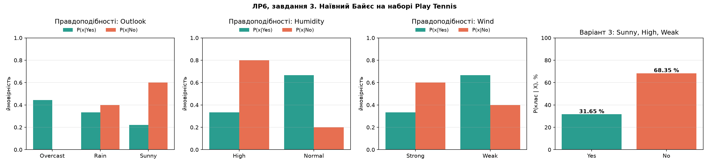
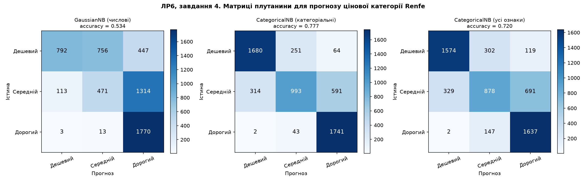
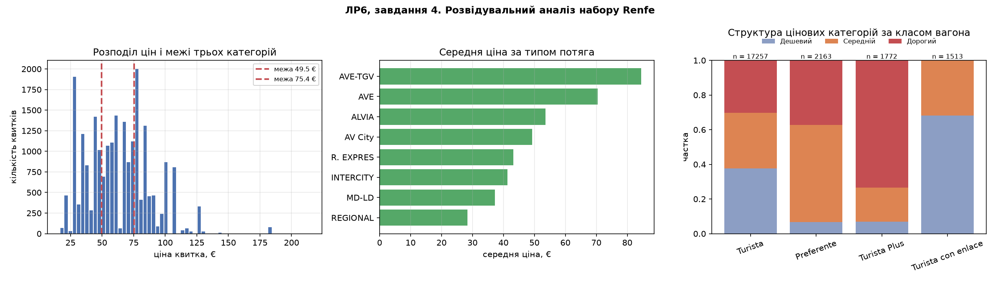

## Мета

Набути навичок роботи з даними у Python із застосуванням теореми Байєса: побудувати частотні таблиці й таблиці правдоподібності за набором Play Tennis, виконати прогноз для індивідуального варіанта двома незалежними способами (ручний розрахунок за формулою та засобами бібліотеки scikit-learn) і застосувати байєсівський аналіз до реального набору даних про ціни на квитки іспанських високошвидкісних залізниць Renfe.

Виконав: Камінський Олексій Дмитрович, група ВТ-23-2, номер у списку групи — 3 (звідси **варіант 3**: `Outlook = Sunny`, `Humidity = High`, `Wind = Weak`).

Середовище виконання: Python 3.14.6, scikit-learn 1.9.1, numpy 2.5.3, pandas 3.0.6, matplotlib 3.11.2. Усі рисунки збережено у PNG через неінтерактивний бекенд `Agg` (замість `plt.show()`, який блокує виконання скрипта).

Склад робочих файлів:

| Файл | Призначення |
|---|---|
| `LR_6_task_1.py` | завдання 2–3: набір Play Tennis, частотні таблиці, таблиці правдоподібності, прогноз для варіанта 3 двома способами |
| `LR_6_task_2.py` | завдання 4: байєсівський аналіз набору Renfe, три моделі наївного Байєса, розвідувальні графіки |
| `renfe_small.csv` | вхідні дані завдання 4 (25 798 рядків) |
| `fig1_play_tennis.png`, `fig2_renfe_confusion.png`, `fig3_renfe_eda.png` | рисунки, які будують скрипти |

Обидва скрипти будують шляхи від `Path(__file__).resolve().parent`, тому запускаються з будь-якої робочої теки.

## Завдання 1. Теоретичні відомості

### Теорема Байєса

Теорема Байєса описує ймовірність події на основі попереднього знання про умови, які можуть бути з цією подією пов'язані, тобто є способом обчислення умовної ймовірності. Для гіпотези *H* і доказу (свідчення) *E*:

P(H|E) = P(E|H) · P(H) / P(E)

де P(H) — **апріорна** ймовірність гіпотези (до отримання доказу), P(H|E) — **апостеріорна** ймовірність (після отримання доказу), P(E|H) — правдоподібність доказу за умови гіпотези, P(E) — повна ймовірність доказу. Відношення P(E|H)/P(E) називають відношенням правдоподібності, і теорему можна перефразувати так: «апостеріорна ймовірність дорівнює апріорній, помноженій на відношення правдоподібності».

Класичний приклад із методички: ймовірність того, що навмання витягнута карта є королем, за умови що вона лицьова. P(король) = 4/52, P(лицьова|король) = 1, P(лицьова) = 12/52, звідки P(король|лицьова) = 1 · (4/52) / (12/52) = 1/3.

### Наївний байєсівський класифікатор

Класифікатор обчислює ймовірність належності об'єкта до класу *c* за вектором ознак X = (x₁, …, xₙ). «Наївність» полягає у припущенні **умовної незалежності** ознак між собою за заданого класу, що дозволяє замінити спільну ймовірність добутком:

P(c|X) ∝ P(c) · ∏ᵢ P(xᵢ|c)

Знаменник P(X) однаковий для всіх класів, тому для вибору класу його можна не рахувати, а наприкінці нормувати добутки так, щоб їхня сума дорівнювала одиниці.

### Типи наївного байєсівського класифікатора

| Тип | Модель ознак | Типове застосування |
|---|---|---|
| **Мультиноміальний** (поліноміальний) | вектори ознак — значення частотності (скільки разів подія сталася), мультиноміальний розподіл | класифікація документів за частотою слів, тематична категоризація новин, фільтрація спаму за bag-of-words |
| **Бернуллі** | ознаки — незалежні бінарні (логічні) змінні: ознака або присутня, або ні | класифікація коротких текстів, де важливий сам факт наявності слова, а не його частота; виявлення спаму за набором маркерів |
| **Гаусів** | неперервні ознаки, розподілені за нормальним (гаусовим) законом; при нанесенні на графік — дзвоноподібна крива | задачі з вимірюваними величинами: медична діагностика, сенсорні дані, ціни, тривалості, біометрія |

Окремо у scikit-learn є **CategoricalNB** — варіант для суто категоріальних ознак із скінченною множиною значень; саме він відповідає ручному розрахунку за частотними таблицями, тому використаний у завданні 3.

### Де застосовується наївний Байєс

Фільтрація спаму (статистичний метод на основі набору слів), категоризація RSS-новин, прогноз погоди (апостеріорні ймовірності для кожної мітки класу, перемагає максимальна), медична діагностика (прозоре пояснення рішення через внески окремих атрибутів), аналіз емоційного забарвлення текстів, рекомендаційні системи. Переваги — простота, швидкість навчання, робота на малих вибірках; головний недолік — вимога незалежності предикторів, яка на практиці майже ніколи не виконується точно.

**Висновок:** наївний Байєс є генеративною ймовірнісною моделлю, яка за рахунок припущення про незалежність ознак зводить задачу класифікації до перемноження простих частотних оцінок, що робить її надзвичайно дешевою в навчанні і прозорою в інтерпретації.

## Завдання 2. Набір даних Play Tennis, частотні таблиці та таблиці правдоподібності

У методичці набір даних подано **картинкою**, тому 14 рядків внесено в код вручну і звірено з зображенням PDF посторінково. На картинці методички стовпця `Temperature` немає — є лише `Day`, `Outlook`, `Humidity`, `Wind`, `Play`. Щоб частотні таблиці були повними, стовпець `Temperature` додано з класичного набору Mitchell'а; на прогноз для варіанта 3 він не впливає, бо в умові варіанта не згадується, і його частотна таблиця нижче наведена **довідково**.

Частотні таблиці та таблиці правдоподібності будуються **програмно** через `pandas.crosstab`, а не переписуються з картинки, — це й дало змогу виявити арифметичні розбіжності з методичкою (див. розділ «Зауваження до методички»).

```python
FEATURES = ["Outlook", "Temperature", "Humidity", "Wind"]   # список ознак
n_total = len(df)
n_yes = int((df.Play == "Yes").sum())
n_no = int((df.Play == "No").sum())

# Крок 1. Частотні таблиці (frequency table) по кожному атрибуту
freq_tables = {}
for col in FEATURES:
    # перехресна таблиця «значення × клас»
    tab = pd.crosstab(df[col], df["Play"])
    tab = tab.reindex(columns=["Yes", "No"], fill_value=0)
    tab["Разом"] = tab.sum(axis=1)          # сума по рядку
    tab.loc["Разом"] = tab.sum(axis=0)      # підсумковий рядок
    freq_tables[col] = tab

# Крок 2. Таблиці правдоподібності: P(значення|клас) = частота / розмір класу
like_tables = {}
for col in FEATURES:
    tab = freq_tables[col].drop(index="Разом").drop(columns="Разом")
    lik = pd.DataFrame(index=tab.index)
    lik["P(x|Yes)"] = tab["Yes"] / n_yes    # умовна ймовірність класу Yes
    lik["P(x|No)"]  = tab["No"]  / n_no     # умовна ймовірність класу No
    lik["P(x)"] = (tab["Yes"] + tab["No"]) / n_total   # маргінальна
    like_tables[col] = lik
```

```text
Усього рядків: 14
Розподіл цільової змінної Play:   Yes  9    No  5

Frequency Table: Outlook          Frequency Table: Humidity
Play      Yes  No  Разом          Play      Yes  No  Разом
Overcast    4   0      4          High        3   4      7
Rain        3   2      5          Normal      6   1      7
Sunny       2   3      5          Разом       9   5     14
Разом       9   5     14

Frequency Table: Wind             Frequency Table: Temperature
Play    Yes  No  Разом            Play   Yes  No  Разом
Strong    3   3      6            Cool     3   1      4
Weak      6   2      8            Hot      2   2      4
Разом     9   5     14            Mild     4   2      6
                                  Разом    9   5     14

Likelihood Table: Outlook   (знаменники: Yes=9, No=5, Разом=14)
          P(x|Yes)  P(x|No)    P(x)
Overcast    0.4444      0.0  0.2857
Rain        0.3333      0.4  0.3571
Sunny       0.2222      0.6  0.3571

Likelihood Table: Humidity        Likelihood Table: Wind
        P(x|Yes)  P(x|No)  P(x)          P(x|Yes)  P(x|No)    P(x)
High      0.3333      0.8   0.5  Strong    0.3333      0.6  0.4286
Normal    0.6667      0.2   0.5  Weak      0.6667      0.4  0.5714

Апріорні ймовірності: P(Yes) = 9/14 = 0.6429 ; P(No) = 5/14 = 0.3571
```

**Висновок:** за 14 рядками набору частоти класів становлять 9 «Yes» і 5 «No», тож усі умовні ймовірності мають знаменники 9 і 5 відповідно, а апріорні ймовірності дорівнюють 0,6429 та 0,3571; саме ці значення, а не наведені в методичці 10/14 і 4/14, використано далі.

## Завдання 3. Прогноз для варіанта 3 (Sunny, High, Weak)

Задача розв'язується двома незалежними способами, результати яких мають збігтися.

**Спосіб (а) — ручний розрахунок** за формулою P(c|X) ∝ P(c)·∏P(xᵢ|c) з виведенням усіх проміжних множників. Функція `manual_posterior` додатково підтримує параметр згладжування Лапласа `alpha`.

**Спосіб (б) — `CategoricalNB` зі scikit-learn** після порядкового кодування категорій. Щоб формула збіглася з ручним розрахунком «один-в-один», модель навчається з `alpha=1e-10` (фактична відсутність згладжування), бо типове значення в sklearn — `alpha=1.0`.

```python
def manual_posterior(condition, alpha=0.0, verbose=True):
    """Ненормовані добутки P(X|c)*P(c) для класів Yes/No.
    Згладжування застосовується лише до P(x|c), як у CategoricalNB."""
    scores = {}
    for cls, n_cls in (("Yes", n_yes), ("No", n_no)):
        prior = n_cls / n_total            # апріорна ймовірність класу
        prod = prior                       # починаємо добуток з апріорної
        for col, val in condition.items():  # по кожній ознаці умови
            tab = freq_tables[col].drop(index="Разом").drop(columns="Разом")
            cnt = int(tab.loc[val, cls])   # частота «значення & клас»
            n_vals = tab.shape[0]          # кількість різних значень ознаки
            cond = (cnt + alpha) / (n_cls + alpha * n_vals)   # P(знач.|клас)
            prod *= cond                   # накопичуємо добуток
        scores[cls] = prod
    return scores

# умова варіанта 3
VARIANT = {"Outlook": "Sunny", "Humidity": "High", "Wind": "Weak"}
scores = manual_posterior(VARIANT)                         # ручний розрахунок
post_yes = scores["Yes"] / (scores["Yes"] + scores["No"])  # нормування

enc = OrdinalEncoder()                     # кодування категорій у числа
X = enc.fit_transform(df[list(VARIANT)])
y = (df["Play"] == "Yes").astype(int).to_numpy()
nb_raw = CategoricalNB(alpha=1e-10, force_alpha=True).fit(X, y)
proba_raw = nb_raw.predict_proba(enc.transform(pd.DataFrame([VARIANT])))[0]
assert abs(proba_raw[1] - post_yes) < 1e-6   # два способи мають збігтися
```

```text
Умова: Outlook = Sunny, Humidity = High, Wind = Weak

  Клас «Yes»:                            Клас «No»:
    P(Yes) = 0.6429                        P(No) = 0.3571
    P(Outlook=Sunny|Yes) = 2/9 = 0.2222    P(Outlook=Sunny|No) = 3/5 = 0.6000
    P(Humidity=High|Yes) = 3/9 = 0.3333    P(Humidity=High|No) = 4/5 = 0.8000
    P(Wind=Weak|Yes)     = 6/9 = 0.6667    P(Wind=Weak|No)     = 2/5 = 0.4000
    Добуток = 0.031746                     Добуток = 0.068571

  Нормування:
    P(Yes|X) = 0.031746 / (0.031746 + 0.068571) = 0.3165  (31.65 %)
    P(No|X)  = 0.068571 / (0.031746 + 0.068571) = 0.6835  (68.35 %)

  ВІДПОВІДЬ (ручний розрахунок): Play = No — матч НЕ відбудеться

Нульові умовні ймовірності у наборі: P(Outlook=Overcast|No) = 0
З alpha = 1:  P(Yes|X) = 0.4049 (40.49 %), P(No|X) = 0.5951 (59.51 %)

  Outlook: Overcast->0, Rain->1, Sunny->2
  Humidity: High->0, Normal->1
  Wind: Strong->0, Weak->1

CategoricalNB(alpha=1e-10): P(No|X) = 0.6835 (68.35 %), P(Yes|X) = 0.3165 (31.65 %)
CategoricalNB(alpha=1.0)  : P(No|X) = 0.5951 (59.51 %), P(Yes|X) = 0.4049 (40.49 %)
Прогноз sklearn: Play = No

Перевірка збігу: |ручний P(Yes|X) - sklearn P(Yes|X)| = 1.17e-11
Результати двох способів ЗБІГАЮТЬСЯ.

Довідково, приклад методички (Rain, High, Weak), перерахунок за 14 рядками:
  Yes = 0.047619, No = 0.045714  =>  P(Yes|X) = 51.02 %, P(No|X) = 48.98 %
  (у методичці наведено 0,0199 / 0,0166 і 55 % / 45 % — не відтворюються)
```



**Про згладжування Лапласа.** У наборі є одна нульова умовна ймовірність: P(Outlook = Overcast | No) = 0/5, бо в хмарну погоду матч не скасовували жодного разу. Для умов варіанта 3 нулі не трапляються, тому згладжування не є обов'язковим і рішення не змінює. Проте застосовувати його потрібно принципово: у добутку ∏P(xᵢ|c) один-єдиний нульовий множник обнуляє всю апостеріорну ймовірність класу незалежно від того, наскільки добре решта ознак на цей клас вказують. Згладжування Лапласа замінює оцінку на (cnt + α)/(n_c + α·k), де k — кількість різних значень ознаки; при α = 1 відповідь для варіанта 3 стає 40,49 % проти 59,51 % — висновок той самий, але оцінки менш категоричні.

**Висновок:** для умов варіанта 3 (сонячно, висока вологість, слабкий вітер) апостеріорна ймовірність проведення матчу становить **31,65 %** проти **68,35 %** для відмови, тому **матч НЕ відбудеться**; ручний розрахунок і `CategoricalNB` зі scikit-learn дають ідентичні числа з розбіжністю 1,17·10⁻¹¹, що підтверджує коректність обох реалізацій.

## Завдання 4. Байєсівський аналіз набору даних Renfe

### Постановка задачі та її обґрунтування

Методичка обмежується вказівкою «застосуйте методи байєсівського аналізу до набору даних про ціни на квитки іспанських високошвидкісних залізниць», тому постановку задачі сформульовано самостійно:

> **Передбачити цінову категорію квитка** (Дешевий / Середній / Дорогий) за характеристиками рейсу: станція відправлення, станція призначення, тип потяга, клас вагона, тариф, тривалість поїздки, година відправлення, день тижня та глибина бронювання.

Обґрунтування вибору:

1. У наборі `price` — єдина неперервна величина, і саме вона становить практичний інтерес (набір називається «ціни на квитки»). Пряме регресійне прогнозування ціни наївним Байєсом неможливе, бо це класифікатор, тому ціну дискретизовано.
2. Поділ на **три квантильні групи** (`pd.qcut(price, q=3)`) дає приблизно однакову потужність класів (7810 / 7557 / 7349). Завдяки цьому базовий рівень випадкового вгадування дорівнює 1/3 ≈ 0,333, і будь-яке перевищення цієї межі однозначно інтерпретується як корисність моделі; при поділі за фіксованими порогами класи були б незбалансовані й accuracy стала б оманливою.
3. Альтернатива з методичного завдання — прогноз `train_class` — гірша: клас `Turista` становить 19 495 з 25 798 записів (понад 75 %), тож тривіальний класифікатор «завжди Turista» дав би високу accuracy без жодної змістовної моделі.
4. Задача має прикладний сенс: за параметрами рейсу, відомими до перегляду ціни, оцінити, у який ціновий сегмент потрапить квиток.

### Обробка даних

| Стовпець | Пропусків | Що зроблено |
|---|---|---|
| `price` | 3082 (11,9 %) | рядки вилучено — це цільова величина, відновити її нічим, а імпутація середнім створила б штучний «середній» клас і завищила метрики |
| `train_class` | 103 | усі 103 рядки є **підмножиною** рядків без `price` (перевірено програмно: перетин = 103 зі 103), тому вилучаються разом із ними; виклик `fillna("Unknown")` залишено як захисний код для інших зрізів даних, і на цьому наборі він не заповнює жодної комірки |
| `fare` | 103 | те саме: перетин із рядками без `price` дорівнює 103 зі 103, фактичних заповнень — 0 |

Скрипт друкує і перетин пропусків, і фактичну кількість проставлених міток `Unknown` (обидві нулі), тож мітка `Unknown` у підсумкових даних не з'являється — після обробки `train_class` містить лише Turista 17257, Preferente 2163, Turista Plus 1772, Turista con enlace 1513, Cama Turista 8 і Cama G. Clase 3, разом 22 716.

Із дат обчислено похідні ознаки: `duration_min` = `end_date` − `start_date` (тривалість поїздки у хвилинах), `days_ahead` = `start_date` − `insert_date` (за скільки діб до рейсу зафіксовано ціну), `dep_hour` і `dep_weekday` (година та день тижня відправлення).

### Порядок операцій: поділ передує будь-якій підгонці

Щоб уникнути витоку інформації з тестової вибірки, поділ 75 % / 25 % (`random_state = 3` — номер варіанта) виконується **до** формування цільової змінної. Межі квантилів ціни (`pd.qcut`) обчислюються лише за навчальною вибіркою і далі застосовуються до всіх рядків через `pd.cut`; так само `KBinsDiscretizer` навчається лише на train. Наслідок: стратифікація за класом неможлива, бо на момент поділу класів ще не існує — проте на 22 716 рядках звичайний випадковий поділ і так дає майже рівний баланс (train 5815 / 5659 / 5563, test 1995 / 1898 / 1786), що скрипт друкує для контролю.

Єдиний виняток — `OrdinalEncoder`, який підганяється на всьому наборі **свідомо**: він не обчислює жодної статистики, а лише складає словник «назва категорії → номер». Якби його навчити тільки на train, категорія, що трапляється виключно в тесті, дістала б код −1, а `CategoricalNB` вимагає невід'ємних кодів і впав би з помилкою.

Навчено три моделі: `GaussianNB` на числових ознаках, `CategoricalNB` на категоріальних і `CategoricalNB` на повному наборі (категоріальні + числові, дискретизовані `KBinsDiscretizer` на 5 квантильних кошиків).

```python
# Обробка пропусків: price — цільова, відновити нічим.
# Пропуски train_class / fare — підмножина рядків без price, тому
# fillna нижче є ЗАХИСНИМ кодом і на цьому наборі не спрацьовує.
df = df.dropna(subset=["price"]).copy()
df["train_class"] = df["train_class"].fillna("Unknown")
df["fare"] = df["fare"].fillna("Unknown")

# Інженерія ознак із дат
dur = (df["end_date"] - df["start_date"]).dt.total_seconds()
df["duration_min"] = dur / 60
ahead = (df["start_date"] - df["insert_date"]).dt.total_seconds()
df["days_ahead"] = ahead / 86400
df["dep_hour"] = df["start_date"].dt.hour            # година відправлення
df["dep_weekday"] = df["start_date"].dt.dayofweek    # день тижня

# Поділ ПЕРЕД підгонкою: межі квантилів не бачать тестових рядків
idx_tr, idx_te = train_test_split(np.arange(len(df)), test_size=0.25,
                                  random_state=3)

# Цільова змінна: межі рахуємо за train, застосовуємо до всього набору
LABELS = ["Дешевий", "Середній", "Дорогий"]
price = df["price"].to_numpy(dtype=float)
_, bins = pd.qcut(price[idx_tr], q=3, labels=LABELS, retbins=True)
edges = bins.astype(float).copy()
edges[0], edges[-1] = -np.inf, np.inf
df["price_cat"] = pd.cut(price, bins=edges, labels=LABELS)
y = df["price_cat"].cat.codes.to_numpy()

# Кодування ознак і дискретизація числових
enc = OrdinalEncoder(handle_unknown="use_encoded_value", unknown_value=-1)
X_cat = enc.fit_transform(df[CAT_FEATURES])    # лише словник категорій
X_num = df[NUM_FEATURES].to_numpy(dtype=float)
kbins = KBinsDiscretizer(n_bins=5, encode="ordinal", strategy="quantile",
                         quantile_method="averaged_inverted_cdf")
kbins.fit(X_num[idx_tr])                       # підгонка ЛИШЕ на train
X_all_cat = np.hstack([X_cat, kbins.transform(X_num)])

gnb = GaussianNB().fit(X_num[idx_tr], y[idx_tr])
cnb = CategoricalNB(alpha=1.0, force_alpha=True)
cnb.fit(X_cat[idx_tr], y[idx_tr])
cnb_all = CategoricalNB(alpha=1.0, force_alpha=True)
cnb_all.fit(X_all_cat[idx_tr], y[idx_tr])
```

```text
Розмір сирого набору: 25798 рядків, 9 стовпців
Пропуски: price 3082, train_class 103, fare 103
Пропуски train_class: 103, з них price теж NaN: 103
Пропуски fare: 103, з них price теж NaN: 103
Вилучено 3082 рядків без ціни (11.9 %); залишилось 22716
Мітку "Unknown" фактично проставлено: train_class 0, fare 0
Пропусків після обробки: 0

Значення train_class після обробки:
Turista 17257 | Preferente 2163 | Turista Plus 1772
Turista con enlace 1513 | Cama Turista 8 | Cama G. Clase 3

Статистика похідних числових ознак:
       duration_min  days_ahead  dep_hour     price
mean         188.18       22.18     13.24     63.44
std           97.75       13.43      4.73     25.91
min           98.00       -0.82      2.00     16.60
50%          158.00       21.43     14.00     60.30
max          745.00       59.54     22.00    214.20

Навчальна вибірка: 17037 | Тестова вибірка: 5679
Межі цінових категорій за train (євро): 16.60 | 49.55 | 75.40 | 214.20
Розподіл класів (усі рядки): Дешевий 7810, Середній 7557, Дорогий 7349
  train: Дешевий 5815, Середній 5659, Дорогий 5563
  test:  Дешевий 1995, Середній 1898, Дорогий 1786

Кількість унікальних значень категоріальних ознак:
  origin 5 | destination 5 | train_type 15 | train_class 6 | fare 6

--- GaussianNB (числові) ---                  Accuracy = 0.5341
              precision    recall  f1-score   support
     Дешевий      0.872     0.397     0.546      1995
    Середній      0.380     0.248     0.300      1898
     Дорогий      0.501     0.991     0.666      1786
    accuracy                          0.534      5679

--- CategoricalNB (категоріальні) ---         Accuracy = 0.7772
              precision    recall  f1-score   support
     Дешевий      0.842     0.842     0.842      1995
    Середній      0.772     0.523     0.624      1898
     Дорогий      0.727     0.975     0.833      1786
    accuracy                          0.777      5679
   macro avg      0.780     0.780     0.766      5679

--- CategoricalNB (усі ознаки) ---            Accuracy = 0.7200
              precision    recall  f1-score   support
     Дешевий      0.826     0.789     0.807      1995
    Середній      0.662     0.463     0.544      1898
     Дорогий      0.669     0.917     0.773      1786
    accuracy                          0.720      5679

Базовий рівень (випадкове вгадування 3 класів) = 0.3333
Найкраща модель: CategoricalNB (категоріальні) (accuracy = 0.7772)

Матриця плутанини — CategoricalNB (категоріальні):
          Дешевий  Середній  Дорогий
Дешевий      1680       251       64
Середній      314       993      591
Дорогий         2        43     1741

Крайні значення середньої ціни за типом потяга:
  REGIONAL = 28.35 EUR | AVE-TGV = 84.44 EUR
Частка дешевих квитків за класом вагона, %:
Turista               37.7
Preferente             6.7
Turista Plus           6.9
Turista con enlace    68.1

Класи вагона на рисунку 3 (поріг n >= 100):
  Turista n=17257, Preferente n=2163, Turista Plus n=1772,
  Turista con enlace n=1513
Відкинуто як статистично незначущі:
  Cama Turista n=8, Cama G. Clase n=3

ПРИКЛАДИ ПРОГНОЗУ НАЙКРАЩОЇ МОДЕЛІ
P: апостеріорні ймовірності у порядку Дешевий / Середній / Дорогий
1) BARCELONA -> MADRID | R. EXPRES | ціна = 43.25 € | істина = Дешевий
   Turista | Adulto ida | прогноз = Дешевий | P: 1.00/0.00/0.00
2) MADRID -> BARCELONA | AVE | ціна = 59.50 € | істина = Середній
   Turista Plus | Promo | прогноз = Дорогий | P: 0.00/0.11/0.89
3) VALENCIA -> MADRID | REGIONAL | ціна = 28.35 € | істина = Дешевий
   Turista | Adulto ida | прогноз = Дешевий | P: 1.00/0.00/0.00
4) PONFERRADA -> MADRID | LD | ціна = 32.90 € | істина = Дешевий
   Turista con enlace | Promo | прогноз = Дешевий | P: 0.96/0.04/0.00
5) BARCELONA -> MADRID | AVE | ціна = 58.15 € | істина = Середній
   Turista | Promo | прогноз = Дорогий | P: 0.05/0.32/0.63
```





**Інтерпретація результатів.** Найкращою виявилася модель `CategoricalNB` на п'яти категоріальних ознаках: accuracy **0,7772** проти базового рівня 0,3333, тобто модель працює у 2,3 раза краще за випадкове вгадування. Матриця плутанини показує, що крайні класи розпізнаються надійно (recall 0,842 для «Дешевий» і 0,975 для «Дорогий»), а основні помилки зосереджені в середньому класі (recall 0,523): 591 «середній» квиток віднесено до дорогих і 314 — до дешевих. Це очікувано, бо межі 49,55 € і 75,40 € є штучними квантильними розрізами, і рейс із ціною 74 € за ознаками майже не відрізняється від рейсу за 78 €.

`GaussianNB` на числових ознаках дає лише 0,5341: тривалість, година відправлення, день тижня і глибина бронювання слабо пов'язані з ціною, а сам розподіл цих величин далекий від нормального (`duration_min` має медіану 158 хв при максимумі 745 хв), тож припущення гаусової моделі порушене. Додавання дискретизованих числових ознак до категоріальної моделі **погіршило** результат (0,7200 проти 0,7772) — класичний прояв наївного припущення: шумові ознаки вносять у добуток свої множники нарівні з інформативними і «розмивають» сигнал від типу потяга й тарифу.

Розвідувальні графіки пояснюють, звідки береться сигнал: середня ціна монотонно зростає від REGIONAL (28,35 €) до AVE-TGV (84,44 €), а структура цінових категорій різко відрізняється за класом вагона — `Preferente` і `Turista Plus` майже не мають дешевих квитків (6,7 % і 6,9 %), тоді як `Turista con enlace` складається з них на 68,1 %. На третій панелі рисунка 3 показано лише класи з кількістю спостережень не менше 100, і над кожним стовпчиком підписано обсяг вибірки `n`; класи `Cama Turista` (n = 8) і `Cama G. Clase` (n = 3) відкинуто як статистично беззмістовні — на діаграмі часток вони мали б таку саму висоту, як `Turista` з 17 257 спостережень.

**Висновок:** наївний байєсівський класифікатор на категоріальних ознаках рейсу прогнозує цінову категорію квитка Renfe з точністю 77,7 % (базовий рівень 33,3 %), причому дешевий і дорогий сегменти розпізнаються з recall 0,84 і 0,98, а основна похибка припадає на проміжний сегмент через штучність квантильних меж.

## Зауваження до методички

Під час виконання роботи в методичці виявлено такі помилки та неточності. Усі перевірки зроблено перерахунком за 14 рядками набору, наведеного в самій методичці.

1. **Частотна таблиця для `Outlook` суперечить набору даних.** У методичці для `Sunny` вказано 3 «Yes» і 2 «No», тоді як у наборі навпаки — 2 «Yes» (D9, D11) і 3 «No» (D1, D2, D8). Через це підсумки таблиці дають Yes = 10 і No = 4 замість правильних 9 і 5. Виправлено: частотні таблиці будуються програмно через `pd.crosstab`, а не переписуються з картинки.

2. **Знаменник 10 замість 9 у таблиці правдоподібності для `Outlook`.** У методичці записано P(Sunny|Yes) = 3/10, P(Overcast|Yes) = 4/10, P(Rainy|Yes) = 3/10 і P(Yes) = 10/14 = 0,71. Правильні знаменники — 9 для класу «Yes» і 5 для класу «No», а P(Yes) = 9/14 = 0,6429. Показово, що **сама методичка собі суперечить**: у тексті вище прямо сказано «ймовірність того, що матч відбудеться (yes) — 0,64», тобто 9/14. Виправлено: використано 9 і 5.

3. **У частотній таблиці для `Wind` переплутано місцями рядки `Strong` і `Weak`.** Методичка подає Strong = 6 «Yes» / 2 «No» і Weak = 3 / 3, тоді як у наборі навпаки: Weak = 6 / 2, Strong = 3 / 3. При цьому таблиця правдоподібності для `Wind` на наступній сторінці наведена **правильно** (Weak: 6/9, 2/5), тобто два зображення в методичці суперечать одне одному. Виправлено: використано значення з реального набору.

4. **Арифметична одруківка у формулі P(Yes|High).** Записано «0.33 × 0.6 / 0.5 = 0.42», але 0,33 · 0,6 / 0,5 = 0,396 ≈ 0,40. Результат 0,42 виходить лише з правильним множником P(Yes) = 0,64, тобто в формулі замість 0,64 надруковано 0,6. Виправлено: у розрахунках використано 9/14.

5. **Розібраний приклад (Rain, High, Weak) містить і неправильний множник, і невідтворюваний результат.** Записано P(Outlook = Rain|Yes) = 2/9, тоді як у наборі «дощ + Yes» трапляється тричі (D4, D5, D10), тобто 3/9. Крім того, наведені добутки не випливають із написаних множників: 2/9 · 3/9 · 6/9 · 9/14 = 0,0317 (а не 0,0199), і 2/5 · 4/5 · 2/5 · 5/14 = 0,0457 (а не 0,0166). Чесний перерахунок дає Yes = 0,047619, No = 0,045714, тобто **51,02 % проти 48,98 %**, а не 55 % / 45 % як у методичці. Напрям висновку («матч відбудеться») зберігається, але запас упевненості насправді значно менший. Виправлено: у скрипті `LR_6_task_1.py` цей приклад перераховано окремо і виведено в консоль для порівняння.

6. **Набір даних подано картинкою, а не текстом,** через що його неможливо скопіювати; крім того, на картинці відсутній стовпець `Temperature`, хоча в класичному наборі Play Tennis він є. Виправлено: 14 рядків внесено в код вручну і звірено з зображенням PDF, а `Temperature` додано з класичного набору Mitchell'а (на результат варіанта 3 не впливає, його таблиця наведена довідково).

7. **Завдання 4 не містить постановки задачі** — вказано лише посилання на CSV-файл, без цільової змінної, метрик і вимог до моделі. Виправлено: постановку сформульовано і обґрунтовано самостійно (прогноз квантильної цінової категорії), див. відповідний розділ.

8. **Методичка не згадує про обробку пропусків,** хоча у наборі Renfe 3082 пропуски у `price` (11,9 %) і по 103 у `train_class` та `fare`. Без явної обробки впав би саме `CategoricalNB`: `OrdinalEncoder` перетворює пропуск категорії на `NaN`, а `CategoricalNB` на це реагує помилкою «Input X contains NaN» (перевірено окремо). `pd.qcut` до NaN байдужий — він просто ставить такому рядку NaN-мітку категорії і сам по собі не падає. Виправлено: рядки без ціни вилучено; оскільки всі 103 пропуски категорій виявилися їхньою підмножиною, вони зникли разом із ними, а `fillna("Unknown")` залишено як захисний код для інших зрізів даних.

9. **Дрібна одруківка в таблиці варіантів:** для варіантів 5, 10, 15 український переклад подано як «Outlook = Дощ» замість «Перспектива = Дощ» (у решті рядків формат витриманий). На зміст не впливає.

10. **Термінологія.** Перший тип класифікатора названо «поліноміальний»; загальноприйнятий український термін — «мультиноміальний» (від multinomial distribution), оскільки «поліноміальний» зазвичай стосується поліномів, а не мультиноміального розподілу.

Застарілих API або зламаного коду в методичці немає, бо готового коду вона не містить — лише формули та зображення таблиць.

## Контрольні питання

### 1. Де застосовується наївний Байєс?

Наївний байєсівський класифікатор застосовують там, де потрібно швидко й дешево отримати ймовірнісну класифікацію за великою кількістю ознак:

- **Фільтрація спаму** — найвідоміше застосування: електронний лист подається як набір слів (bag of words), і класифікатор оцінює P(спам | набір слів). Метод популярний саме через швидкість донавчання на нових листах.
- **Категоризація новин і RSS-каналів** — веб-сканер витягує корисний текст зі сторінок новинних статей, і кожна стаття автоматично маркується тематичною рубрикою.
- **Аналіз емоційного забарвлення текстів** (sentiment analysis) — класифікація відгуків і коментарів на позитивні/негативні/нейтральні.
- **Прогноз погоди** — апостеріорні ймовірності обчислюються для кожної мітки класу, підсумковою вважається мітка з максимальною ймовірністю; саме цю задачу розв'язано в завданні 3 на наборі Play Tennis.
- **Медична діагностика** — класифікатор враховує докази з багатьох атрибутів (симптоми, аналізи) і дає прозоре пояснення свого рішення через внески окремих ознак, тому вважається одним із найкорисніших для підтримки рішень лікаря.
- **Рекомендаційні системи**, виявлення шахрайських транзакцій, а також, як показано в завданні 4, **прогнозування цінових сегментів** у транспорті та e-commerce.

Загальне правило: наївний Байєс доречний, коли ознак багато, вони слабко корельовані, навчальних даних порівняно мало, а модель має навчатися й оновлюватися швидко.

### 2. Поясніть теорему Байєса

Теорема Байєса пов'язує апріорну та апостеріорну ймовірності гіпотези через доказ:

P(H|E) = P(E|H) · P(H) / P(E)

де P(H) — **апріорна** ймовірність гіпотези *H* до отримання доказу *E*; P(H|E) — **апостеріорна** ймовірність гіпотези після отримання доказу; P(E|H) — правдоподібність доказу за істинності гіпотези; P(E) — повна ймовірність доказу, яка слугує нормувальним множником. Коефіцієнт P(E|H)/P(E) називають відношенням правдоподібності, тому теорему формулюють і словесно: «апостеріорна ймовірність дорівнює апріорній, помноженій на відношення правдоподібності».

Зміст теореми — **перегляд переконань у світлі нових даних**: ми мали певне уявлення про ймовірність гіпотези, отримали спостереження і перераховуємо це уявлення пропорційно до того, наскільки спостереження характерне саме для цієї гіпотези порівняно з усіма іншими.

Приклад із колодою карт: P(король) = 4/52, P(лицьова | король) = 1 (усі королі лицьові), P(лицьова) = 12/52 (валет, дама, король у чотирьох мастях). Тоді P(король | лицьова) = 1 · (4/52) / (12/52) = 1/3. Знання про те, що карта лицьова, підняло ймовірність короля з 1/13 до 1/3.

У класифікації теорема набуває вигляду P(c|X) = P(X|c)·P(c)/P(X), а «наївне» припущення про умовну незалежність ознак дозволяє замінити P(X|c) на добуток ∏P(xᵢ|c). Оскільки P(X) не залежить від класу, для порівняння класів достатньо ненормованих добутків P(c)·∏P(xᵢ|c) — саме так у завданні 3 отримано 0,031746 для «Yes» і 0,068571 для «No», що після нормування дало 31,65 % і 68,35 %.

### 3. Які типи наївного байєсівського класифікатора існують?

- **Мультиноміальний (поліноміальний)** — вектори ознак є значеннями частотності, тобто частотою, з якою генеруються ті чи інші події, відповідно до мультиноміального розподілу. Це модель подій, яку зазвичай використовують для класифікації документів за кількістю входжень слів.
- **Бернуллі** — у багатовимірній моделі подій Бернуллі характеристики є незалежними логічними (двійковими) значеннями. Подібно до мультиноміальної моделі, застосовується в задачах класифікації документів, але використовує не частотність терміна, а бінарну ознаку його присутності (слово в документі є чи немає).
- **Гаусів** — припускається, що неперервні значення всіх характеристик мають нормальний (гаусів) розподіл; при нанесенні на графік виходить дзвоноподібна крива. Модель зберігає для кожної ознаки та класу середнє й дисперсію. У завданні 4 `GaussianNB` застосовано до числових ознак (тривалість, година і день тижня відправлення, глибина бронювання).
- **Категоріальний** (`CategoricalNB` у scikit-learn) — для ознак зі скінченною множиною невпорядкованих категорій; імовірності оцінюються безпосередньо за частотними таблицями. Саме цей тип відповідає ручному розрахунку в завданні 3 і дав найкращий результат у завданні 4.
- **Комплементарний** (`ComplementNB`) — модифікація мультиноміального для сильно незбалансованих класів: оцінки будуються за «доповненням» класу.

Вибір типу визначається природою ознак: частоти — мультиноміальний, бінарні індикатори — Бернуллі, неперервні величини — гаусів, скінченні категорії — категоріальний.

## Висновки

У лабораторній роботі опрацьовано теорему Байєса і наївний байєсівський класифікатор — від ручного розрахунку за частотними таблицями до застосування промислової бібліотеки scikit-learn на реальному наборі з 25 798 записів. Ключова ідея методу полягає у припущенні умовної незалежності ознак, яке зводить обчислення спільної ймовірності до добутку простих частотних оцінок: P(c|X) ∝ P(c)·∏P(xᵢ|c). Це припущення майже ніколи не виконується точно, але на практиці класифікатор залишається напрочуд стійким, бо для вибору класу важливий не абсолютний рівень ймовірності, а лише порядок класів за величиною добутку.

За набором Play Tennis програмно побудовано частотні таблиці й таблиці правдоподібності для всіх чотирьох атрибутів. Для умов варіанта 3 (Outlook = Sunny, Humidity = High, Wind = Weak) отримано ненормовані добутки 0,031746 для класу «Yes» і 0,068571 для класу «No», що після нормування дає 31,65 % проти 68,35 %. Відповідь: **матч не відбудеться**. Результат є інтуїтивно зрозумілим: сонячна погода в цьому наборі асоціюється радше з відмовою від гри (P(Sunny|No) = 0,6 проти P(Sunny|Yes) = 0,222), висока вологість працює в той самий бік (0,8 проти 0,333), і слабкий вітер (0,667 проти 0,4) не встигає цей ефект перекрити.

Принципово важливим виявився контроль двома незалежними способами. Ручний розрахунок і `CategoricalNB` зі scikit-learn збіглися з точністю 1,17·10⁻¹¹ — за умови, що моделі задано `alpha = 1e-10`, бо типове значення `alpha = 1.0` відповідає згладжуванню Лапласа і дає інші числа (40,49 % / 59,51 %). Саме цей контроль дав змогу довести, що розбіжності з методичкою є помилками методички, а не власними. У наборі знайдено одну нульову умовну ймовірність P(Overcast|No) = 0: для варіанта 3 вона не задіяна, але показує, навіщо потрібне згладжування — один нульовий множник здатен обнулити весь добуток незалежно від решти ознак.

Перевірка методички перерахунком за її ж 14 рядками виявила десять помилок і неточностей, зокрема переплутані значення у частотних таблицях для `Outlook` і `Wind`, знаменники 10 і 4 замість 9 і 5, а також розібраний приклад, числові результати якого (0,0199 / 0,0166 і 55 % / 45 %) не відтворюються з наведених у ньому ж множників — чесний перерахунок дає 51,02 % / 48,98 %. Методичка до того ж суперечить сама собі: у тексті фігурує правильне P(Yes) = 0,64, а на сусідній картинці — помилкове 0,71.

У завданні 4 на наборі Renfe самостійно сформульовано постановку задачі (прогноз квантильної цінової категорії квитка) і виконано повний цикл обробки: вилучення 3082 рядків без цільової ціни (разом із ними зникли і всі 103 пропуски `train_class` та `fare`, бо вони виявилися їхньою підмножиною), інженерія чотирьох ознак із дат, поділ 75/25 **перед** будь-якою підгонкою, обчислення квантильних меж цільової змінної і кошиків числових ознак лише за навчальною вибіркою, порядкове кодування і навчання трьох моделей. Найкращий результат показав `CategoricalNB` на п'яти категоріальних ознаках — accuracy 0,7772 проти базового рівня 0,3333, з recall 0,842 для дешевого і 0,975 для дорогого сегмента. Два негативні результати не менш повчальні за позитивний: `GaussianNB` на числових ознаках дав лише 0,5341, бо їхній розподіл далекий від нормального, а додавання цих ознак до категоріальної моделі **погіршило** точність із 0,7772 до 0,7200 — наївне припущення про незалежність призводить до того, що шумові ознаки вносять у добуток свої множники нарівні з інформативними. Звідси практичний висновок: для наївного Байєса відбір ознак важливіший, ніж їх накопичення, а тип класифікатора слід добирати під природу даних, а не брати за замовчуванням.
