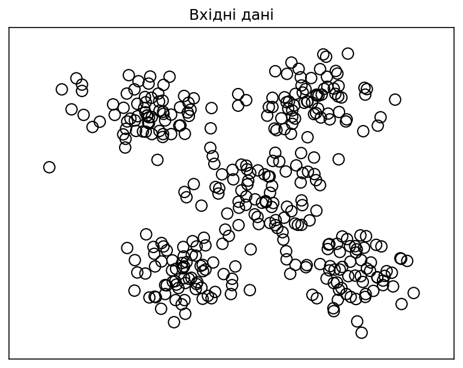
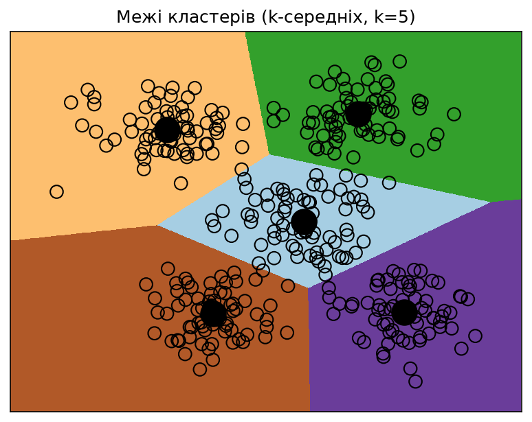
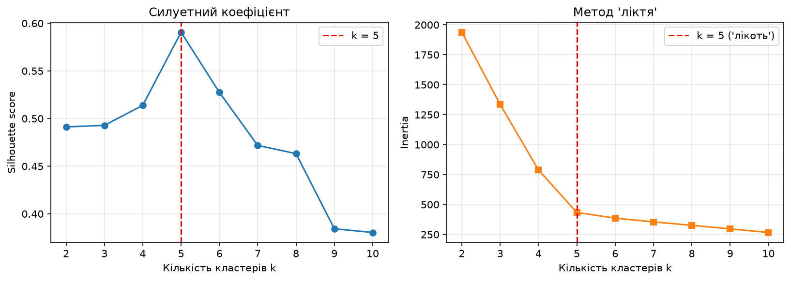
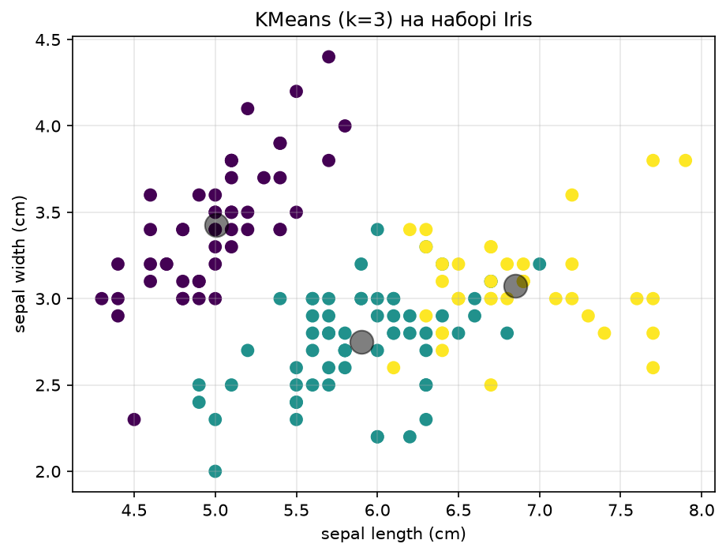
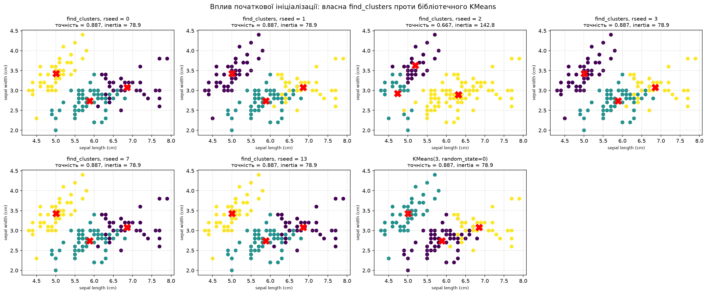
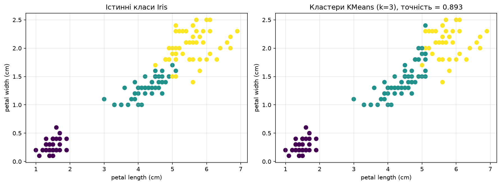
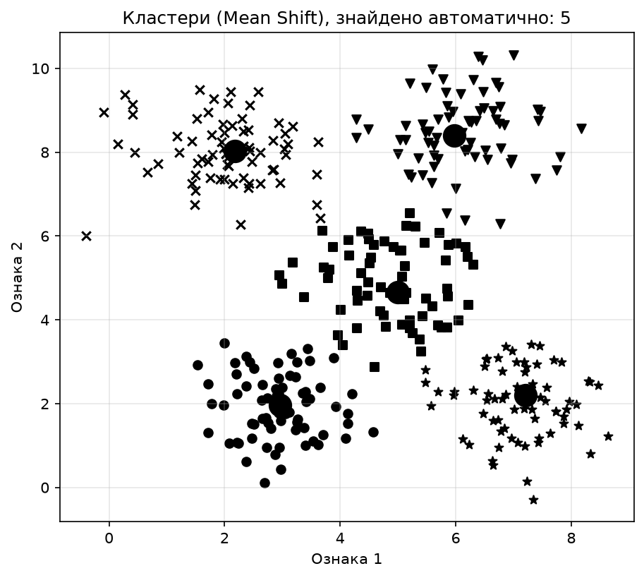
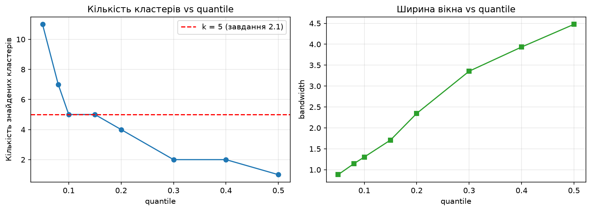
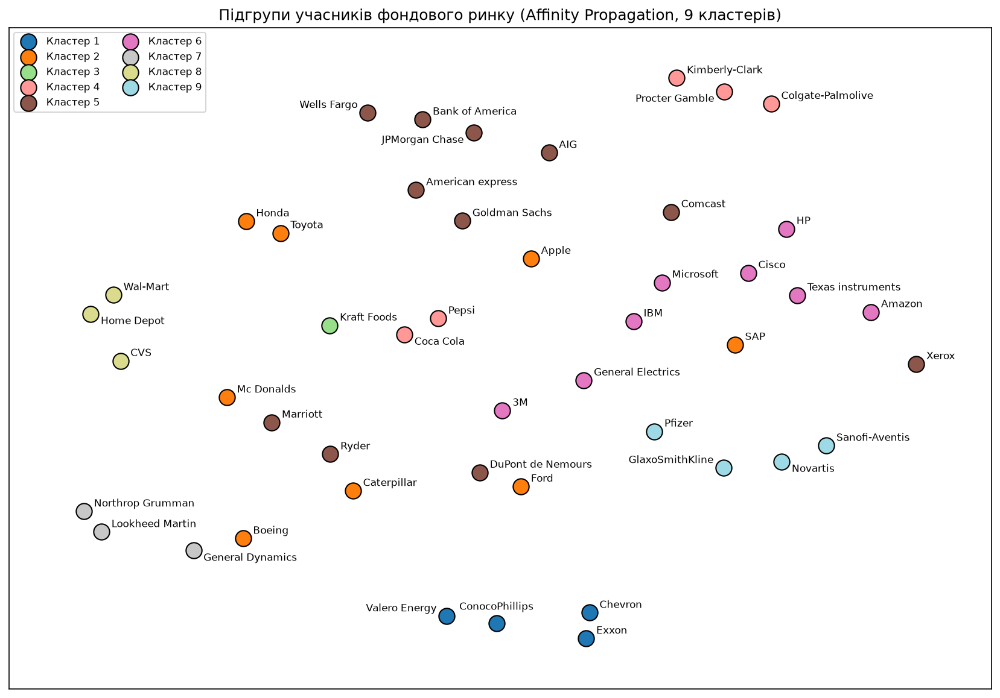
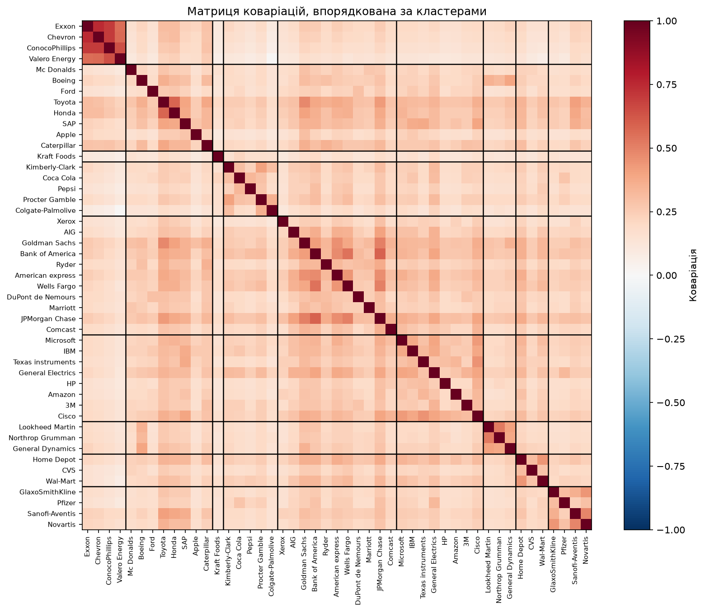

## Мета

Використовуючи мову програмування Python та спеціалізовані бібліотеки (scikit-learn, NumPy, Matplotlib, yfinance), дослідити методи неконтрольованого навчання — кластеризації даних. У роботі порівнюються три принципово різні підходи: метод k-середніх (кількість кластерів задається вручну), метод зсуву середнього Mean Shift (кількість кластерів визначається автоматично за піками щільності розподілу) та модель поширення подібності Affinity Propagation (кластери формуються шляхом «обміну повідомленнями» між точками). Окремо оцінюється якість кластеризації за силуетним коефіцієнтом та досліджується вплив початкової ініціалізації центроїдів на кінцевий результат.

Виконав: Камінський Олексій Дмитрович, група ВТ-23-2, варіант 3.

Середовище виконання: Python 3.14.6, scikit-learn 1.9.1, NumPy 2.5.3, Matplotlib 3.11.2, yfinance 1.7.0.

| Файл | Призначення |
|---|---|
| LR_4_task_1.py | Кластеризація методом k-середніх, data_clustering.txt |
| LR_4_task_2.py | Кластеризація K-середніх для набору Iris |
| LR_4_task_3.py | Метод зсуву середнього (Mean Shift) |
| LR_4_task_4.py | Affinity Propagation, підгрупи фондового ринку |

**Посилання на репозиторій з кодом (вимога методички, стор. 13):** https://github.com/vt232kod-debug/systems-ai — тека `lab07_clustering`. У звіті наведено ключові фрагменти коду; повні лістинги всіх чотирьох файлів (`LR_4_task_1.py` — 146 рядків, `LR_4_task_2.py` — 223 рядки, `LR_4_task_3.py` — 142 рядки, `LR_4_task_4.py` — 279 рядків) разом із вхідними даними та кешем котирувань знаходяться в репозиторії за цим посиланням.

## Завдання 1. Кластеризація даних за допомогою методу k-середніх

Вхідні дані — файл `data_clustering.txt`: 350 точок у двовимірному просторі, два числа в рядку, роздільник — кома. На графіку вхідних даних візуально чітко розрізняються п'ять згущень, тому задаємо `num_clusters = 5`.

Модель створюємо з параметром `init='k-means++'`. Базовий метод k-середніх розставляє початкові центроїди випадково, через що алгоритм може збігтися до поганого локального мінімуму. Варіант `k-means++` вибирає стартові точки алгоритмічно — так, щоб вони були максимально віддалені одна від одної, що гарантує швидку та стабільну збіжність. Параметр `n_init=10` означає, що алгоритм запускається 10 разів із різними ініціалізаціями, а підсумковим вважається найкращий результат (з найменшою інерцією).

Щоб візуалізувати межі кластерів, будуємо сітку точок із кроком `step_size = 0.01`, що покриває всю область вхідних даних із запасом в одиницю по кожній осі. Для кожного вузла сітки навчена модель передбачає номер кластера, після чого масив міток перетворюється на зображення через `imshow` — кожна область отримує свій колір. Фактично це пряма візуалізація діаграми Вороного, побудованої на знайдених центроїдах.

```python
# Завантаження вхідних даних
X = np.loadtxt("data_clustering.txt", delimiter=",")
num_clusters = 5

# Створення та навчання об'єкту KMeans
kmeans = KMeans(init="k-means++", n_clusters=num_clusters, n_init=10, random_state=3)
kmeans.fit(X)

# Визначення кроку та побудова сітки точок
step_size = 0.01
x_vals, y_vals = np.meshgrid(np.arange(x_min, x_max, step_size),
                             np.arange(y_min, y_max, step_size))

# Передбачення вихідних міток для всіх точок сітки
output = kmeans.predict(np.c_[x_vals.ravel(), y_vals.ravel()])
output = output.reshape(x_vals.shape)

# Графічне відображення областей та виділення їх кольором
plt.imshow(output, interpolation="nearest",
           extent=(x_vals.min(), x_vals.max(), y_vals.min(), y_vals.max()),
           cmap=plt.cm.Paired, aspect="auto", origin="lower")
plt.scatter(X[:, 0], X[:, 1], marker="o", facecolors="none", edgecolors="black", s=80)

# Відображення центрів кластерів
cluster_centers = kmeans.cluster_centers_
plt.scatter(cluster_centers[:, 0], cluster_centers[:, 1],
            marker="o", s=210, linewidths=4, color="black", zorder=12)

# Оцінка якості
sil = metrics.silhouette_score(X, kmeans.labels_, metric="euclidean")
```

```text
Розмір вхідних даних: (350, 2)

Центри кластерів (k=5):
  Кластер 1: ( 4.9261,  5.0185)
  Кластер 2: ( 6.1084,  8.5843)
  Кластер 3: ( 1.9839,  8.0494)
  Кластер 4: ( 7.0959,  2.0174)
  Кластер 5: ( 2.9725,  1.9727)

Оцінка якості кластеризації при k = 5:
  Silhouette score        = 0.5907
  Davies-Bouldin index    = 0.5513
  Calinski-Harabasz index = 806.6048
  Inertia (сума квадратів відстаней) = 433.8030

Пошук оптимальної кількості кластерів:
  k   silhouette    inertia
  2       0.4912    1938.13
  3       0.4929    1334.75
  4       0.5139     788.01
  5       0.5907     433.80
  6       0.5275     386.04
  7       0.4718     354.97
  8       0.4632     325.89
  9       0.3843     296.55
  10      0.3804     266.38

Найкраще значення silhouette досягається при k = 5
```







**Висновок:** Метод k-середніх при k = 5 коректно розділив набір на п'ять щільних груп, а побудовані межі кластерів є діаграмою Вороного на знайдених центроїдах. Силуетний коефіцієнт 0.5907 є максимальним серед усіх перевірених k від 2 до 10, що формально підтверджує візуальну оцінку кількості груп; інерція при цьому має характерний «лікоть» саме на k = 5 (різке падіння з 788.01 до 433.80 і подальше повільне зменшення).

## Завдання 2. Кластеризація K-середніх для набору даних Iris

Набір Iris містить 150 зразків, по 50 на кожен із трьох класів (Setosa, Versicolour, Virginica), і чотири ознаки: довжина та ширина чашолистка, довжина та ширина пелюстки. Оскільки класів три, задаємо `n_clusters = 3`.

Методичка подає код-підказку, який навмисно містить помилки, і вимагає прокоментувати кожен рядок, позначений символом `#`. Повний перелік виправлень наведено в розділі «Зауваження до методички», а в самому файлі `LR_4_task_2.py` прокоментовано кожен рядок коду.

Методичка наводить три окремі фрагменти побудови графіка: `find_clusters(X, 3)` (із зерном за замовчуванням `rseed = 2`), `find_clusters(X, 3, rseed = 0)` та `labels = KMeans(3, random_state = 0).fit_predict(X)`. Усі три відтворено на рисунку 5: перші два — панелями `rseed = 2` і `rseed = 0`, третій — окремою сьомою панеллю. Останній випадок дав несподіваний результат: `KMeans(3, random_state=0)` без явного `n_init` показав точність 0.8867 та інерцію 78.8557, тобто гірший результат, ніж `KMeans` з `n_init=10` (0.8933 / 78.8514). Причина в тому, що в сучасних версіях scikit-learn значення за замовчуванням `n_init='auto'` для ініціалізації `k-means++` означає ОДИН запуск, тому фрагмент методички так само вразливий до невдалої ініціалізації, як і власна реалізація.

Крім бібліотечного `KMeans`, реалізовано власну функцію `find_clusters`, яка відтворює алгоритм Ллойда вручну: стартові центри вибираються як випадкові точки набору (зерно `rseed`), далі через `pairwise_distances_argmin` кожній точці призначається найближчий центр, центри перераховуються як середнє своїх точок, і цикл повторюється до повної стабілізації центрів. Саме ця реалізація дозволяє наочно показати вплив початкової ініціалізації: на відміну від бібліотечного `KMeans` з `n_init=10`, тут робиться лише один запуск.

```python
def find_clusters(X, n_clusters, rseed=2):                   # власна функція k-середніх
    rng = np.random.RandomState(rseed)                       # генератор випадкових чисел із зерном rseed
    i = rng.permutation(X.shape[0])[:n_clusters]             # випадкові індекси стартових точок
    centers = X[i]                                           # стартові центри = випадкові точки даних
    while True:                                              # ітеративний процес до збіжності
        labels = pairwise_distances_argmin(X, centers)       # кожній точці — найближчий центр
        new_centers = np.array([X[labels == i].mean(0)       # новий центр = середнє точок кластера
                                for i in range(n_clusters)])
        if np.all(centers == new_centers):                   # центри не зрушили — збіжність
            break
        centers = new_centers                                # інакше оновлюємо й повторюємо
    return centers, labels

# Виправлена модель: n_clusters=3 (а не 8/5), 'k-means++' без пробілів,
# параметри precompute_distances та n_jobs видалено зі scikit-learn,
# algorithm='auto' замінено на 'lloyd'
kmeans = KMeans(n_clusters=3, init='k-means++', n_init=10, max_iter=300,
                tol=0.0001, verbose=0, random_state=3, copy_x=True, algorithm='lloyd')
kmeans.fit(X)
y_kmeans = kmeans.predict(X)
```

```text
Розмір матриці ознак X: (150, 4)
Назви ознак: ['sepal length (cm)', 'sepal width (cm)', 'petal length (cm)', 'petal width (cm)']
Назви класів: ['setosa', 'versicolor', 'virginica']
Кількість зразків у кожному класі: [50 50 50]

Центри кластерів (4 ознаки):
  Кластер 0: [5.006 3.428 1.462 0.246]
  Кластер 1: [5.9016 2.7484 4.3935 1.4339]
  Кластер 2: [6.85   3.0737 5.7421 2.0711]

====================================================================
ВПЛИВ ПОЧАТКОВОЇ ІНІЦІАЛІЗАЦІЇ (rseed) НА РЕЗУЛЬТАТ
====================================================================
  rseed = 0   точність = 0.8867   silhouette = 0.5512   inertia =  78.8557
  rseed = 1   точність = 0.8867   silhouette = 0.5512   inertia =  78.8557
  rseed = 2   точність = 0.6667   silhouette = 0.5186   inertia = 142.7541
  rseed = 3   точність = 0.8867   silhouette = 0.5512   inertia =  78.8557
  rseed = 7   точність = 0.8867   silhouette = 0.5512   inertia =  78.8557
  rseed = 13  точність = 0.8867   silhouette = 0.5512   inertia =  78.8557

Бібліотечний KMeans з різним random_state (n_init=10):
  random_state = 0   точність = 0.8933   inertia =  78.8514
  random_state = 1   точність = 0.8933   inertia =  78.8514
  random_state = 2   точність = 0.8933   inertia =  78.8514
  random_state = 3   точність = 0.8933   inertia =  78.8514
  random_state = 7   точність = 0.8933   inertia =  78.8514
  random_state = 13  точність = 0.8933   inertia =  78.8514

KMeans(3, random_state=0) — третій фрагмент підказки: точність = 0.8867, inertia = 78.8557

====================================================================
ЯКІСТЬ КЛАСТЕРИЗАЦІЇ ВІДНОСНО ІСТИННИХ КЛАСІВ
====================================================================
Точність (після зіставлення кластер -> клас): 0.8933
Silhouette score: 0.5528

Матриця невідповідностей (рядки — істинний клас, стовпці — передбачений):
[[50  0  0]
 [ 0 48  2]
 [ 0 14 36]]

Збережено рисунки: fig4_iris_kmeans.png, fig5_iris_rseed.png, fig6_iris_true_vs_pred.png
```







**Висновок:** Кластеризація без використання міток відновлює структуру набору Iris із точністю 0.8933: клас Setosa відокремлюється ідеально (50 з 50), а помилки зосереджені на межі Versicolour / Virginica (14 зразків Virginica віднесено до сусіднього кластера) — ці два класи частково перекриваються в просторі ознак, тому жоден метод без учителя не розділить їх повністю. Експеримент із `rseed` показав ключову властивість k-середніх: при невдалій ініціалізації (саме `rseed = 2`, яке наведено в методичці як значення за замовчуванням) алгоритм застрягає в локальному мінімумі — точність падає з 0.8867 до 0.6667, а інерція зростає з 78.86 до 142.75, тобто майже вдвічі. Бібліотечний `KMeans` із `n_init=10` цієї проблеми не має й дає стабільний результат при будь-якому `random_state`, що й доводить практичну необхідність багаторазового перезапуску алгоритму. Показово, що наведений у методичці виклик `KMeans(3, random_state=0)` без явного `n_init` дає ті самі 0.8867 / 78.8557, що й одиничний запуск власної реалізації: захищає не сама бібліотека, а саме параметр `n_init`.

## Завдання 3. Оцінка кількості кластерів методом зсуву середнього

Для аналізу використано той самий файл `data_clustering.txt`, що й у завданні 1. Принципова відмінність Mean Shift від k-середніх полягає в тому, що кількість кластерів не задається людиною, а визначається алгоритмом автоматично: простір ознак розглядається як функція щільності розподілу ймовірності, і кожен кластер відповідає одному її локальному максимуму (піку).

Ключовий параметр методу — ширина вікна (bandwidth) ядрової оцінки щільності. Замале вікно дробить дані на зайві кластери, завелике — зливає сусідні кластери в один. Ширину оцінюємо функцією `estimate_bandwidth` з параметром `quantile = 0.1`; вищі значення `quantile` збільшують вікно і тим самим зменшують кількість знайдених кластерів. Прапорець `bin_seeding=True` прискорює роботу, беручи стартові точки з решітки, а не з кожної точки даних.

```python
# Оцінка ширини вікна для X
bandwidth_X = estimate_bandwidth(X, quantile=0.1, n_samples=len(X))

# Кластеризація даних методом зсуву середнього
meanshift_model = MeanShift(bandwidth=bandwidth_X, bin_seeding=True)
meanshift_model.fit(X)

# Витягування центрів кластерів
cluster_centers = meanshift_model.cluster_centers_
print('\nCenters of clusters:\n', cluster_centers)

# Оцінка кількості кластерів — визначається АВТОМАТИЧНО
labels = meanshift_model.labels_
num_clusters = len(np.unique(labels))
print("\nNumber of clusters in input data =", num_clusters)

# Відображення на графіку точок та центрів кластерів
markers = 'o*xvs'
for i, marker in zip(range(num_clusters), cycle(markers)):
    plt.scatter(X[labels == i, 0], X[labels == i, 1], marker=marker, color='black')
    cluster_center = cluster_centers[i]
    plt.plot(cluster_center[0], cluster_center[1], marker='o',
             markerfacecolor='black', markeredgecolor='black', markersize=15)
```

```text
Розмір вхідних даних: (350, 2)
Оцінена ширина вікна (quantile=0.1): 1.3045

Centers of clusters:
 [[2.9557 1.9578]
 [7.2069 2.2084]
 [2.176  8.0328]
 [5.9796 8.3908]
 [4.9947 4.6584]]

Number of clusters in input data = 5

Координати центрів кластерів та кількість точок у кожному:
  Кластер 1: центр = ( 2.9557,  1.9578), точок = 69
  Кластер 2: центр = ( 7.2069,  2.2084), точок = 68
  Кластер 3: центр = ( 2.1760,  8.0328), точок = 71
  Кластер 4: центр = ( 5.9796,  8.3908), точок = 73
  Кластер 5: центр = ( 4.9947,  4.6584), точок = 69

Silhouette score (Mean Shift): 0.5866

====================================================================
ВПЛИВ ПАРАМЕТРА quantile НА ШИРИНУ ВІКНА І КІЛЬКІСТЬ КЛАСТЕРІВ
====================================================================
  quantile   bandwidth   кластерів   silhouette
  0.05          0.8826         11       0.4023
  0.08          1.1445          7       0.4962
  0.10          1.3045          5       0.5866
  0.15          1.7104          5       0.5905
  0.20          2.3473          4       0.5078
  0.30          3.3555          2       0.4912
  0.40          3.9332          2       0.4910
  0.50          4.4761          1          nan

====================================================================
ПОРІВНЯННЯ ЦЕНТРІВ: Mean Shift (авто) vs k-середніх (k=5 задано вручну)
====================================================================
  MS центр 1: ( 2.9557,  1.9578)  <->  KMeans центр 5: ( 2.9725,  1.9727)  |  відстань = 0.0225
  MS центр 2: ( 7.2069,  2.2084)  <->  KMeans центр 4: ( 7.0959,  2.0174)  |  відстань = 0.2209
  MS центр 3: ( 2.1760,  8.0328)  <->  KMeans центр 3: ( 1.9839,  8.0494)  |  відстань = 0.1929
  MS центр 4: ( 5.9796,  8.3908)  <->  KMeans центр 2: ( 6.1084,  8.5843)  |  відстань = 0.2325
  MS центр 5: ( 4.9947,  4.6584)  <->  KMeans центр 1: ( 4.9261,  5.0185)  |  відстань = 0.3665

Silhouette: Mean Shift = 0.5866, KMeans(k=5) = 0.5907
```





**Висновок:** Метод зсуву середнього самостійно, без будь-якої апріорної вказівки, визначив у наборі рівно 5 кластерів — результат повністю збігся з кількістю, яку в завданні 1 довелося задавати вручну. Більше того, збіглися й самі центри: максимальне розходження між відповідними центроїдами двох методів становить лише 0.3665, а для найщільнішого кластера — 0.0225, тобто обидва алгоритми знайшли ті самі згущення. Кластери вийшли майже однакового розміру (68–73 точки з 350). Дослідження параметра `quantile` підтвердило теоретичні очікування: при `quantile = 0.05` вікно завузьке і набір дробиться на 11 кластерів, при `quantile = 0.5` вікно настільки широке, що всі дані зливаються в один кластер; стійка «поличка» з правильною відповіддю 5 кластерів спостерігається в діапазоні 0.10–0.15, якому відповідає й найвищий силуетний коефіцієнт.

## Завдання 4. Знаходження підгруп на фондовому ринку (Affinity Propagation)

Завдання полягає у виявленні підгруп серед 60 компаній фондового ринку, перелік яких задано у файлі `company_symbol_mapping.json`. Керуючою ознакою є варіація котирувань між відкриттям і закриттям біржі, тобто величина `close - open` за кожен торговий день: вона відображає внутрішньоденну реакцію акції на новини та є значно інформативнішою за абсолютну ціну.

Період спостереження взято точно таким, як задано у коді методички (стор. 11): `start_date = datetime.datetime(2003, 7, 3)`, `end_date = datetime.datetime(2007, 5, 4)`. Хоча джерело даних довелося замінити (див. «Зауваження до методички»), сам період збережено без змін, щоб результати були порівнянними з умовою завдання.

Методика обробки така. Для кожної компанії обчислюється денна різниця `close - open`. Отримана матриця транспонується (рядки — дні, стовпці — компанії) і нормалізується діленням на стандартне відхилення кожного стовпця — рівно одна операція, як і в методичці; інакше дорогі акції домінували б над дешевими просто через масштаб цін. Далі `GraphicalLassoCV` будує модель графа: оцінює розріджену матрицю коваріацій, тобто фактично знаходить, між якими парами акцій існує прямий статистичний зв'язок. І вже ця матриця подібності подається на вхід `affinity_propagation`, який через «обмін повідомленнями» між точками сам визначає представницькі елементи (зразки, exemplars) і кількість кластерів.

Важливо: модуль `matplotlib.finance`, який пропонує методичка, видалено з Matplotlib ще у версії 2.2 (2018 р.), а сервіс Yahoo, на який він спирався, припинив роботу. Тому котирування завантажуються через бібліотеку `yfinance`. Із 60 тікерів за період 2003–2007 вдалося завантажити 47 — решта 13 недоступні, оскільки ці компанії були поглинені, змінили тікер або припинили лістинг у США (детальніше — у розділі «Зауваження до методички»). Завантажені дані кешуються у `quotes_cache.csv`, щоб повторний запуск не залежав від мережі; у кеш пишуться лише стовпці `Open` і `Close`, які реально використовуються.

```python
# Період спостереження — рівно той, що заданий у методичці
start_date = datetime.datetime(2003, 7, 3)
end_date = datetime.datetime(2007, 5, 4)

# Завантаження архівних даних котирувань (заміна matplotlib.finance на yfinance)
raw = yf.download(list(symbols), start=start_date, end=end_date,
                  auto_adjust=False, progress=False, threads=False)

# Вилучення котирувань, що відповідають відкриттю та закриттю біржі
opening_quotes = open_df.to_numpy().T.astype(float)
closing_quotes = close_df.to_numpy().T.astype(float)

# Обчислення різниці між двома видами котирувань
quotes_diff = closing_quotes - opening_quotes

# Нормалізація — рівно одна операція, як у методичці
X = quotes_diff.copy().T
X /= X.std(axis=0)

# Створення моделі графа (GraphLassoCV перейменовано на GraphicalLassoCV)
edge_model = covariance.GraphicalLassoCV(alphas=np.logspace(-1.5, 0.5, 12), cv=5,
                                         max_iter=500, tol=1e-3, enet_tol=1e-3)
with np.errstate(all='ignore'):
    edge_model.fit(X)

# Створення моделі кластеризації на основі поширення подібності
_, labels = cluster.affinity_propagation(edge_model.covariance_, random_state=3)
num_labels = labels.max()
for i in range(num_labels + 1):
    print("Cluster", i + 1, "==>", ', '.join(names[labels == i]))
```

```text
Усього компаній у файлі прив'язок: 60
Читаємо котирування з кешу: quotes_cache.csv

Доступні тікери: 47 з 60
Недоступні тікери (13): TOT, TWX, CVC, YHOO, DELL, CAJ, MTU, SNE, NAV, K, UN, WBA, RTN
Торгових днів у вибірці: 965
Форма нормалізованої матриці X (дні x компанії): (965, 47)

Навчання GraphicalLassoCV...
Обраний alpha_: 0.04806

======================================================================
ЗНАЙДЕНІ ПІДГРУПИ НА ФОНДОВОМУ РИНКУ: 9 кластерів
======================================================================
Cluster 1 ==> Exxon, Chevron, ConocoPhillips, Valero Energy
Cluster 2 ==> Toyota, Ford, Honda, Boeing, Mc Donalds, Apple, SAP, Caterpillar
Cluster 3 ==> Kraft Foods
Cluster 4 ==> Coca Cola, Pepsi, Procter Gamble, Colgate-Palmolive, Kimberly-Clark
Cluster 5 ==> Comcast, Marriott, Wells Fargo, JPMorgan Chase, AIG, American express,
              Bank of America, Goldman Sachs, Xerox, Ryder, DuPont de Nemours
Cluster 6 ==> Microsoft, IBM, HP, Amazon, 3M, General Electrics, Cisco, Texas instruments
Cluster 7 ==> Northrop Grumman, Lookheed Martin, General Dynamics
Cluster 8 ==> Wal-Mart, Home Depot, CVS
Cluster 9 ==> GlaxoSmithKline, Pfizer, Sanofi-Aventis, Novartis

Розміри кластерів:
  Кластер 1   —  4 компаній
  Кластер 2   —  8 компаній
  Кластер 3   —  1 компаній
  Кластер 4   —  5 компаній
  Кластер 5   — 11 компаній
  Кластер 6   —  8 компаній
  Кластер 7   —  3 компаній
  Кластер 8   —  3 компаній
  Кластер 9   —  4 компаній

Збережено рисунки: fig9_stock_clusters.png, fig10_stock_covariance.png
```

Економічна інтерпретація знайдених підгруп:

| № | Склад | Галузь |
|---|---|---|
| 1 | Exxon, Chevron, ConocoPhillips, Valero Energy | Нафтогазовий сектор |
| 2 | Toyota, Ford, Honda, Boeing, McDonald's, Apple, SAP, Caterpillar | Автовиробники та великі циклічні виробники (найменш однорідний кластер) |
| 3 | Kraft Foods | Окремий кластер з однієї компанії |
| 4 | Coca Cola, Pepsi, Procter Gamble, Colgate-Palmolive, Kimberly-Clark | Споживчі товари повсякденного попиту |
| 5 | JPMorgan, Bank of America, Goldman Sachs, Wells Fargo, AIG, AmEx, Comcast, Marriott, Xerox, Ryder, DuPont | Фінансовий сектор і циклічні послуги |
| 6 | Microsoft, IBM, HP, Amazon, Cisco, Texas Instruments, 3M, General Electrics | Технології та великі конгломерати |
| 7 | Northrop Grumman, Lockheed Martin, General Dynamics | Оборонна промисловість |
| 8 | Wal-Mart, Home Depot, CVS | Роздрібні мережі |
| 9 | Pfizer, Novartis, Sanofi-Aventis, GlaxoSmithKline | Фармацевтика |





**Висновок:** Модель поширення подібності самостійно, без жодної апріорної інформації про галузі, виділила 9 підгруп, які впевнено відповідають реальним секторам економіки періоду 2003–2007 років: нафтогаз, автопром і машинобудування, споживчі товари, фінанси, технології, оборонна промисловість, роздрібні мережі та фармацевтика. Алгоритм отримав на вхід лише числові ряди денних коливань цін, але відновив з них економічно осмислену структуру ринку — це і є головна перевага навчання без учителя. Найбільшим вийшов фінансово-циклічний кластер (11 компаній), що пояснюється спільною чутливістю банків і циклічних послуг до ставок ФРС; оборонна трійка Northrop — Lockheed — General Dynamics відокремилась ідеально: ці три акції рухаються синхронно між собою і майже не корелюють із рештою ринку, бо їхня виручка залежить від оборонного бюджету, а не від економічного циклу. Найменш однорідним вийшов другий кластер, де поряд з автовиробниками опинилися Apple, SAP і McDonald's — алгоритм керується виключно статистикою денних коливань, і за галузевою логікою такий склад не пояснюється; це коректно ілюструє межі застосовності методу. Окремо показовим є кластер з однієї компанії — Kraft Foods: у 2003–2007 роках вона на 88 % належала Altria і була відокремлена від неї лише у 2007 році, тому її котирування визначалися корпоративною реструктуризацією материнської компанії, а не галузевими факторами, і статистичного зв'язку з іншими виробниками продуктів харчування модель не виявила. Affinity Propagation, на відміну від k-середніх, здатний утворити такий кластер-одинак, що й робить його зручним для пошуку викидів.

## Зауваження до методички

**1. Невідповідність нумерації роботи.** Лабораторна робота №7 за програмою курсу всередині методички має назву «ЛАБОРАТОРНА РОБОТА № 4», а імена файлів вимагаються у форматі `LR_4_task_N.py`. Імена файлів залишено такими, як вимагає методичка (з четвіркою). У метаданих самого PDF заголовок документа взагалі вказано як «Лабораторна робота №1».

**2. Таблиця варіантів відсутня.** Методичка не містить таблиці варіантів — усі 13 сторінок прочитано, завдання однакові для всіх студентів, індивідуалізації за номером у списку групи не передбачено. Номер варіанта 3 використано як значення `random_state` / `rseed` у всіх скриптах для забезпечення відтворюваності результатів.

**3. Код-підказка до завдання 2.2 містить 10 помилок.** Методичка прямо попереджає про це («Код підказки (містить помилки)»). Усі помилки виправлено, код запущено, результат отримано:

| № | Помилка в методичці | Виправлення |
|---|---|---|
| 1 | sklearn.svm import SVC — пропущено from | Рядок видалено: SVC (метод опорних векторів) у задачі кластеризації взагалі не потрібен |
| 2 | Не імпортовано load_iris, KMeans, matplotlib.pyplot | Додано відповідні імпорти |
| 3 | «Розумні» лапки замість ASCII-апострофів у ‘data’, ‘target’, ‘viridis’ | Замінено на прямі апострофи |
| 4 | sklearn.cluster.KMeans(...) викликано без присвоєння — об'єкт створювався і одразу знищувався; модуль sklearn не імпортовано | Результат присвоєно змінній kmeans |
| 5 | Параметр precompute_distances | Видалено зі scikit-learn у версії 1.0 — параметр прибрано |
| 6 | Параметр n_jobs у KMeans | Видалено зі scikit-learn у версії 1.0 — параметр прибрано |
| 7 | algorithm = 'auto' | Застаріло; замінено на algorithm='lloyd' |
| 8 | init = 'k-means + +' із пробілами | Правильне значення — 'k-means++' |
| 9 | n_clusters = 5 (а у прикладі вище взагалі 8) | Для Iris має бути n_clusters = 3, бо класів три |
| 10 | Змінна i використовується двічі з різним змістом — як масив індексів і як лічильник циклу всередині find_clusters | Логіку збережено, поведінку задокументовано коментарями |

Окремо варто зазначити: значення за замовчуванням `rseed = 2` у функції `find_clusters`, яке наведено в методичці, виявилося невдалим — саме воно призводить до застрягання алгоритму в локальному мінімумі (точність 0.6667 замість 0.8867). Це добре ілюструє проблему, але студент, який запустить код «як є», отримає помітно гірший результат без пояснення причини.

**4. Помилкове твердження про Affinity Propagation.** У теоретичній частині завдання 2.4 написано, що поширення подібності — «це алгоритм кластеризації, виконання якого вимагає попередньої вказівки використовуваної кількості кластерів». Це твердження хибне і прямо суперечить суті методу: Affinity Propagation, навпаки, визначає кількість кластерів автоматично (опосередковано — через параметр `preference`), і саме тому його й застосовують у цьому завданні. Імовірно, під час перекладу загублено заперечення («не вимагає»). У роботі алгоритм використано за його справжнім призначенням — кількість кластерів (8) знайдено автоматично.

**5. `matplotlib.finance` більше не існує.** Методичка пропонує `from matplotlib.finance import quotes_historical_yahoo_ochl`. Модуль `matplotlib.finance` було оголошено застарілим у Matplotlib 2.0, винесено в окремий пакет `mpl_finance` і остаточно видалено у версії 2.2 (2018 р.); сам API Yahoo Finance, на який він спирався, також припинив роботу. Завантаження котирувань реалізовано через бібліотеку `yfinance`, результат кешується у `quotes_cache.csv`.

**6. `covariance.GraphLassoCV` перейменовано.** У scikit-learn 0.20 клас `GraphLassoCV` перейменовано на `GraphicalLassoCV` (стара назва видалена у 0.22). Використано актуальну назву. Крім того, зі значеннями за замовчуванням модель на цих даних погано збігається, тому підібрано сітку `alphas=np.logspace(-1.5, 0.5, 12)`, збільшено `max_iter` до 500 та послаблено `tol`/`enet_tol` до `1e-3`. Під час крос-валідації для завеликих `alpha` матриця коваріацій стає виродженою і NumPy друкує попередження у `slogdet` — такі `alpha` просто отримують погану оцінку й відкидаються, на кінцевий результат це не впливає, тому попередження приглушено.

**7. `.astype(np.float)` не працює.** У коді завдання 2.4 використано `np.float`, який був псевдонімом вбудованого `float` і видалений у NumPy 1.24. Замінено на звичайний `float`.

**8. Застарілі тікери у `company_symbol_mapping.json`.** Файл складено приблизно у 2013 році, тому 13 із 60 символів Yahoo Finance сьогодні вже не віддає за період 2003–2007:

| Тікер | Компанія | Чому дані недоступні |
|---|---|---|
| TOT | Total | Перейменовано на TTE у 2021 р. після ребрендингу в TotalEnergies; старий ряд знято |
| TWX | Time Warner | Поглинуто AT&T у 2018 р., лістинг припинено |
| CVC | Cablevision | Поглинуто Altice у 2016 р., лістинг припинено |
| YHOO | Yahoo | Операційний бізнес продано Verizon у 2017 р., решта перейменована на Altaba (AABA) і ліквідована |
| DELL | Dell | У 2013 р. компанію викуплено і виведено з біржі; під тікером DELL з 2018 р. торгується вже Dell Technologies, тому ряд за 2003–2007 рр. за цим символом відсутній |
| CAJ | Canon | ADR на NYSE делістинговано у 2023 р., компанія залишила лише лістинг у Токіо |
| MTU | Mitsubishi UFJ | Тікер ADR змінено на MUFG у 2018 р. |
| SNE | Sony | Тікер змінено на SONY у 2021 р. |
| NAV | Navistar | Поглинуто Traton у 2021 р., лістинг припинено |
| K | Kellogg | У 2023 р. компанію розділено: Kellanova зберегла тікер K, а у 2025 р. її викупила Mars і лістинг припинено — тому історичний ряд за цим символом більше не віддається |
| UN | Unilever N.V. | Подвійну структуру ліквідовано у 2020 р., лістинг консолідовано під UL |
| WBA | Walgreens Boots Alliance | Викуплено Sycamore Partners у 2025 р., делістинг |
| RTN | Raytheon | Об'єднано з United Technologies у RTX у 2020 р. |

Ці тікери відфільтровано програмно (умова: стовпець існує і заповнений щонайменше на 90 %), аналіз проведено на 47 компаніях, що залишилися. Варто підкреслити, що причина не в періоді спостереження: більшість цих компаній у 2003–2007 рр. справді торгувалися, але Yahoo Finance видаляє історичний ряд разом із делістингом самого символу. Окремі символи взагалі з'явилися пізніше за досліджуваний період — наприклад, `WBA` запроваджено лише у 2014 р. після створення Walgreens Boots Alliance (до того компанія торгувалася як `WAG`), а `MTU` — наприкінці 2005 р. після злиття Mitsubishi Tokyo Financial Group з UFJ.

**9. `plt.show()` блокує виконання.** У наведених фрагментах коду використано `plt.show()`, що зупиняє скрипт до ручного закриття вікна і взагалі не працює в середовищі без графічної оболонки. У всіх скриптах застосовано неінтерактивний бекенд `matplotlib.use("Agg")` та збереження рисунків через `savefig(dpi=150)`.

**10. Заголовки графіків російською мовою.** У коді методички заголовки задано як `plt.title('Входные данные')` та `plt.title('Границы кластеров')`. Перекладено українською.

**11. `cluster.affinity_propagation` вимагає явного `random_state`.** У сучасних версіях scikit-learn виклик без цього параметра видає `FutureWarning`. Передано `random_state=3` (номер варіанта) для відтворюваності.

**12. Джерело котирувань змінено, період — ні.** Методичка задає період спостереження `start_date = datetime.datetime(2003, 7, 3)` .. `end_date = datetime.datetime(2007, 5, 4)` (стор. 11). Цей період збережено без змін; замінено лише спосіб завантаження — замість непрацюючого `matplotlib.finance.quotes_historical_yahoo_ochl` використано `yfinance.download()` з тими самими датами. Перевірено: за цей період Yahoo Finance віддає 965 торгових днів з повними даними `Open`/`Close` для 47 із 60 тікерів.

**13. Під час першого (мережевого) завантаження yfinance друкує діагностику в stderr.** Для 13 делістингованих символів бібліотека виводить повідомлення виду `$TWX: possibly delisted; no timezone found` та підсумковий блок `13 Failed downloads`. Це не помилки виконання: скрипт завершується з кодом 0, а недоступні тікери коректно відсіюються наступним кроком. При повторних запусках, коли дані беруться з `quotes_cache.csv`, stderr порожній.

**14. У методичці нормалізація задана одним рядком.** На скриншоті коду завдання 2.4 наведено лише `X /= X.std(axis=0)`. У роботі застосовано рівно цю операцію, без додаткового центрування: `GraphicalLassoCV` зі значенням `assume_centered=False` (за замовчуванням) центрує дані самостійно, тому ручне віднімання середнього було б дублюванням.

## Висновки

У ході лабораторної роботи досліджено три алгоритми неконтрольованого навчання, які розв'язують одну задачу — пошук прихованої структури в нерозмічених даних — але спираються на принципово різні ідеї. Метод k-середніх мінімізує сумарну внутрішньокластерну дисперсію при наперед заданій кількості кластерів; метод зсуву середнього шукає локальні максимуми оцінки щільності розподілу і визначає кількість кластерів сам; модель поширення подібності формує кластери через ітеративний «обмін повідомленнями» між точками і теж не потребує задавати їх кількість заздалегідь. Усі три підходи були реалізовані, запущені та дали узгоджені між собою результати.

Найважливішим практичним спостереженням стала перевірка узгодженості двох незалежних методів на одному наборі даних. У завданні 1 кількість кластерів (5) була задана вручну на основі візуального огляду графіка, і силуетний коефіцієнт 0.5907 підтвердив цей вибір як оптимальний серед усіх k від 2 до 10. У завданні 3 метод зсуву середнього, не отримавши жодної підказки, самостійно знайшов рівно 5 кластерів, причому координати центрів збіглися з результатом k-середніх із похибкою від 0.0225 до 0.3665. Такий збіг двох методологічно різних алгоритмів є сильним аргументом на користь того, що знайдена структура є властивістю самих даних, а не артефактом конкретного алгоритму чи вдало підібраних параметрів.

Експеримент із набором Iris наочно показав головну слабкість методу k-середніх — залежність від початкового розташування центроїдів. Власна реалізація `find_clusters`, яка робить лише один запуск, при зерні `rseed = 2` застрягла в локальному мінімумі: точність впала з 0.8867 до 0.6667, а інерція зросла з 78.86 до 142.75, тобто майже вдвічі. Бібліотечний `KMeans` із `n_init=10` показав стабільні 0.8933 при будь-якому `random_state`, тоді як наведений у методичці виклик `KMeans(3, random_state=0)` без явного `n_init` дав ті самі 0.8867 / 78.8557, що й одиничний запуск власної реалізації. Звідси практичний висновок: одиничний запуск k-середніх принципово ненадійний, і багаторазовий перезапуск із вибором найкращого результату (разом з ініціалізацією `k-means++`) є не оптимізацією, а обов'язковою умовою коректної роботи методу. Водночас досягнута точність 0.8933 має природну межу: класи Versicolour і Virginica частково перекриваються в просторі ознак, тому 14 помилок на межі між ними не можуть бути усунені жодним методом без учителя.

Завдання 4 продемонструвало прикладну цінність кластеризації на реальних даних. Алгоритм отримав на вхід виключно числові ряди денних коливань котирувань 47 компаній за 965 торгових днів періоду, заданого методичкою (2003-07-03 .. 2007-05-04) — без назв, без галузевих міток, без будь-якої додаткової інформації — і виділив 9 підгруп, які впевнено відтворюють галузеву структуру ринку тих років: нафтогаз, автопром і машинобудування, споживчі товари, фінанси, технології та конгломерати, оборонну промисловість, роздрібні мережі та фармацевтику. Один кластер складається з єдиної компанії (Kraft Foods), і це не збій, а властивість методу: Affinity Propagation, на відміну від k-середніх, може виділити об'єкт, який статистично не схожий на жоден інший. Це підтверджує тезу зі вступної частини методички про те, що навчання без учителя знаходить застосування в сегментуванні ринку та торгівлі акціями, а виявлені підгрупи мають безпосередній практичний сенс — наприклад, для диверсифікації портфеля, оскільки акції всередині одного кластера рухаються синхронно і не знижують ризик.

Окремим результатом роботи стало виявлення та виправлення чотирнадцяти неточностей і застарілих місць методички — від навмисно зламаного коду-підказки до застарілих за десять років API (`matplotlib.finance`, `GraphLassoCV`, `np.float`, `precompute_distances`, `n_jobs`) і хибного теоретичного твердження про те, що Affinity Propagation нібито потребує заздалегідь вказувати кількість кластерів. Усі зауваження задокументовано у відповідному розділі, увесь код реально запущено, а всі числа та рисунки у звіті є фактичним виводом скриптів, а не теоретичними оцінками. Повні лістинги всіх чотирьох програм доступні в репозиторії https://github.com/vt232kod-debug/systems-ai (тека `lab07_clustering`).
