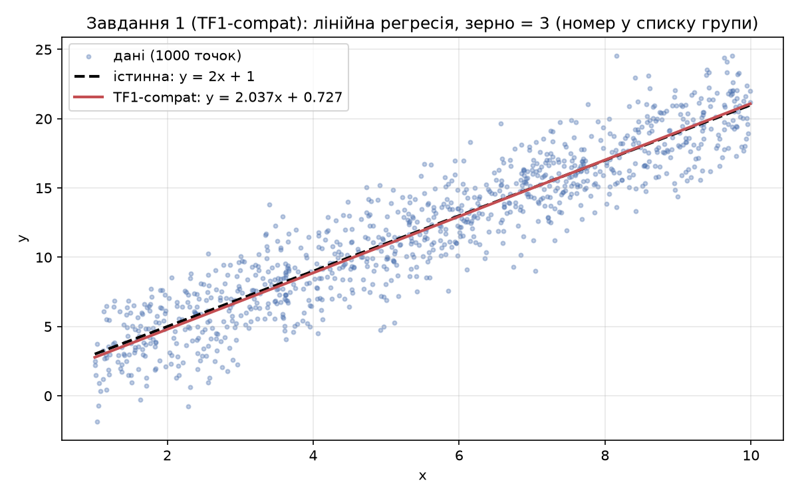
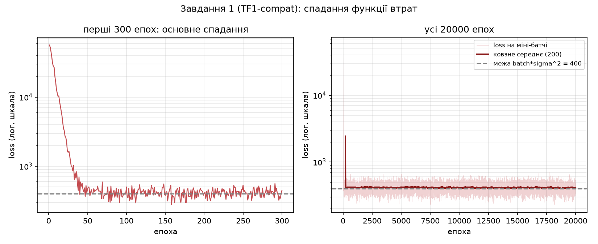
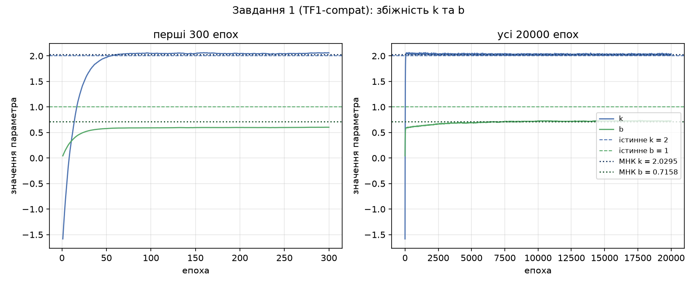
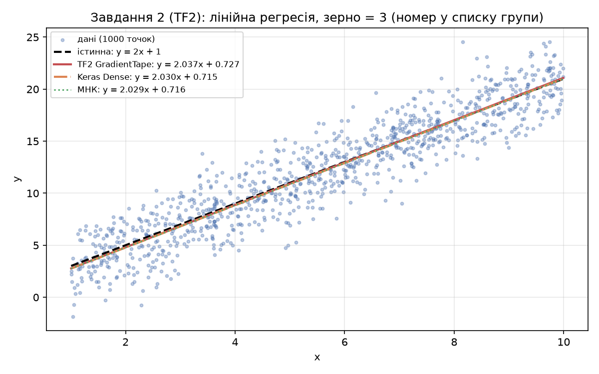
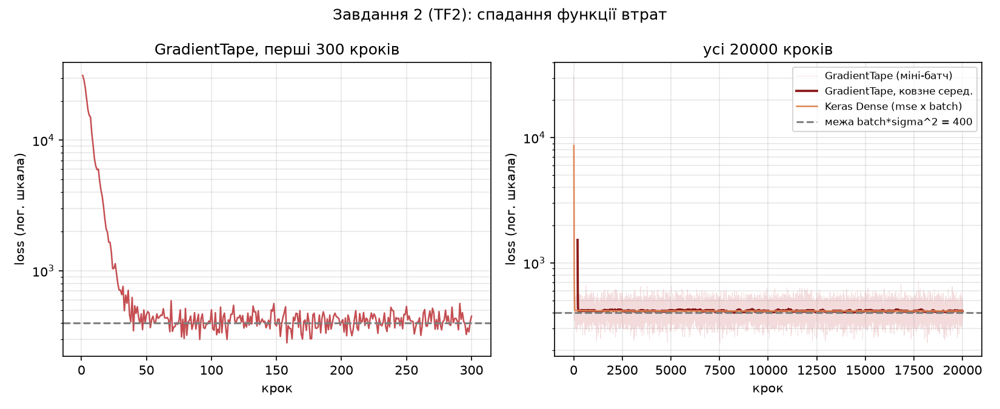
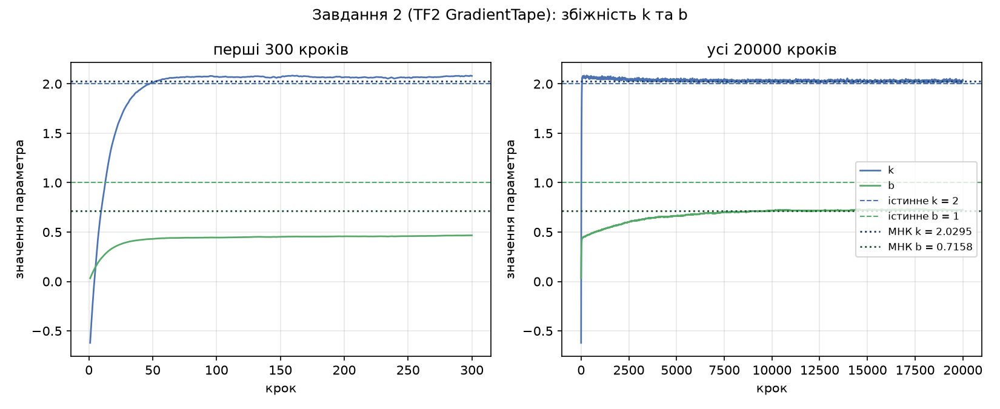
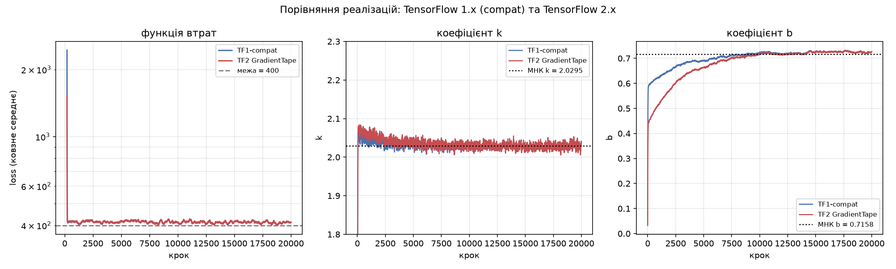
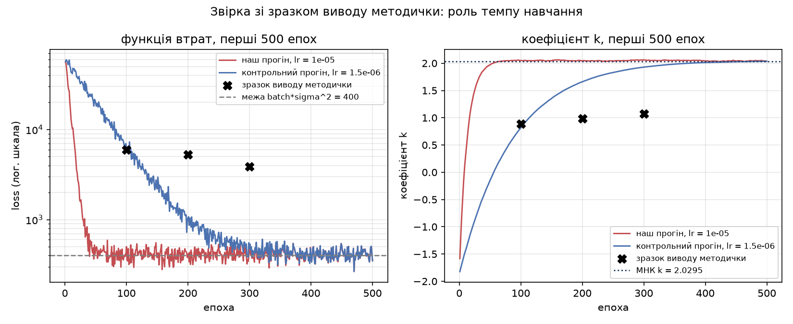

## Мета

Дослідити ресурси Keras і TensorFlow та застосувати TensorFlow для навчання
лінійної регресії. Засобами TensorFlow реалізувати наведений у методичці код і
дослідити структуру розрахункового алгоритму: генерацію даних, оголошення
заглушок (placeholder) і змінних, побудову моделі та функції втрат, вибір
оптимізатора і цикл навчання з міні-батчами.

Виконав: Камінський Олексій Дмитрович, група ВТ-23-2, варіант 3.
Середовище: Python 3.14.6, TensorFlow 2.22.0-rc0, Keras 3.16 (бекенд — TensorFlow),
NumPy 2.5.3, macOS (CPU).

Постановка задачі. Лінійна регресія — це фактично один нейрон, який отримує на
вхід вектор x і видає число. На даних {(x_1, y_1), ..., (x_N, y_N)} потрібно
мінімізувати суму квадратів відхилень. Наближаємо функцію f = kx + b для
істинних k = 2 і b = 1; k та b є параметрами, які навчаються.

Номер варіанта (3) використано як зерно генераторів випадкових чисел
(`np.random.seed(3)`, `tf.set_random_seed(3)`), тому всі наведені нижче числа
відтворюються при повторному запуску.

## Завдання 1. Дослівна реалізація коду методички (TensorFlow 1.x через compat.v1)

Код методички написаний під TensorFlow 1.x: він спирається на статичний граф
обчислень (`tf.placeholder`), явну сесію (`tf.Session`), підстановку даних через
`feed_dict` і оптимізатор `tf.train.GradientDescentOptimizer`. У встановленому
TensorFlow 2.22 жодного з цих імен у кореневому просторі імен немає — TF2 працює
в режимі негайного виконання (eager). Щоб довести, що відтворено саме алгоритм
методички, а не «щось схоже», перший скрипт імпортує шар сумісності
`tensorflow.compat.v1` і явно вимикає поведінку другої версії:

```python
import tensorflow.compat.v1 as tf           # шар сумісності з TensorFlow 1.x
tf.disable_v2_behavior()                    # вимикаємо eager -> працює статичний граф
```

Далі структура розрахункового алгоритму повністю повторює 6 кроків методички.

**Крок 1 — генерація вхідних даних.** 1000 точок x, для кожної обчислюється
«правильна відповідь» y = 2x + 1 + ε. Тут важлива суперечність: у ТЕКСТІ
методички сказано, що точки розподілені рівномірно на інтервалі [0; 1], а в КОДІ
методички стоїть `np.random.uniform(1, 10)`, тобто інтервал [1; 10]. Беремо код,
бо саме він узгоджується з наведеним у методичці зразком виводу. Перевірено
прямим обчисленням: у стані зі зразка методички (k = 0.8925, b = 0.0988) очікувана
втрата на міні-батчі зі 100 точок дорівнює 6047 на інтервалі [1; 10] і лише 608 на
інтервалі [0; 1], тоді як методичка наводить 5962.16. Самі інтервали відрізняються
за дисперсією x рівно у 81 раз (емпірично 6.5313 проти 0.0806, теоретично 9² = 81)
і у 111 разів за E[x²] (37.2723 проти 0.3356).

**Крок 2 — заглушки.** `tf.placeholder` з розмірністю (розмір міні-батча × 1) для
X і для y.

**Крок 3 — змінні.** k ініціалізується стандартним нормальним розподілом, b — нулем.

**Крок 4 — модель і функція втрат.** y_pred = X·k + b, loss = `tf.reduce_sum((y - y_pred) ** 2)`.
Використано саме `tf.reduce_sum`, а не `numpy.sum`: сума має бути вузлом графа,
інакше TensorFlow не зможе продиференціювати її й оптимізувати обчислення.

**Крок 5 — оптимізатор.** Стохастичний градієнтний спуск; `.minimize(loss)`
повертає операцію, виконання якої оновлює всі змінні, від яких залежить loss
(тобто k і b). По X та y оптимізації не буде — це жорстко задані вхідні дані.

**Крок 6 — цикл навчання.** 20000 кроків; на кожному беремо випадкову підмножину
з 100 індексів, формуємо міні-батч і передаємо його в `sess.run` через `feed_dict`.

```python
n_samples, batch_size, num_steps = 1000, 100, 20000     # крок 1
X_data = np.random.uniform(1, 10, (n_samples, 1))       # 1000 точок x на [1; 10]
y_data = 2 * X_data + 1 + np.random.normal(0, 2, (n_samples, 1))   # y = 2x + 1 + шум

X = tf.placeholder(tf.float32, shape=(batch_size, 1))   # крок 2
y = tf.placeholder(tf.float32, shape=(batch_size, 1))

with tf.variable_scope('linear-regression'):            # крок 3
    k = tf.Variable(tf.random_normal((1, 1)), name='slope')
    b = tf.Variable(tf.zeros((1,)), name='bias')

y_pred = tf.matmul(X, k) + b                            # крок 4
loss = tf.reduce_sum((y - y_pred) ** 2)
optimizer = tf.train.GradientDescentOptimizer(LEARNING_RATE).minimize(loss)  # крок 5

with tf.Session() as sess:                              # крок 6
    sess.run(tf.global_variables_initializer())
    for i in range(num_steps):
        indices = np.random.choice(n_samples, batch_size)
        X_batch, y_batch = X_data[indices], y_data[indices]
        _, loss_val, k_val, b_val = sess.run(
            [optimizer, loss, k, b],
            feed_dict={X: X_batch, y: y_batch})
```

Темп навчання. У методичці `GradientDescentOptimizer()` викликано взагалі без
аргументів, хоча `learning_rate` є обов'язковим. Оскільки loss — це СУМА по 100
елементах батча, її градієнт у 100 разів більший за градієнт середньої похибки,
тому крок має бути малим. Для цих даних власні числа матриці одного кроку спуску
дорівнюють 7620.18 та 34.28 (на одиницю learning_rate), тобто межа стійкості
становить 2/7620.18 = 2.62·10⁻⁴. Обрано LEARNING_RATE = 1·10⁻⁵ — це 3.8 % від межі,
спуск стійкий і при цьому достатньо швидкий. Оскільки темп навчання методичка не
задає, її зразок виводу точно не відтворюється; окремий розділ «Звірка власного
виводу зі зразком методички» нижче показує, який саме крок потрібен для збігу і
чому обрано інший.

Нижче — СКОРОЧЕНИЙ витяг із консолі (скрипт друкує, як і методичка, рівно кожні
100 епох, тобто 200 рядків; додатково, понад методичку, друкуються перші 5 кроків):

```text
Крок 1: 56663.01953125, k=-1.5840, b=0.0432
Крок 2: 52437.89062500, k=-1.3016, b=0.0848
Крок 5: 30832.37304688, k=-0.5939, b=0.1911
Епоха 100: 500.39248657, k=2.0511, b=0.5906
Епоха 500: 351.81582642, k=2.0363, b=0.6082
Епоха 4000: 472.98876953, k=2.0374, b=0.6894
Епоха 10000: 274.13494873, k=2.0240, b=0.7232
Епоха 16000: 365.94433594, k=2.0343, b=0.7249
Епоха 20000: 403.24114990, k=2.0370, b=0.7267
----------------------------------------------------------------
TF1-compat: k = 2.0370, b = 0.7267, час навчання = 1.34 с
Аналітичний МНК (еталон): k = 2.0295, b = 0.7158
Істинні параметри генератора: k = 2.0000, b = 1.0000
Фінальна втрата на міні-батчі: 403.2411 (теоретична межа ~ batch*sigma^2 = 400)
Стартове значення k (випадкова ініціалізація): -1.8647
```







Два вікна на рисунках 2 і 3 потрібні тому, що з кроком друку 100 епох (як у
методичці) основне спадання взагалі не видно: функція втрат падає з 56663 до
~500 за перші ~60 ітерацій, тобто повністю до першого ж друку. Тому історію в
скрипті записуємо на кожному кроці, а друкуємо рівно кожні 100 епох, як вимагає
методичка; у звіт із цих 200 рядків винесено лише скорочений витяг.

Розрахунковий алгоритм має два чітко розділені режими збіжності, що відповідають
двом власним числам матриці кроку. «Швидкий» режим (власне число 7620) за
~60 ітерацій виводить нахил k практично на оптимум. «Повільний» режим (власне
число 34.3, у 222 рази менше) відповідає за зсув b, і саме він розтягує навчання
на всі 20000 кроків: b повзе від 0.59 на 100-й епосі до 0.727 на 20000-й.

**Висновок:** код методички відтворено дослівно через `tensorflow.compat.v1`; усі
шість кроків алгоритму працюють, функція втрат спадає з 56663 до ~403, що
збігається з теоретичною межею batch·σ² = 100·2² = 400, а параметри сходяться до
k = 2.0370 і b = 0.7267 — практично до аналітичного розв'язку МНК (2.0295 і 0.7158).

## Завдання 2. Сучасна реалізація того самого алгоритму на TensorFlow 2.x

Другий скрипт розв'язує рівно ту саму задачу — той самий генератор даних, те саме
зерно 3, ті самі n_samples = 1000, batch_size = 100, num_steps = 20000 і
learning_rate = 1·10⁻⁵ — але засобами «рідного» TF2. Концептуальні відмінності:

| Елемент | TensorFlow 1.x (методичка) | TensorFlow 2.x |
|---|---|---|
| Передача даних | `tf.placeholder` + `feed_dict` | звичайні аргументи функції |
| Виконання | статичний граф + `tf.Session` | негайне (eager), граф через `@tf.function` |
| Градієнти | неявно, всередині `.minimize()` | явно, через `tf.GradientTape` |
| Оптимізатор | `tf.train.GradientDescentOptimizer` | `keras.optimizers.SGD` |
| Ініціалізація | `tf.global_variables_initializer()` | автоматична при створенні `tf.Variable` |

Варіант А — низькорівневий TF2 на `tf.GradientTape`. Декоратор `@tf.function`
компілює крок навчання у граф, тобто повертає ту саму перевагу, заради якої в
TF1 існувала сесія, але без ручної роботи з графом:

```python
k = tf.Variable(tf.random.normal((1, 1)), name='slope')   # крок 3
b = tf.Variable(tf.zeros((1,)), name='bias')
opt = keras.optimizers.SGD(learning_rate=LEARNING_RATE)   # крок 5

@tf.function                                 # компіляція у граф
def train_step(X_batch, y_batch):
    with tf.GradientTape() as tape:                       # стрічка запису операцій
        y_pred = tf.matmul(X_batch, k) + b                # крок 4: модель
        loss = tf.reduce_sum((y_batch - y_pred) ** 2)     # крок 4: сума квадратів
    grads = tape.gradient(loss, [k, b])                   # автоматичне диференціювання
    opt.apply_gradients(zip(grads, [k, b]))               # оновлення k та b
    return loss

for i in range(num_steps):                                # крок 6
    indices = np.random.choice(n_samples, batch_size)
    loss_val = train_step(tf.gather(X_tf, indices), tf.gather(y_tf, indices))
```

Варіант Б — високорівневий Keras: `Sequential` з одним шаром `Dense(1)`. Шар
`Dense` реалізує операцію `output = activation(dot(input, kernel) + bias)`, тобто
при `activation=None` його `kernel` — це і є k, а `bias` — це b. Уся модель —
2 параметри, що й підтверджує `model.summary()`. Єдина тонкість: стандартна втрата
`'mse'` — це СЕРЕДНЄ по батчу, а не сума, тому її градієнт у batch_size разів
менший; щоб динаміка навчання збіглася з варіантом А, темп навчання збільшено
рівно в batch_size разів (1·10⁻⁵ · 100 = 1·10⁻³).

Друга тонкість стосується ініціалізації. Рядковий псевдонім
`kernel_initializer='random_normal'` у Keras означає не стандартний нормальний
розподіл, а `RandomNormal(mean=0.0, stddev=0.05)` — тобто шар стартував би
практично з k ≈ 0, а не з того самого розподілу, що й варіанти TF1/TF2, де
`tf.random_normal` дає стандартний нормальний. Щоб старт був однаковим,
ініціалізатор задано явно, через об'єкт `RandomNormal(stddev=1.0)`.
Сам шар `Dense` повертає ваги як два масиви, тому їх ще треба розгорнути у скаляри:

```python
model = keras.Sequential([
    keras.layers.Input(shape=(1,)),
    keras.layers.Dense(1,
                       kernel_initializer=keras.initializers.RandomNormal(stddev=1.0),
                       bias_initializer='zeros')
], name='linear_regression')
model.compile(optimizer=keras.optimizers.SGD(learning_rate=LEARNING_RATE * batch_size),
              loss='mse')
history = model.fit(X_data, y_data, batch_size=batch_size,
                    epochs=num_steps // (n_samples // batch_size), verbose=0)
w, bias = model.get_weights()                       # kernel (1,1) і bias (1,)
k_keras, b_keras = float(w.ravel()[0]), float(bias.ravel()[0])
```

```text
TensorFlow: 2.22.0-rc0 | Keras: 3.16.0.dev2026100704 | бекенд Keras: tensorflow
Стартове значення k у TF2 (tf.random.set_seed): -0.8296
Епоха 1: 31356.42968750, k=-0.6214, b=0.0322
Епоха 100: 501.72174072, k=2.0733, b=0.4443
Епоха 4000: 473.04833984, k=2.0431, b=0.6510
Епоха 10000: 274.04394531, k=2.0247, b=0.7182
Епоха 20000: 403.24346924, k=2.0370, b=0.7265
----------------------------------------------------------------
TF2 (GradientTape): k = 2.0370, b = 0.7265, час навчання = 3.19 с
Model: "linear_regression"
 Layer (type)        Output Shape       Param #
 dense (Dense)       (None, 1)                2
 Total params: 2 (8.00 B)   Trainable params: 2
----------------------------------------------------------------
Keras Sequential(Dense(1)): k = 2.0304, b = 0.7152, час навчання = 16.96 с (2000 епох)
Остання mse: 4.1335  (mse * batch_size = 413.3 -> та сама шкала, що й loss у TF1)
================================================================
Реалізація                           k         b     час, с
TF1-compat (Session)            2.0370    0.7267       1.34
TF2 (GradientTape)              2.0370    0.7265       3.19
Keras Sequential(Dense)         2.0304    0.7152      16.96
Аналітичний МНК                 2.0295    0.7158          -
Істинні параметри               2.0000    1.0000          -
================================================================
Слід різної початкової ініціалізації k (TF1 проти TF2):
крок           різниця |dk|       різниця |db|
1                  0.962602           0.011016
60                 0.030537           0.147063
100                0.022235           0.146246
1000               0.016420           0.107435
4000               0.005747           0.038411
10000              0.000740           0.004934
20000              0.000024           0.000161
Контроль причини розбіжності b у 4-му знаку:
  лише тип обчислень (float32 проти float64, однаковий старт): |db| = 8.72e-07
  лише початкове k (-1.8647 проти -0.8296, однаковий тип):     |db| = 1.61e-04
  відтворені значення: b = 0.726708 (старт TF1) проти b = 0.726548 (старт TF2)
================================================================
```

Зведене порівняння результатів:

| Реалізація | k | b | час навчання, с | відхилення k від МНК | відхилення b від МНК |
|---|---|---|---|---|---|
| TF1-compat (`Session` + `feed_dict`) | 2.0370 | 0.7267 | 1.34 | +0.0075 | +0.0109 |
| TF2 (`GradientTape` + `@tf.function`) | 2.0370 | 0.7265 | 3.19 | +0.0075 | +0.0107 |
| Keras `Sequential(Dense(1))` | 2.0304 | 0.7152 | 16.96 | +0.0009 | −0.0006 |
| Аналітичний МНК (еталон) | 2.0295 | 0.7158 | — | — | — |
| Істинні параметри генератора | 2.0000 | 1.0000 | — | — | — |









На рисунку 7 ліва й середня панелі TF1 і TF2 практично накладаються одна на одну:
обидва скрипти використовують одне зерно 3, тому отримують ту саму вибірку даних і
ту саму послідовність міні-батчів. Відрізняється лише випадкова початкова
ініціалізація k: TF1 стартує з −1.8647 (`tf.set_random_seed`), TF2 — з −0.8296
(`tf.random.set_seed`); це різні генератори, тому однакове зерно дає різні числа.

Важливо, що цей слід старту згасає в k і в b з РІЗНОЮ швидкістю, і права панель
рисунка 7 це добре показує: сині й червоні криві коефіцієнта b помітно розходяться
аж приблизно до 10000-го кроку. Скрипт друкує модуль різниці траєкторій напряму:

| крок | модуль різниці по k | модуль різниці по b |
|---|---|---|
| 1 | 0.962602 | 0.011016 |
| 60 | 0.030537 | 0.147063 |
| 100 | 0.022235 | 0.146246 |
| 1000 | 0.016420 | 0.107435 |
| 4000 | 0.005747 | 0.038411 |
| 10000 | 0.000740 | 0.004934 |
| 20000 | 0.000024 | 0.000161 |

Тобто у нахилі k слід ініціалізації зникає приблизно за 60 ітерацій (різниця
падає з 0.96 до 0.03), а у зсуві b він, навпаки, лише НАРОСТАЄ до 0.147 на
60—100-му кроці й розсмоктується аж до ~10000-го кроку. Причина — та сама пара
власних чисел 7620 і 34.3: початкове відхилення по k майже миттєво гаситься
«швидкою» модою, але частина його перекидається у «повільну» моду, яка живе
у 222 рази довше і проявляється саме в b. Тому залишкова розбіжність у четвертому
знаку (b = 0.7267 проти 0.7265) — це не похибка обчислень, а останній хвіст різної
початкової ініціалізації. Щоб це не залишалось припущенням, у скрипті зроблено
прямий контрольний експеримент: той самий спуск повторено чистим numpy, і в ньому
окремо змінено або лише тип обчислень, або лише стартове k. Зміна типу з float32
на float64 при однаковому старті зсуває b лише на 8.7·10⁻⁷, тобто у шостому знаку,
а зміна самого лише стартового k (−1.8647 проти −0.8296) при однаковому типі дає
b = 0.726708 проти b = 0.726548, тобто рівно ті 0.7267 і 0.7265, які спостерігаємо.
Отже причина — ініціалізація, а не точність накопичення в графовому чи eager-режимі.

Щодо часу: найшвидшим виявився статичний граф TF1 (1.34 с), вдвічі повільнішим —
`@tf.function` у TF2 (3.19 с, бо на кожній ітерації додається `tf.gather` і
зчитування `k.numpy()` для історії), і найповільнішим — високорівневий Keras
(16.96 с). Абсолютні значення часу коливаються від запуску до запуску на ±15 %,
але співвідношення між реалізаціями стабільне. Відставання Keras не має відношення до математики: на 2 параметри
модель витрачає ~10 мс на епоху на внутрішню інфраструктуру `fit` (колбеки,
`tf.data`-конвеєр, облік метрик). На задачі з двох ваг ця інфраструктура — чиста
накладна витрата, але саме вона окупається на реальних мережах.

**Висновок:** усі три реалізації збіглися до одного й того самого розв'язку
(k ≈ 2.03, b ≈ 0.72), що підтверджує: `tf.GradientTape` і `Dense(1)` виконують ту
саму математику, що й граф із `placeholder` та `feed_dict`, а відрізняються лише
способом її запису та накладними витратами виконання.

## Звірка власного виводу зі зразком методички

Методичка наводить зразок виводу («Епоха 100: 5962.15625000, k=0.8925, b=0.0988»),
але НЕ наводить `learning_rate`, бо викликає `GradientDescentOptimizer()` без
аргументів. Тому її зразок у принципі не відтворюється однозначно: кожному темпу
навчання відповідає своя траєкторія. Наш робочий прогін з LEARNING_RATE = 1·10⁻⁵
дає на 100-й епосі loss = 500.39 і k = 2.0511 — втрата у 12 разів менша, а нахил
уже практично на оптимумі. Щоб показати, що розбіжність спричинена саме темпом
навчання, а не іншою математикою, скрипт повторює ТОЙ САМИЙ граф на ТИХ САМИХ
даних і з ТИМ САМИМ стартовим k та тією самою послідовністю міні-батчів, змінюючи
лише `learning_rate`:

```text
Підбір темпу навчання під зразок методички (ціль: epoch 100 -> loss 5962.16, k 0.8925):
  lr = 5.0e-07 -> епоха 100: loss =   27872.06, k = -0.6186, b = 0.1861
  lr = 1.0e-06 -> епоха 100: loss =   13310.46, k =  0.2338, b = 0.3135
  lr = 1.5e-06 -> епоха 100: loss =    6482.86, k =  0.8162, b = 0.4006
  lr = 2.0e-06 -> епоха 100: loss =    3289.24, k =  1.2134, b = 0.4601
  lr = 5.0e-06 -> епоха 100: loss =     529.32, k =  1.9738, b = 0.5755
  lr = 1.0e-05 -> епоха 100: loss =     500.39, k =  2.0511, b = 0.5906
```

Отже еталонна траєкторія методички відповідає темпу навчання близько 1.5·10⁻⁶ —
приблизно у 7 разів меншому за обраний. Повна звірка по епохах:

| епоха | зразок методички | наш прогін, lr = 1.5·10⁻⁶ | наш прогін, lr = 1·10⁻⁵ |
|---|---|---|---|
| 100 | 5962.16, k=0.8925, b=0.0988 | 6482.86, k=0.8162, b=0.4006 | 500.39, k=2.0511, b=0.5906 |
| 200 | 5312.12, k=0.9862, b=0.1927 | 1054.58, k=1.6594, b=0.5280 | 402.83, k=2.0457, b=0.5981 |
| 300 | 3904.57, k=1.0761, b=0.2825 | 481.81, k=1.9293, b=0.5687 | 447.97, k=2.0598, b=0.6032 |
| 19900 | 429.80, k=2.0267, b=0.9006 | 453.37, k=2.0331, b=0.6731 | 452.58, k=2.0172, b=0.7224 |
| 20000 | 378.42, k=2.0179, b=0.8902 | 403.31, k=2.0364, b=0.6741 | 403.24, k=2.0370, b=0.7267 |



На 100-й епосі контрольний прогін збігається зі зразком методички за порядком
величини (6482.86 проти 5962.16, k = 0.8162 проти 0.8925) — це видно на рисунку 8,
де перший «хрестик» зразка лежить просто на синій кривій. А от на епохах 200 і 300
збіг зникає: у методички k зростає лише на +0.0937 і +0.0899 за сотню кроків, тоді
як будь-який темп навчання, що дає на 100-й епосі втрату 5962, виводить k на
оптимум уже за наступні 150—200 кроків.

Причина в тому, що сам зразок виводу методички внутрішньо суперечливий. Для
x ~ U[1; 10] градієнт по k приблизно у 6.6 раза більший за градієнт по b — скрипт
обчислює це співвідношення для точки зразка і друкує 6.57. Отже за однакову
кількість кроків k має зростати приблизно в 6.6 раза швидше за b. У зразку ж
методички прирости k і b рівні: +0.0937 проти +0.0939 на епохах 100 → 200 і
+0.0899 проти +0.0898 на епохах 200 → 300, тобто співвідношення рівно 1.00. Такої
траєкторії градієнтний спуск на цих даних дати не може ні за якого темпу навчання.
При цьому самі значення loss узгоджені з парами (k, b) бездоганно, а фінальні
k = 2.0179, b = 0.8902 — цілком правдоподібний оптимум МНК на іншій зашумленій
вибірці. Тобто зразок узятий із реального прогону, але стовпчик b у ньому
не належить тому самому прогону, що стовпчики loss і k.

Чому все-таки залишено LEARNING_RATE = 1·10⁻⁵, а не «еталонні» 1.5·10⁻⁶. По-перше,
за 20000 кроків обидва темпи приводять до того самого результату, але більший крок
робить це за ~60 ітерацій замість ~400, тому на рисунках 2, 3 і 8 видно повну
картину збіжності. По-друге, 1·10⁻⁵ — це 3.8 % від межі стійкості 2.62·10⁻⁴, тобто
запас надійності більш ніж 25-кратний. По-третє, менший темп не наближає нас до
зразка методички по суті: як показано вище, її траєкторія недосяжна в принципі.

## Чому b зійшлося до 0.72, а не до 1.00

Окремого пояснення потребує те, що навчене b = 0.727 помітно відрізняється від
істинного b = 1. Це не помилка навчання: градієнтний спуск сходиться не до
параметрів генератора, а до оптимуму МНК на конкретній зашумленій вибірці, і цей
оптимум для нашої вибірки дорівнює рівно 0.7158 (обчислено незалежно через
`np.linalg.lstsq`). Стандартна похибка оцінки зсуву для цих даних становить
se(b) = 0.154 (проти se(k) = 0.025 — у 6 разів менше, бо x змінюється на
[1; 10] і екстраполяція до x = 0 ненадійна). Відхилення b̂ від істинної одиниці
дорівнює −1.85 стандартної похибки, тобто цілком у межах звичайної статистичної
флуктуації. Саме тому й у зразку виводу методички b зупиняється на 0.89, а не на 1.00.

Залишкова різниця між навченим b = 0.7267 і оптимумом МНК 0.7158 — це вже шум
самого стохастичного спуску: при сталому learning_rate SGD не зупиняється в точці
мінімуму, а блукає навколо неї в околі, пропорційному кроку навчання.

## Ресурси Keras (теоретична частина)

Keras — високорівневий фронтенд, який працює поверх бекенду (історично Theano,
зараз за замовчуванням TensorFlow). Бекенд перемикається двома способами: правкою
поля `"backend"` у конфігураційному файлі `$HOME/.keras/keras.json` (поряд із
`image_data_format`, `epsilon`, `floatx`) або змінною оточення `KERAS_BACKEND`.
У цій роботі `keras.backend.backend()` повернув `tensorflow`.

Моделі. Основна структура даних Keras — модель, тобто спосіб організації шарів.
Є два основні типи: послідовна модель `Sequential` (лінійна сукупність шарів) і
клас `Model` функціонального API, що дозволяє будувати довільні графи шарів,
у тому числі з кількома входами й виходами:
`model = Model(inputs=[a1, a2], outputs=[b1, b2, b3])`.

Спільні властивості й методи моделей: `model.layers`, `model.inputs`,
`model.outputs`, `model.summary()`, `model.get_config()`, `model.get_weights()`,
`model.set_weights(weights)`, `model.to_json()`. У цій роботі використано
`model.summary()` (показав 2 параметри) і `model.get_weights()` (звідти й узято
навчені k та b).

Основні методи класу Model: `compile(optimizer, loss, metrics, ...)` — налаштування
моделі для навчання; `fit(x, y, batch_size, epochs, validation_split,
initial_epoch, ...)` — навчання протягом заданої кількості епох; `evaluate(...)` —
оцінка якості навченості на тестовому режимі; `predict(x, batch_size, ...)` —
створення вихідних прогнозів; `get_layer(name, index)` — отримання шару за іменем
або індексом.

Шари. Спільні методи шарів: `layer.get_weights()`, `layer.set_weights(weights)`,
`layer.get_config()`; шар відновлюється з конфігурації через
`Dense.from_config(config)`. Якщо шар має один вузол, доступні властивості
`layer.input`, `layer.output`, `layer.input_shape`, `layer.output_shape`.

Щільний шар `Dense(units, activation=None, use_bias=True,
kernel_initializer='glorot_uniform', bias_initializer='zeros', ...)` реалізує
операцію `output = activation(dot(input, kernel) + bias)`. Саме цей шар і було
застосовано у варіанті Б завдання 2: `Dense(1)` з лінійною активацією — це
буквально один нейрон лінійної регресії, що й зазначено в постановці задачі.
Для задання активації окремо є `Activation(activation)`.

Перенавчання (overfitting) — модель добре розпізнає лише приклади з навчальної
вибірки, втрачаючи здатність до узагальнення. Основний засіб боротьби — метод
виключення `Dropout(rate)`: нейрон виключається з мережі з імовірністю `rate`,
тобто повертає 0 при будь-яких вхідних даних. Допоміжні шари зміни форми —
`Reshape(target_shape)` і `Permute(dims)`.

Ресурси TensorFlow, задіяні в роботі: тензор як основний об'єкт; змінна
(`tf.Variable`) як буфер у пам'яті, що вміщує тензори і потребує явної
ініціалізації; заглушка `tf.placeholder` для подачі міні-батчів; простори імен
змінних (`tf.variable_scope` / `tf.get_variable`) для повторного використання тих
самих ваг у різних шляхах обчислень; редукції (`tf.reduce_sum`, `tf.reduce_mean`)
і broadcasting при поелементних операціях над тензорами різної форми.

## Зауваження до методички

Методичка містить кілька фактичних помилок і застарілих викликів. Нижче — повний
перелік знайденого і те, як це обійдено в роботі.

**Зауваження 1. Увесь код написаний під TensorFlow 1.x.** `tf.placeholder`,
`tf.Session`, `feed_dict`, `tf.train.GradientDescentOptimizer`, `tf.variable_scope`,
`tf.random_normal` — жодного з цих імен немає в кореневому просторі імен
встановленого TensorFlow 2.22. Обійдено: перший скрипт імпортує
`tensorflow.compat.v1 as tf` і викликає `tf.disable_v2_behavior()`, завдяки чому
код працює дослівно; другий скрипт показує сучасний еквівалент.

**Зауваження 2. `tf.initialize_global_variables()` не існує.** Правильна назва —
`tf.global_variables_initializer()`. Виклик із методички негайно падає з
`AttributeError`. Виправлено в коді; в коментарі зазначено оригінал.

**Зауваження 3. `tf.mul` застаріло.** У теоретичному прикладі з `feed_dict`
використано `output = tf.mul(x, y)`. Ця функція вилучена ще в TF 1.0; сучасна
назва — `tf.multiply` (у TF2 — `tf.math.multiply`). Перевірено: `hasattr(tf, 'mul')`
повертає `False`.

**Зауваження 4. `GradientDescentOptimizer()` викликано без обов'язкового
`learning_rate`.** У методичці стоїть `tf.train.GradientDescentOptimizer().minimize(loss)`,
що падає з `TypeError: missing 1 required positional argument: 'learning_rate'`.
Темп навчання довелося підібрати самостійно: обчислено межу стійкості для цих
даних (2.62·10⁻⁴) і обрано LEARNING_RATE = 1·10⁻⁵ — 3.8 % від межі. Наслідок цього
пропуску важливіший, ніж просто падіння коду: без `learning_rate` зразок виводу
методички взагалі не є відтворюваним. Скануванням темпу навчання (розділ «Звірка
власного виводу зі зразком методички») встановлено, що еталонна траєкторія
методички відповідає lr ≈ 1.5·10⁻⁶, тобто приблизно у 7 разів меншому кроку; з
обраним 1·10⁻⁵ на 100-й епосі виходить loss = 500.39, k = 2.0511 замість
5962.16 / 0.8925. Розбіжність свідома й пояснена, а не випадкова.

**Зауваження 5. Суперечність між текстом і кодом щодо інтервалу x.** Текст
методички (пункт 1 алгоритму) каже «1000 випадкових точок рівномірно на інтервалі
[0; 1]», а код генерує `np.random.uniform(1, 10, ...)`, тобто [1; 10]. Взято код,
і вирішальний аргумент тут один: наведений методичкою зразок виводу на інтервалі
[0; 1] неможливий. У стані зі зразка (k = 0.8925, b = 0.0988) очікувана втрата на
міні-батчі зі 100 точок дорівнює 6047 на [1; 10] і лише 608 на [0; 1], а методичка
друкує 5962.16. Самі інтервали відрізняються за дисперсією x рівно у 81 раз
(емпірично 6.5313 проти 0.0806) і у 111 разів за E[x²] (37.2723 проти 0.3356).
Зауважимо окремо, що на [0; 1] задача не стає нерозв'язною — навпаки, вона
краще обумовлена: власні числа матриці кроку там 254.44 і 12.68 проти 7620.18 і
34.28, а межа стійкості 7.86·10⁻³, тобто у 30 разів БІЛЬША. З тим самим lr = 1·10⁻⁵
за 20000 кроків на [0; 1] виходить k = 2.0261, b = 0.8773 при МНК-оптимумі
2.2653 / 0.7453 (збіжність часткова), а з lr = 1·10⁻³ спуск збігається повністю
(k = 2.2804, b = 0.6472). Отже обмеження тут не фундаментальне, а наслідок
фіксованого темпу навчання.

**Зауваження 6. Плутанина «дисперсія/стандартне відхилення» в описі шуму.** Текст
каже «шум із дисперсією 2, ε ∼ N(ε; 0, 2)», але в коді стоїть
`np.random.normal(0, 2, ...)`, де другий аргумент NumPy — це стандартне відхилення,
а не дисперсія. Отже, фактично σ = 2, дисперсія = 4. Це видно і з самої методички:
наведена нею фінальна помилка 378 відповідає межі batch·σ² = 100·4 = 400, а не
100·2 = 200. У роботі використано код (σ = 2) і перевірено збіг із цією межею
(отримано 403.2).

**Зауваження 7. `loss` у прикладі — сума, а не середнє.** Через `tf.reduce_sum`
функція втрат масштабується разом із розміром батча, тому її абсолютні значення
великі (тисячі й десятки тисяч) і на око «не схожі на помилку». Це також означає,
що градієнт у 100 разів більший за градієнт середньоквадратичної похибки, і
стандартні значення learning_rate (0.01, 0.001) тут миттєво розбігаються. У роботі
цю властивість враховано явно: при переході на Keras із `loss='mse'` темп навчання
збільшено рівно в `batch_size` разів, щоб динаміка збіглася.

**Зауваження 8. `print('%.4f' % k_val)` падає в сучасному NumPy.** Змінна k має
форму (1, 1), b — форму (1,), а з NumPy 1.25 неявне перетворення непустого масиву
на скаляр є помилкою (`TypeError: only 0-dimensional arrays can be converted to
Python scalars`). Виправлено явним `float(np.ravel(k_val)[0])`.

**Зауваження 9. Крок друку 100 ховає найцікавішу частину навчання.** Основне
спадання функції втрат (з 56663 до ~500) відбувається за перші ~60 ітерацій, тобто
повністю потрапляє в проміжок до першого ж друку. Сам друк залишено таким, як у
методичці — рівно кожні 100 епох, 200 рядків; у звіт із них винесено лише
скорочений витяг. Натомість історію в скрипті записуємо на КОЖНОМУ кроці, на
рисунках 2, 3, 5, 6 додано окрему панель зі стартом навчання, а у вивід додано
(понад методичку) перші 5 кроків.

**Зауваження 10. Некоректне посилання в постановці завдання.** Методичка пропонує
«використовувати онлайн-середовище google-colab (перехід за посиланням:
http://neuralnetworksanddeeplearning.com/chap4.html)». За цим посиланням
розташована глава книги Майкла Нільсена про універсальну апроксимацію, а не Google
Colab. Роботу виконано локально у віртуальному оточенні `/Users/alex/.venvs/systems-ai`.

**Зауваження 11. Зразок виводу методички внутрішньо суперечливий.** У наведеному
методичкою прикладі стовпчики k і b зростають з однаковою швидкістю: +0.0937 проти
+0.0939 на епохах 100 → 200 і +0.0899 проти +0.0898 на епохах 200 → 300, тобто
співвідношення приростів рівно 1.00. Але для x ~ U[1; 10] градієнт функції втрат
по k приблизно у 6.6 раза більший за градієнт по b (обчислено в скрипті для точки
зразка: 6.57), тому k зобов'язане зростати у ~6.6 раза швидше. Градієнтний спуск на
цих даних не може дати траєкторію з рівними приростами ні за якого темпу навчання.
Значення loss при цьому бездоганно узгоджені з парами (k, b), а фінальні
k = 2.0179 і b = 0.8902 правдоподібні як оптимум МНК на іншій вибірці. Висновок:
зразок узято з реального прогону, але стовпчик b у ньому не належить тому самому
прогону, що loss і k. Саме тому в розділі «Звірка власного виводу зі зразком
методички» порівняння доведено лише до 100-ї епохи, де воно ще має сенс.

**Зауваження 12. Розбіжність у нумерації.** Файл методички названий «ЛР 8», а
всередині заголовок — «Лабораторна робота №10». У звіті використано нумерацію 8.

## Висновки

У роботі досліджено структуру розрахункового алгоритму навчання лінійної регресії
засобами TensorFlow і реалізовано його у двох варіантах. Перший скрипт
(`LR_8_task_1_tf1_compat.py`) дослівно відтворює код методички через шар
сумісності `tensorflow.compat.v1` зі статичним графом, сесією та `feed_dict`.
Другий (`LR_8_task_2_tf2.py`) розв'язує ту саму задачу сучасними засобами
TensorFlow 2.22 — через `tf.GradientTape` із декоратором `@tf.function`, а також
через високорівневу модель `keras.Sequential` з єдиним шаром `Dense(1)`. Обидва
скрипти реально запущені; усі наведені числа є фактичним виводом консолі.

Алгоритм із шести кроків методички працює як задумано. Функція втрат спадає з
56663 на першій ітерації до ~403 наприкінці навчання, тобто падає більш ніж у
140 разів і виходить на теоретичну межу batch·σ² = 100·2² = 400 — нижче цієї межі
функція втрат опуститися не може в принципі, бо вона дорівнює сумі квадратів
самого шуму, який у даних є непереборним. Коефіцієнти збіглися до k = 2.0370 і
b = 0.7267 у TF1-реалізації та до k = 2.0370, b = 0.7265 у TF2-реалізації;
високорівневий Keras дав k = 2.0304 і b = 0.7152.

Усі три реалізації збіглися до одного й того самого розв'язку, причому цей
розв'язок — не параметри генератора (k = 2, b = 1), а оптимум методу найменших
квадратів на конкретній зашумленій вибірці, незалежно обчислений через
`np.linalg.lstsq` і рівний k = 2.0295, b = 0.7158. Відхилення навченого b від
одиниці пояснюється статистикою, а не помилкою оптимізації: стандартна похибка
оцінки зсуву на цих даних становить 0.154, тобто отримане значення лежить за
1.85 стандартної похибки від істинного. Саме з цієї ж причини і в зразку виводу
методички b зупиняється на 0.89. Залишкова різниця між навченим b = 0.7267 та
оптимумом 0.7158 — це стаціонарний шум SGD зі сталим кроком навчання.

Дослідження структури алгоритму виявило його найважливішу особливість: збіжність
розпадається на два режими з різними швидкостями. Матриця одного кроку спуску для
цих даних має власні числа 7620.18 і 34.28, що відрізняються в 222 рази. «Швидкий»
режим виводить нахил k на оптимум уже за ~60 ітерацій, тоді як «повільний» режим
відповідає за зсув b і розтягує навчання на всі 20000 кроків. Саме це число
обумовлення (а не складність задачі з двох параметрів) і пояснює, навіщо
методичці знадобилося 20000 ітерацій на підгонку прямої. Той самий поділ на дві
моди пояснює і розбіжність між двома реалізаціями: різне стартове k (−1.8647 у TF1
проти −0.8296 у TF2) зникає з коефіцієнта k за ~60 ітерацій, але в коефіцієнті b
тягнеться приблизно до 10000-го кроку, що добре видно на правій панелі рисунка 7.

Окремо звірено власний вивід зі зразком, наведеним у методичці. Оскільки
`learning_rate` у методичці не заданий, її зразок не є однозначно відтворюваним;
скануванням темпу навчання встановлено, що еталонна траєкторія відповідає
lr ≈ 1.5·10⁻⁶ — приблизно у 7 разів меншому кроку, ніж обраний 1·10⁻⁵. Саме через
це на 100-й епосі власний прогін дає loss = 500.39 і k = 2.0511 замість 5962.16 і
0.8925. При цьому точне відтворення зразка неможливе в принципі: у ньому
коефіцієнти k і b зростають з однаковою швидкістю, тоді як на даних з інтервалу
[1; 10] градієнт по k у 6.57 раза більший за градієнт по b, тож k зобов'язане
випереджати b приблизно в 6.6 раза.

Порівняння реалізацій за швидкістю дало очікуваний результат: статичний граф TF1
виявився найшвидшим (1.34 с), `@tf.function` у TF2 — 3.19 с, а високорівневий
`model.fit` Keras — 16.96 с. Різниця не пов'язана з математикою: на моделі з двох
параметрів інфраструктура `fit` (колбеки, конвеєр `tf.data`, облік метрик) стає
домінуючою накладною витратою. Практичний висновок такий: для навчальних задач
такого масштабу низькорівневий `tf.GradientTape` і зрозуміліший, і швидший, тоді
як переваги Keras проявляються на реальних багатошарових мережах, де ручне
керування градієнтами перетворюється на джерело помилок. Водночас реалізація на
`tf.GradientTape` є прямим і повністю еквівалентним замінником застарілої схеми
`placeholder` + `Session` + `feed_dict`, тож код методички не втратив навчальної
цінності — його потрібно лише перекласти на сучасний API.
